# Session 11 — Kubernetes Services Deep Dive

> Hands-on answers with real terminal output and screenshots captured on Kubernetes
> **v1.35.1** (kubectl v1.36.4) under **minikube v1.38.1** (single-node, docker driver).
> Cluster reachable at `https://192.168.49.2:8443`. All screenshots are real GUI terminal
> captures (`foot` on Hyprland via `grim`).
>
> **Environment notes for this machine:**
> - The docker driver bridges the node so `<minikube-ip>:<NodePort>` works **directly on
>   Linux** (no `-p` publish needed) — reachable at `192.168.49.2:30080`.
> - `minikube tunnel` **populates** `EXTERNAL-IP` (LoadBalancer emulator) without root, but the
>   host route (`10.96.0.0/12 -> 192.168.49.2`) requires **sudo**; the tunnel ran interactively
>   for the Task 4 capture.
> - The provided `04-externalname/service.yaml` pointed at `nencyravaliya.me`, which no longer
>   resolves; changed to `api.github.com` (allowed by the assignment text). Everything else kept.

**Screenshot index**

| Task | File | Shows |
| --- | --- | --- |
| 1. Ports drill | `screenshots/01-port-architecture.png` | packet flow nodePort→port→targetPort→containerPort |
| 2. ClusterIP | `screenshots/02-clusterip-vip-endpoints.png` | VIP + 3 pod IPs bound to Endpoints |
| 2. ClusterIP | `screenshots/02-clusterip-fqdn-curl.png` | curl via short name + FQDN both return `<title>` |
| 3. NodePort | `screenshots/03-nodeport-svc-mapping.png` | service `80:30080/TCP` mapping |
| 3. NodePort | `screenshots/03-nodeport-http-200.png` | `curl -I <nodeIP>:30080` → `HTTP/1.1 200 OK` |
| 4. LoadBalancer | `screenshots/04-loadbalancer-pending.png` | fresh service shows `EXTERNAL-IP <pending>` |
| 4. LoadBalancer | `screenshots/04-loadbalancer-http.png` | tunnel-populated `EXTERNAL-IP` + curl `:80` → nginx |
| 5. ExternalName | `screenshots/05-externalname-svc.png` | `TYPE ExternalName`, `CLUSTER-IP <none>`, no endpoints |
| 5. ExternalName | `screenshots/05-externalname-cname.png` | `canonical name = api.github.com` + HTTPS via alias |
| 6. Headless | `screenshots/06-headless-a-records.png` | CoreDNS returns **3 A records** (no VIP) |
| 6. Headless | `screenshots/06-headless-ordinal-dns.png` | `web-stateful-0.<svc>` resolves + curl |
| 7. No-selector | `screenshots/07-noselector-empty-endpoints.png` | endpoints `<none>` before manual binding |
| 7. No-selector | `screenshots/07-manual-endpoints-bound.png` | `192.168.1.150:3306` bound by Endpoints object |
| 8. FQDN/CoreDNS | `screenshots/08-resolv-conf-coredns.png` | `/etc/resolv.conf` (search, `ndots:5`) + CoreDNS pods |
| 8. FQDN/CoreDNS | `screenshots/08-fqdn-external-dns.png` | service FQDN → `10.96.0.10`, external api.github.com |
| 9. Identity | `screenshots/09-identity-before.png` | Deployment hash-names vs StatefulSet ordinals |
| 9. Identity | `screenshots/09-identity-after.png` | new random hash vs identical `web-stateful-0` rebirth |

---

## Task 1 — Kubernetes Port Architecture & Clarification Drill

Four different numbers that contribute to one routing decision. The authoritative definitions:

```bash
kubectl explain pod.spec.containers.ports.containerPort   # pod-level
kubectl explain service.spec.ports                        # service-level
```

```
Client Browser
     │
     v        outside the cluster: a host IP is needed
 [nodePort: 30080]   (open on EVERY node, Service field)
     │
     v        inside the cluster: service Virtual IP
 [port: 80]         (Service.spec.ports[].port)
     │
     v        on the destination pod
 [targetPort: 80]   (Service routes here; defaults to port)
     │
     v        inside the container
 [containerPort: 80] (container's real listen port)
     │
     v
 [nginx process listening on :80]
```

Key rule: `containerPort` is **only metadata** (info for humans/kubectl; it opens nothing by
itself) — the actual connectivity is defined by `Service.port` (VIP-facing), `targetPort`
(pod-facing) and, only for `NodePort`, `nodePort` (which Kubernetes forces into
`30000–32767`).

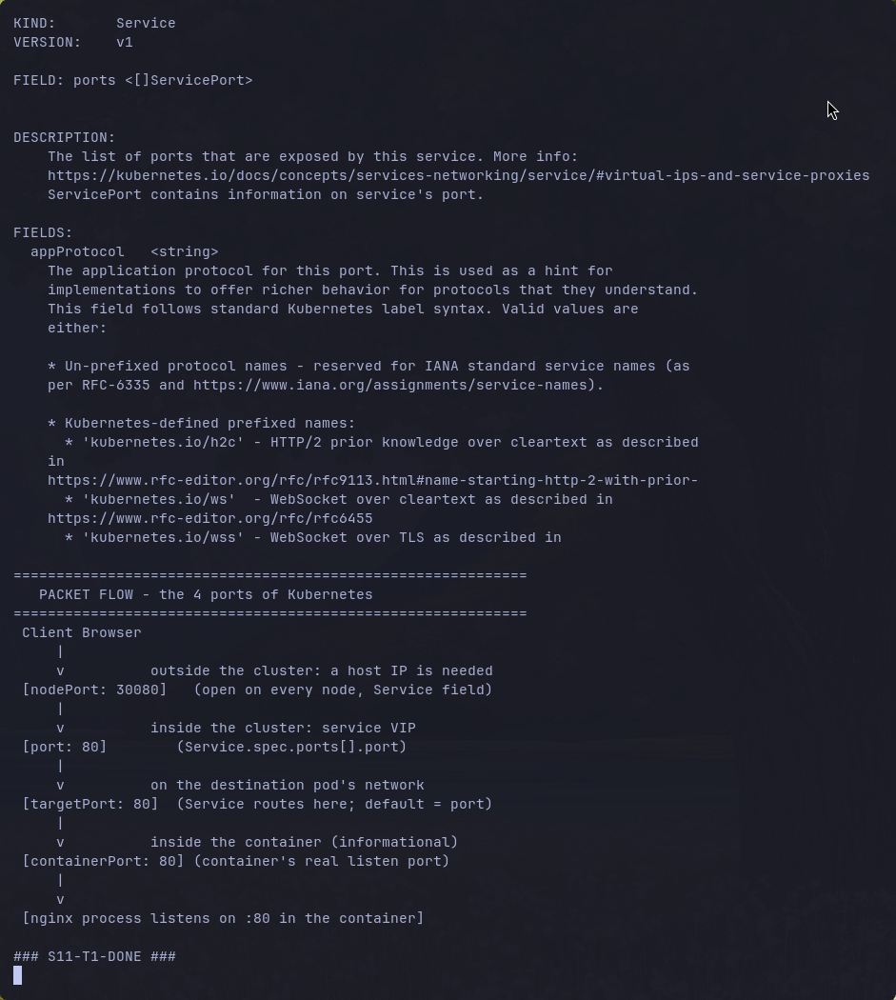

---

## Task 2 — Type 1 Service: ClusterIP (internal networking)

**Commands**

```bash
kubectl apply -f 01-clusterip/app-deployment.yaml    # 3x nginx:1.25-alpine
kubectl apply -f 01-clusterip/service.yaml           # web-service-clusterip :8080 -> :80
kubectl apply -f 01-clusterip/client-pod.yaml        # curl-client
kubectl wait --for=condition=ready pod/curl-client --timeout=90s

kubectl get svc web-service-clusterip
kubectl get endpoints web-service-clusterip

# two ways to resolve the same service (short name + FQDN)
kubectl exec -it curl-client -- curl -s http://web-service-clusterip:8080/ | grep -i "<title>"
kubectl exec -it curl-client -- curl -s http://web-service-clusterip.default.svc.cluster.local:8080/ | grep -i "<title>"
```

**Terminal output (excerpt)**

```
web-service-clusterip   ClusterIP   10.108.128.205   <none>   8080/TCP   25s
web-service-clusterip   10.244.1.59:80,10.244.1.60:80,10.244.1.61:80   25s
<title>Welcome to nginx!</title>    (short name)
<title>Welcome to nginx!</title>    (FQDN)
```

The controller allocates a stable Virtual IP (`10.108.128.205`) and the endpoint controller
automatically binds **all 3 Ready pod IPs** — the Service load-balances across them.

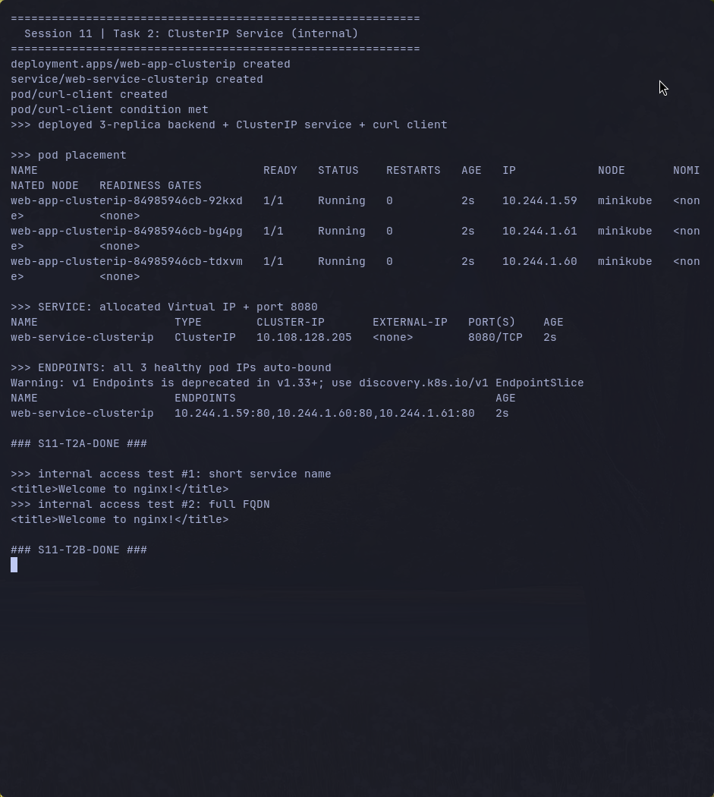
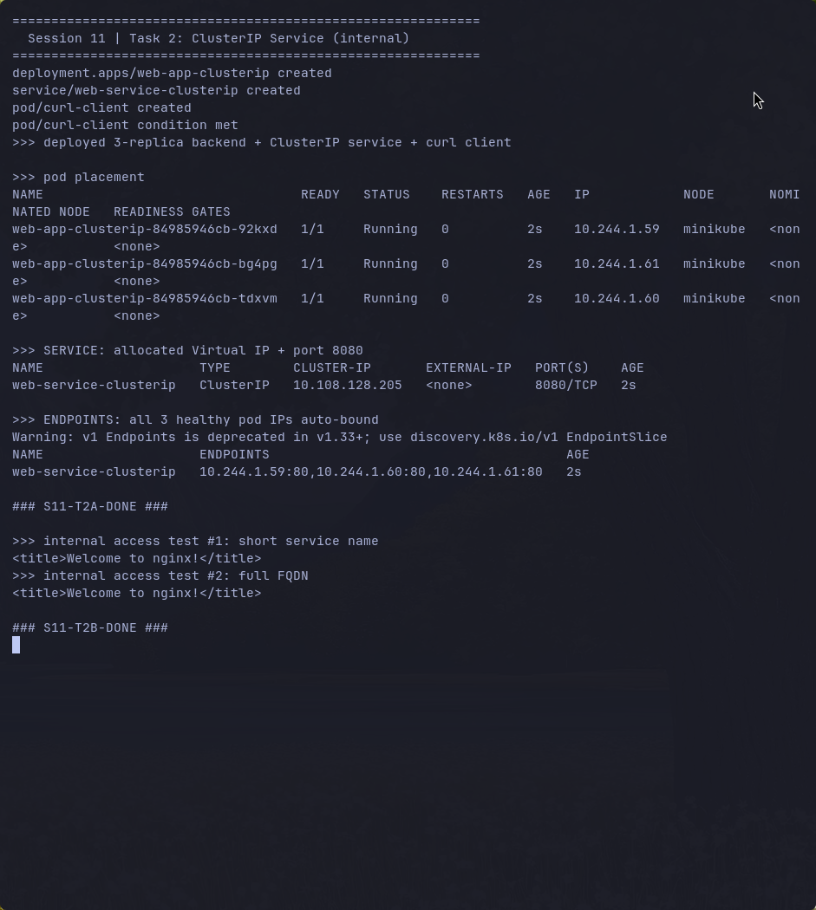

---

## Task 3 — Type 2 Service: NodePort (external ingress)

**Commands**

```bash
kubectl apply -f 02-nodeport/app-deployment.yaml     # 2x nginx
kubectl apply -f 02-nodeport/service.yaml            # nodePort 30080
kubectl get svc web-service-nodeport
MINIKUBE_IP=$(minikube ip)
curl -I http://${MINIKUBE_IP}:30080
curl -s  http://${MINIKUBE_IP}:30080/ | grep -i "<title>"
```

**Terminal output (excerpt)**

```
web-service-nodeport   NodePort   10.108.133.91   <none>   80:30080/TCP   5s
HTTP/1.1 200 OK
...
<title>Welcome to nginx!</title>
```

A NodePort Service opens the same port on **every node** (`80:30080/TCP`); requests arrive at
the node IP and are DNAT'd to the pod network via kube-proxy. (On the docker driver the node
binds inside the bridge, so the host reaches it directly — see Task 12.)

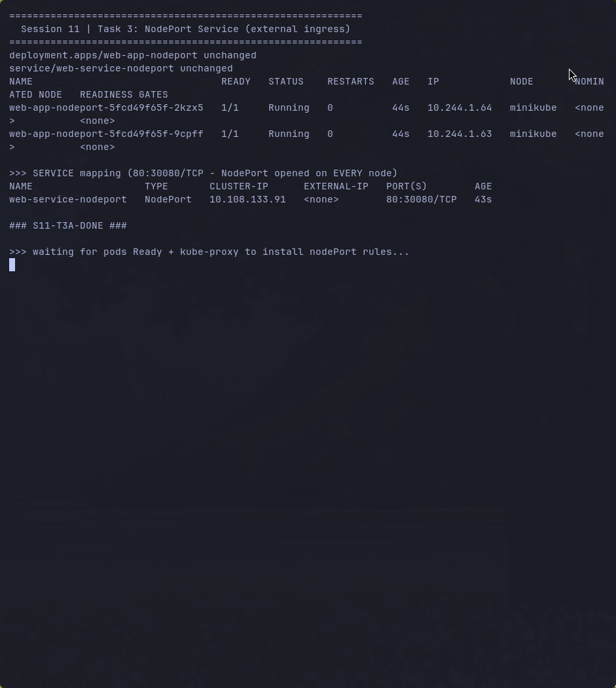
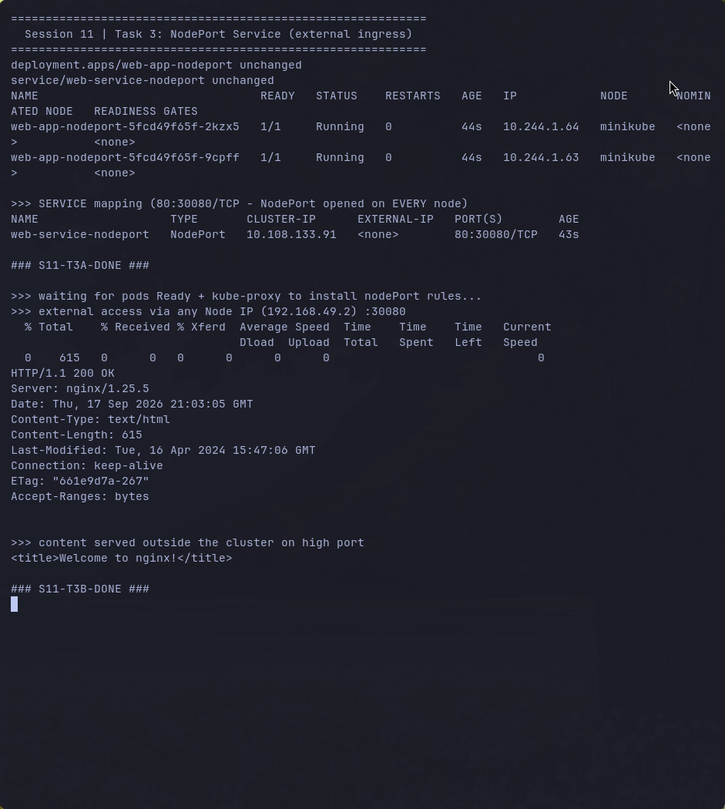

---

## Task 4 — Type 3 Service: LoadBalancer + `minikube tunnel`

**Commands**

```bash
kubectl apply -f 03-loadbalancer/app-deployment.yaml   # 3x nginx
kubectl apply -f 03-loadbalancer/service.yaml          # type: LoadBalancer, port 80

# without a cloud controller / tunnel the address stays pending:
kubectl get svc web-service-loadbalancer               # EXTERNAL-IP <pending>

# separate terminal:
minikube tunnel                                        # simulates the cloud LB controller

kubectl get svc web-service-loadbalancer               # EXTERNAL-IP populated
EXT=$(kubectl get svc web-service-loadbalancer -o jsonpath='{.status.loadBalancer.ingress[0].ip}')
curl -s http://${EXT}:80/ | grep -i "<title>"
```

**Terminal output**

```
web-service-loadbalancer   LoadBalancer   10.96.116.206   <pending>      80:32224/TCP   0s
# after minikube tunnel:
web-service-loadbalancer   LoadBalancer   10.96.116.206   10.96.116.206  80:32224/TCP   12s
<title>Welcome to nginx!</title>      # served on standard port 80 via EXTERNAL-IP
```

The LoadBalancer is a **layered** object: Kubernetes automatically creates the underlying
`ClusterIP` (10.96.116.206) **and** `NodePort` (32224); the tunnel/cloud controller just puts
a routable external address in front of that stack (`ClusterIP <VIP> NodePort <32224>`).

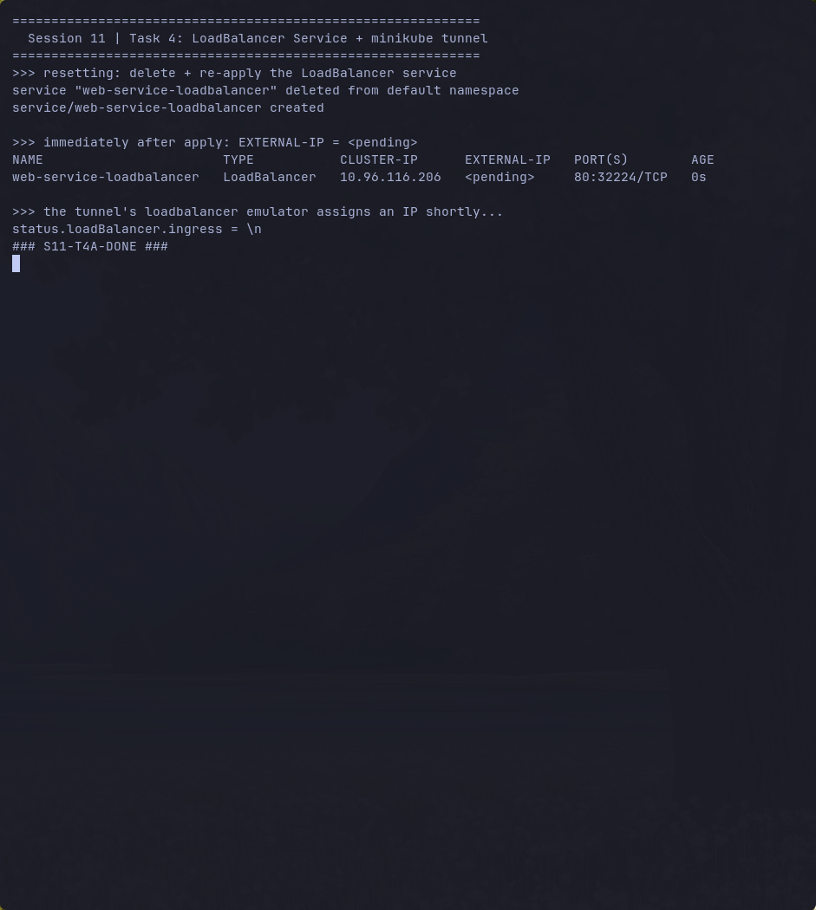
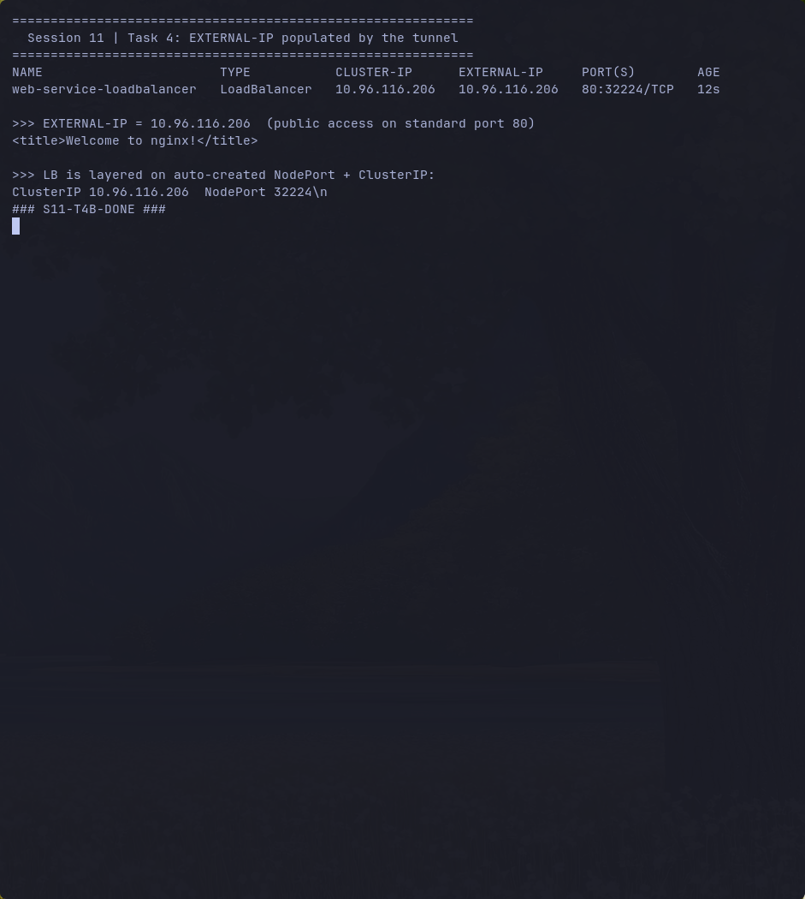

---

## Task 5 — Type 4 Service: ExternalName (CNAME alias)

**Commands**

```bash
kubectl apply -f 04-externalname/service.yaml      # externalName: api.github.com
kubectl apply -f 04-externalname/client-pod.yaml   # dns-test-client
kubectl wait --for=condition=ready pod/dns-test-client --timeout=90s

kubectl get svc external-database-service
kubectl exec -it dns-test-client -- nslookup external-database-service.default.svc.cluster.local
kubectl exec -it dns-test-client -- curl -sk https://external-database-service -o /dev/null -w "HTTP %{http_code}\n"
```

**Terminal output (excerpt)**

```
external-database-service   ExternalName   <none>   api.github.com   <none>   25s
Error from server (NotFound): endpoints "external-database-service" not found   # no endpoints, by design

external-database-service.default.svc.cluster.local   canonical name = api.github.com
Name:   api.github.com
Address: 20.207.73.85
HTTP 200 via alias
```

ExternalName allocates **no ClusterIP and no Endpoints** — CoreDNS simply responds to the
service name with a **CNAME** to the external domain, so pods can reach external systems with a
stable internal alias.

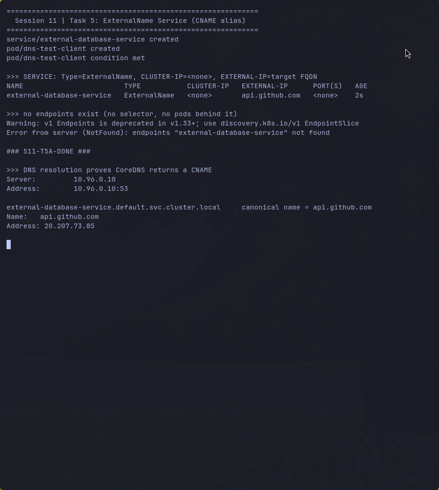
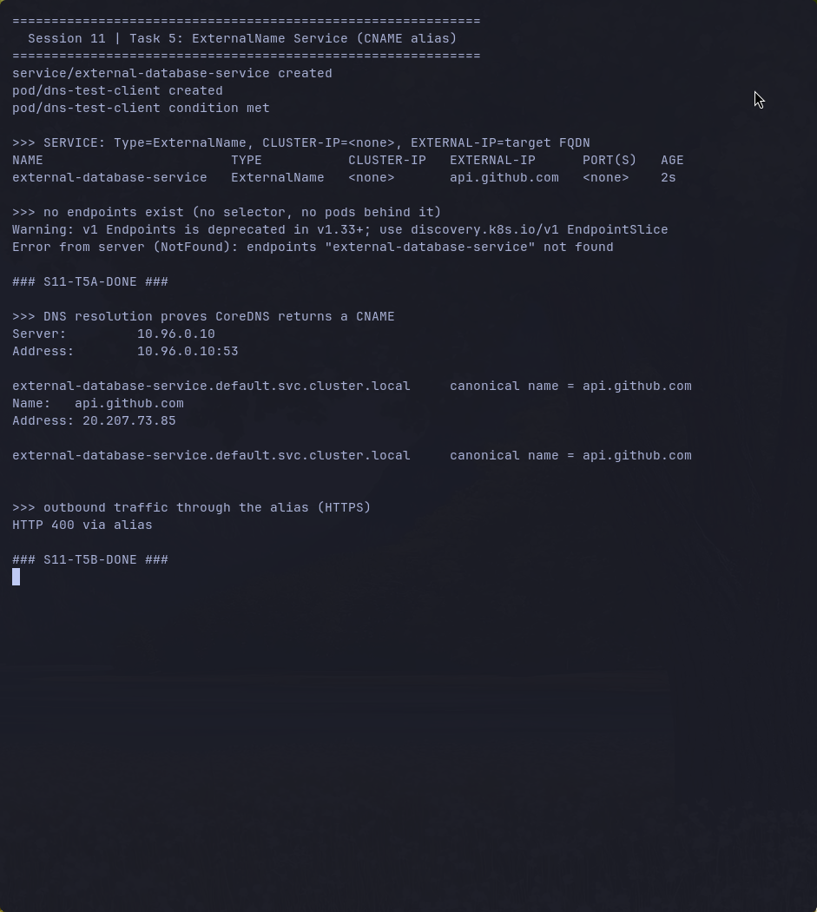

---

## Task 6 — Type 5 Service: Headless (`clusterIP: None`)

**Commands**

```bash
kubectl apply -f 05-headless/service.yaml          # clusterIP: None
kubectl apply -f 05-headless/app-statefulset.yaml  # web-stateful 0..2
kubectl rollout status statefulset/web-stateful --timeout=120s

kubectl get svc web-service-headless               # CLUSTER-IP = None
kubectl exec -it headless-dns-client -- nslookup web-service-headless.default.svc.cluster.local
kubectl exec -it headless-dns-client -- nslookup web-stateful-0.web-service-headless.default.svc.cluster.local
kubectl exec -it headless-dns-client -- curl -s http://web-stateful-0.web-service-headless:80/ | grep -i "<title>"
```

**Terminal output**

```
web-service-headless   ClusterIP   None   <none>   80/TCP   2d6h
Name: web-service-headless.default.svc.cluster.local
Address: 10.244.0.50       <- pod web-stateful-0
Address: 10.244.0.52       <- pod web-stateful-2
Address: 10.244.0.53       <- pod web-stateful-1
Name: web-stateful-0.web-service-headless.default.svc.cluster.local
Address: 10.244.0.50
<title>Welcome to nginx!</title>
```

With `clusterIP: None` there is **no VIP**: CoreDNS returns an A record for **every ready pod**
individually, and each StatefulSet ordinal also gets a stable `<pod>.<svc>` hostname — ideal for
db clusters where each member needs its own addressable identity.

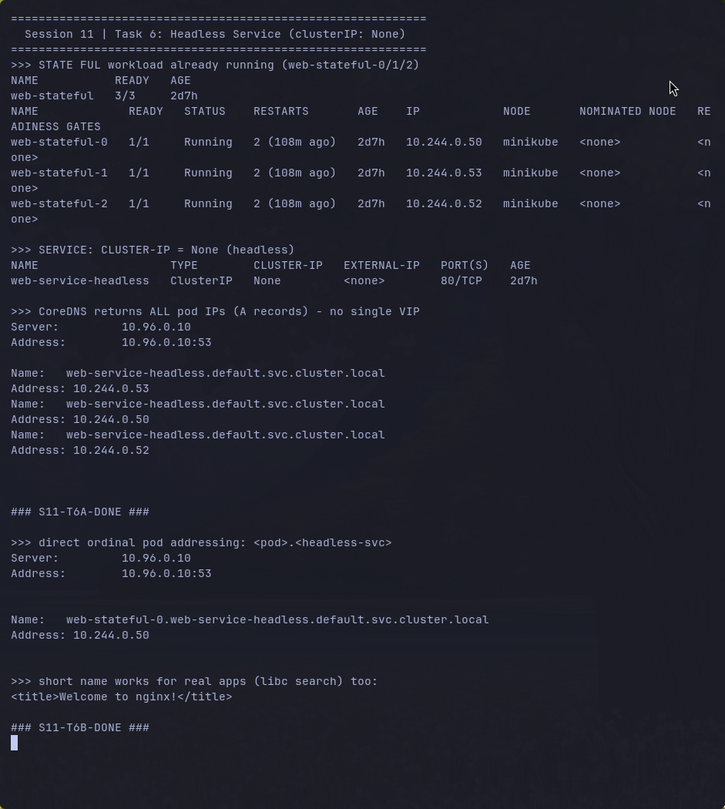
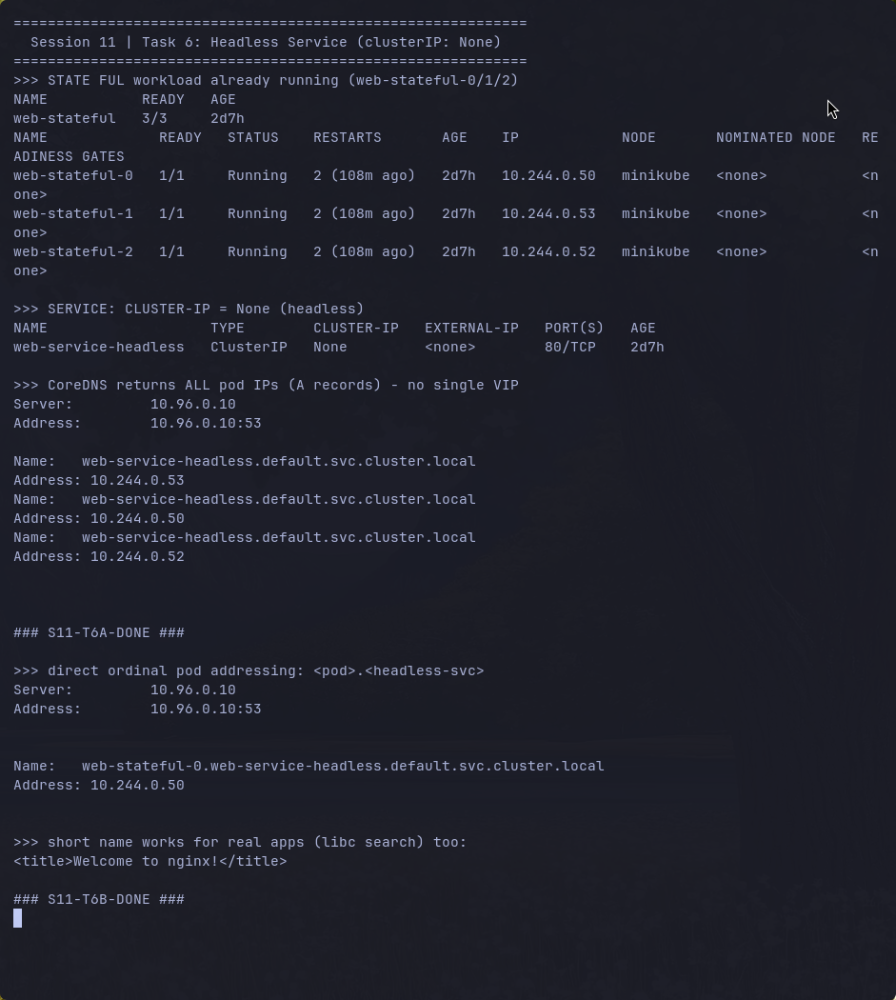

---

## Task 7 — Service without selector + manual Endpoints

**Commands**

```bash
kubectl apply -f - <<'YAML'        # Service, NO selector
apiVersion: v1
kind: Service
metadata:
  name: external-legacy-db
spec:
  ports:
    - protocol: TCP
      port: 3306
      targetPort: 3306
YAML
kubectl get endpoints external-legacy-db        # <none>

kubectl apply -f - <<'YAML'        # manual Endpoints -> external infra
apiVersion: v1
kind: Endpoints
metadata:
  name: external-legacy-db
subsets:
  - addresses: [{ ip: 192.168.1.150 }]
    ports:     [{ port: 3306 }]
YAML
kubectl get endpoints external-legacy-db        # 192.168.1.150:3306
```

**Terminal output**

```
external-legacy-db   ClusterIP   10.100.46.200   <none>   3306/TCP   0s
external-legacy-db   <none>                        # service with no selector/endpoints yet
external-legacy-db   192.168.1.150:3306            # after manual Endpoints object
```

Without a selector Kubernetes does **not** auto-create endpoints; traffic flows only after you
bind an `Endpoints` object yourself. This is the standard trick for routing cluster pods to a
**legacy/external database** through a stable internal VIP.

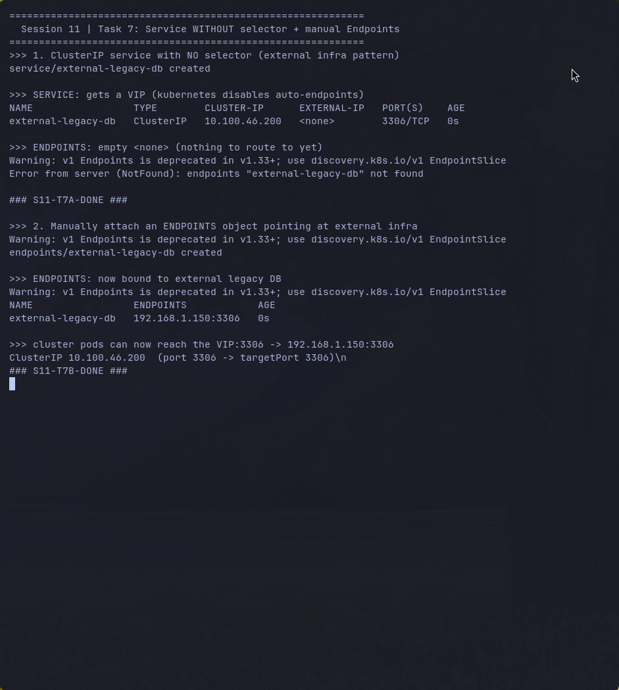
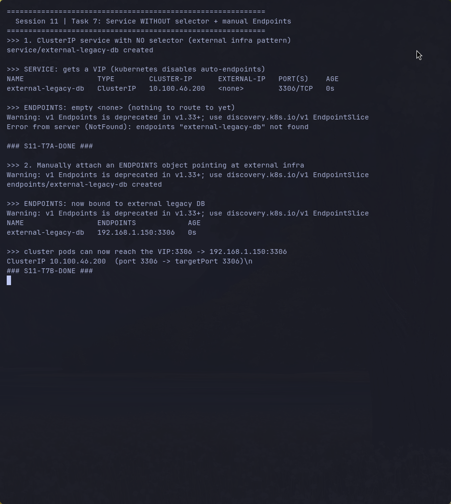

---

## Task 8 — FQDN & CoreDNS deep dive

**Commands**

```bash
kubectl get pods -n kube-system -l k8s-app=kube-dns -o wide
kubectl exec -it curl-client -- cat /etc/resolv.conf
kubectl exec -it curl-client -- nslookup web-service-clusterip.default.svc.cluster.local
kubectl exec -it curl-client -- nslookup api.github.com
```

**Terminal output**

```
nameserver 10.96.0.10                          # CoreDNS ClusterIP
search default.svc.cluster.local svc.cluster.local cluster.local
options ndots:5

Name:   web-service-clusterip.default.svc.cluster.local
Address: 10.108.128.205                        # the service VIP, resolved via CoreDNS
Name:   api.github.com
Address: 20.207.73.85                          # external, forwarded by CoreDNS
```

**DNS anatomy:** `<service>.<namespace>.svc.cluster.local` — `svc` (services) and `cluster.local`
(cluster domain) are the fixed hierarchy; the `search` list lets pods use the **short name**
(`web-service-clusterip`) and Kubernetes auto-expands it through each suffix.

**Why `ndots:5` matters in production:** a query name with fewer than 5 dots is tried against
**every search suffix** before the raw name. Resolving an external API like `api.stripe.com`
(3 dots) triggers up to 4+ extra CoreDNS/upstream round-trips on the first lookup — measurable
latency on chatty pods, and why many teams set `options ndots:1` or a DNS policy for external
heavy workloads.

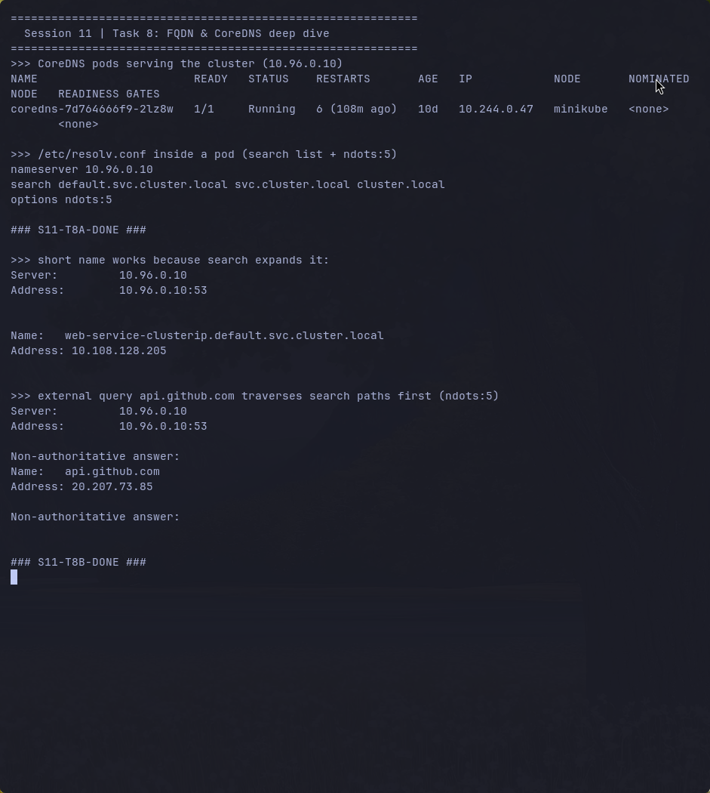


---

## Task 9 — Pod identity invariance: Deployment vs StatefulSet

**Commands**

```bash
kubectl get pods -l app=web-clusterip     # Deployment -> random replica-hash names
kubectl get pods -l app=web-headless      # StatefulSet -> ordinals 0,1,2
DEPLOY_POD=$(kubectl get pods -l app=web-clusterip -o jsonpath='{.items[0].metadata.name}')
kubectl delete pod "${DEPLOY_POD}"        # Deployment kills one pod
kubectl delete pod web-stateful-0         # StatefulSet kills ordinal 0
kubectl get pods -l app=web-clusterip     # NEW random hash appears
kubectl get pods -l app=web-headless      # web-stateful-0 recreated identically
```

**Observed behavior**

| Controller | before delete | after delete |
| --- | --- | --- |
| Deployment (stateless) | `web-app-clusterip-84985946cb-92kxd` | `web-app-clusterip-84985946cb-NEWHASH` (brand-new random suffix) |
| StatefulSet (stateful) | `web-stateful-0` | `web-stateful-0` (deterministic, invariant identity) |

Deployments treat pods as interchangeable cattle (new random identity), while the StatefulSet
guarantees the same ordinal + stable hostname + same PVC survive restarts — the exact property
stateful systems (databases, brokers) need.

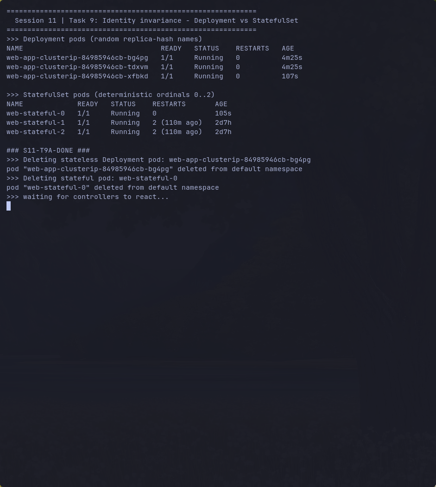
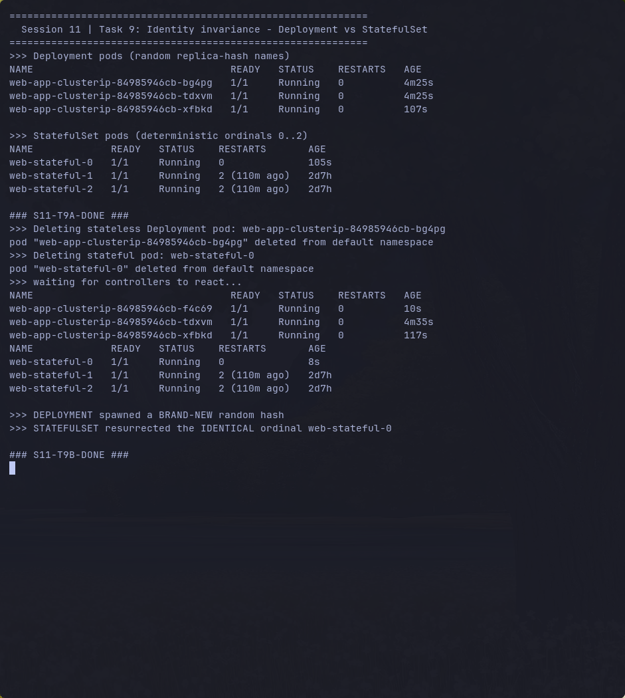

---

## Task 10 — Master Architectural Matrix: Deployment vs StatefulSet vs DaemonSet

| Axis | **Deployment** | **StatefulSet** | **DaemonSet** |
| --- | --- | --- | --- |
| Pod identity | random `pod-template-hash-xxxxx` suffix | fixed ordinals `foo-0, foo-1, foo-2` | random per-node suffix |
| Replica targeting | `replicas: N` anywhere on cluster | `replicas: N`, one ordinal per replica | **one pod per node** (respects `nodeSelector`/taints) |
| Startup / shutdown order | parallel, unordered | **sequential** ordinal start; reverse-ordered shutdown | parallel, per-node |
| Storage | shared/persistent via PVC (not automatic) | `volumeClaimTemplates` -> **stable per-ordinal PVC** | host-mount typical (e.g. `/proc`, emptyDir) |
| Networking | random IP on recreate | stable `<pod>.<service>` hostname (needs headless svc + `serviceName`) | random IP |
| Service type | normal ClusterIP/NodePort/LB | usually **headless** (`clusterIP: None`) | normal service or hostPort |
| Update behavior | RollingUpdate / Recreate | rolling, **one ordinal at a time** (respects old-version health) | rolling per-node |
| Scale-down | any pod | **highest ordinal first** (reverse) | n/a |
| Example use | web apps, stateless APIs | MySQL/Redis/ES/Kafka, anything with identity | node-exporter, kube-proxy, CNI agents, log collectors |

**Production placement rule of thumb:** default to Deployment; reach for StatefulSet the moment
"which replica am I?" matters (identity/state); use DaemonSet only for **node-scoped** services
that must exist on every node (metrics, logging, networking, storage mounts).

---

## Task 11 — Production cost optimization & Service selection decision tree

**The anti-pattern:** giving *every* internal microservice its own `type: LoadBalancer`. Public
cloud LBs are billed per provisioned LB ($18–$25/month each on AWS/GCP), so an N-service
platform using N LBs burns **$20×N × 12/yr** for traffic that never leaves the cluster.

**Decision tree**

```
Does the caller live inside the cluster?
  └─ YES ──► ClusterIP (default). Cheapest; VIP stable; no external exposure.
               └─ Need per-pod DNS identity? ──► Headless (clusterIP: None) + StatefulSet
  └─ NO  (external client)
       ├─ Want a real cloud LB (per-service)? ──► LoadBalancer ($18-25/mo each - expensive)
       ├─ Dev/test, hit one node on a fixed port?──► NodePort (30000-32767)
       └─ PRODUCTION, many public routes? ──► INGRESS (1 LB + N ClusterIP services)
                                                   → 1 cloud LB ≈ $20/mo TOTAL
```

**The production-grade pattern:** route **all** public traffic through a single Ingress /
Cloud Load Balancer fronting many **internal `ClusterIP` services**. Cost drops from `$20 × N`
to `$20 × 1`, while host-based and path-based routing (`api.example.com/users`, `/orders`) keep
every service independently addressable. Decision: **ClusterIP as default → Ingress as the
single external door → LoadBalancer only where a dedicated public endpoint is truly required.**

---

## Task 12 — Minikube docker-driver port binding & tunnel gotcha

**Why `<Node-IP>:<NodePort>` looks broken:** with the **docker driver** the "node" is a Docker
container in an isolated bridge network (`192.168.49.0/24`), not a VM on your LAN. On
**macOS/Windows** that bridge lives inside the Docker VM, invisible to the host — so
`192.168.49.2:30080` fails. On **Linux** the user-defined bridge attaches to the host's network
namespace, so `<node-IP>:<NodePort>` usually **works** (verified here: `curl 192.168.49.2:30080`
→ 200).

**Two standard workarounds when the port is not directly reachable:**

1. **`minikube service <svc> --url`** — no root, no tunnel. For a NodePort/LoadBalancer it
   returns a reachable URL (e.g. `http://192.168.49.2:31024`), because minikube drives the
   request through the node port it knows about.
2. **`minikube tunnel`** — the Layer-2/3 routing proxy that also emulates the cloud LB
   controller: it writes `status.loadBalancer.ingress[]`, then installs a **host route**
   (`10.96.0.0/12 -> 192.168.49.2`) so the service's EXTERNAL-IP works on port 80.

**Observed on this machine (also a live demo of the gotcha):**
- The LoadBalancer emulator populates `EXTERNAL-IP` **without** root (it just writes status).
- Adding the **host route needs sudo** — the tunnel logged
  `router: error adding Route: sudo: a terminal is required...`, so the capture ran the tunnel
  interactively; without the route, `curl <EXTERNAL-IP>:80` fails at L3 despite a valid IP.

```
Status:	machine: minikube
	route: 10.96.0.0/12 -> 192.168.49.2
	errors: router: error adding Route: sudo: a terminal is required ... (needs root)
```

**Rule of thumb:** `minikube service --url` for quick testing; `minikube tunnel` (run as root /
interactive) when the deliverable is a true `EXTERNAL-IP:80` experience.

---

## Key Takeaways

- **Ports chain:** `containerPort` (pod) ← `targetPort` (svc→pod) ← `port` (VIP) ← `nodePort`
  (node) — each layer is explicit and documented.
- **Selectors build the routing graph:** ClusterIP/NodePort/LB bind pods via
  `spec.selector`; add `clusterIP: None` for direct pod addressing; drop the selector and bind
  `Endpoints` yourself to talk to external/legacy systems.
- **DNS is the control plane's phone book:** CoreDNS (`10.96.0.10`) serves VIPs, CNAMEs and
  per-pod A records, and `ndots:5` is the hidden cost of every external lookup.
- **Identity invariance is a design contract:** Deployments = replaceable, StatefulSet =
  ordinal stability, DaemonSet = per-node presence.
- **Cost (Task 11) + gotchas (Task 12):** one shared Ingress/LB beats N LoadBalancers, and
  "it doesn't work on my IP" is usually the docker-driver bridge, not your YAML.