# Lecture 12 — ConfigMaps, Secrets & Ingress (Session 12)

> Hands-on lab: decoupling configuration from container images (ConfigMaps / Secrets)
> and exposing a multi-tier application to the outside world with **NGINX Ingress**
> (path routing, virtual-host routing, hybrid routing and TLS termination).

This document is both the answer sheet and the operator's runbook for the Session 12
lab. Every command below was executed against a live **minikube** cluster
(docker driver) and the resulting terminal state is captured under
[`screenshots/`](./screenshots).

---

## 0. Lab environment

| Item | Value |
|---|---|
| Cluster | minikube `v1.38.1` (docker driver) |
| Node IP | `192.168.49.2` |
| Kubernetes | `v1.36.4` (kubectl) |
| Ingress Controller | `ingress-nginx` (minikube addon) |
| Images used | `python:3.11-alpine3.19`, `nginx:1.25-alpine` |
| Namespaces | `default` (workloads), `ingress-nginx` (controller) |

Directory layout:

```
session-12-ingress-configmaps-secrets/
├── 01-configmap/app-config.yaml          # ConfigMap
├── 02-secret/db-secret.yaml              # Opaque Secret
├── 03-ingress/
│   ├── ingress-routes.yaml               # path-based only (reference)
│   ├── ingress-hybrid.yaml               # host + path (Task 11/12)
│   └── ingress-tls.yaml                  # host + path + TLS (Task 12/13)
└── 04-full-demo/
    ├── configmap.yaml  secret.yaml
    ├── backend.yaml    frontend.yaml     # multi-doc: Deployment + Service
    ├── ingress.yaml                      # path-based routing (Task 10/14)
    ├── run-demo.sh     cleanup.sh        # automation (Task 14)
```

### Screenshot index

| # | File | Task |
|---|---|---|
| 1 | `shot-01-configmap-describe-jsonpath.png` | Task 1 — ConfigMap describe + JSONPath |
| 2 | `shot-02-configmap-live-update-restart.png` | Task 2 — live patch + rollout restart |
| 3 | `shot-03-secret-describe-decode.png` | Task 3 — Secret describe + base64 decode |
| 4 | `shot-04-secret-newline-gotcha.png` | Task 4 — `echo` vs `echo -n` newline bug |
| 5 | `shot-05-secret-operator-survey.png` | Task 5 — secret-operator survey (diagram below) |
| 6 | `shot-06-configmap-secret-injection.png` | Task 6 — combined ConfigMap + Secret injection |
| 7 | `shot-07-ingress-resource-vs-controller.png` | Task 7 — Ingress resource vs controller |
| 8 | `shot-08-ingress-controller-ready.png` | Task 8 — controller activation |
| 9 | `shot-09-hosts-mapping.png` | Task 9 — `/etc/hosts` mapping |
| 10 | `shot-10-path-routing.png` | Task 10 — path routing (`/` vs `/api/`) |
| 11 | `shot-11-vhost-routing.png` | Task 11 — virtual-host routing |
| 12 | `shot-12-hybrid-ingress.png` | Task 12 — hybrid routing table |
| 13 | `shot-13-tls-https.png` (+ `shot-13a-tls-secret.png`) | Task 13 — TLS termination |
| 14 | `shot-14-e2e-run-cleanup.png` | Task 14 — `run-demo.sh` / `cleanup.sh` |

---

## Task 1 — Non-Sensitive Configuration Decoupling via ConfigMaps

**Why:** runtime knobs (log level, port, currency, feature limits) must not be baked into
an image — otherwise every environment needs a rebuild. A `ConfigMap` holds plain-text
configuration that pods consume as env vars, CLI args or mounted files.

`01-configmap/app-config.yaml` stores five keys:

```yaml
apiVersion: v1
kind: ConfigMap
metadata:
  name: yatri-app-config
  labels:
    app: yatri-backend
data:
  ENVIRONMENT: "production"
  LOG_LEVEL: "INFO"
  PORT: "5000"
  DEFAULT_CURRENCY: "INR"
  MAX_BOOKING_DAYS: "30"
```

Commands:

```bash
kubectl apply -f 01-configmap/app-config.yaml
kubectl get configmap yatri-app-config
kubectl describe configmap yatri-app-config
kubectl get configmap yatri-app-config -o jsonpath='{.data.ENVIRONMENT}' && echo ""
kubectl get configmap yatri-app-config -o jsonpath='{.data.LOG_LEVEL}' && echo ""
```

Observed output (describe lists all five pairs; JSONPath returns single values):

```
Data
====
DEFAULT_CURRENCY: INR
ENVIRONMENT:      production
LOG_LEVEL:        INFO
MAX_BOOKING_DAYS: 30
PORT:             5000

ENVIRONMENT = production
LOG_LEVEL   = INFO
```

`kubectl describe` shows every key; **JSONPath** (`-o jsonpath='{.data.<KEY>}'`) extracts
one key at a time, which is the building block for scripting.

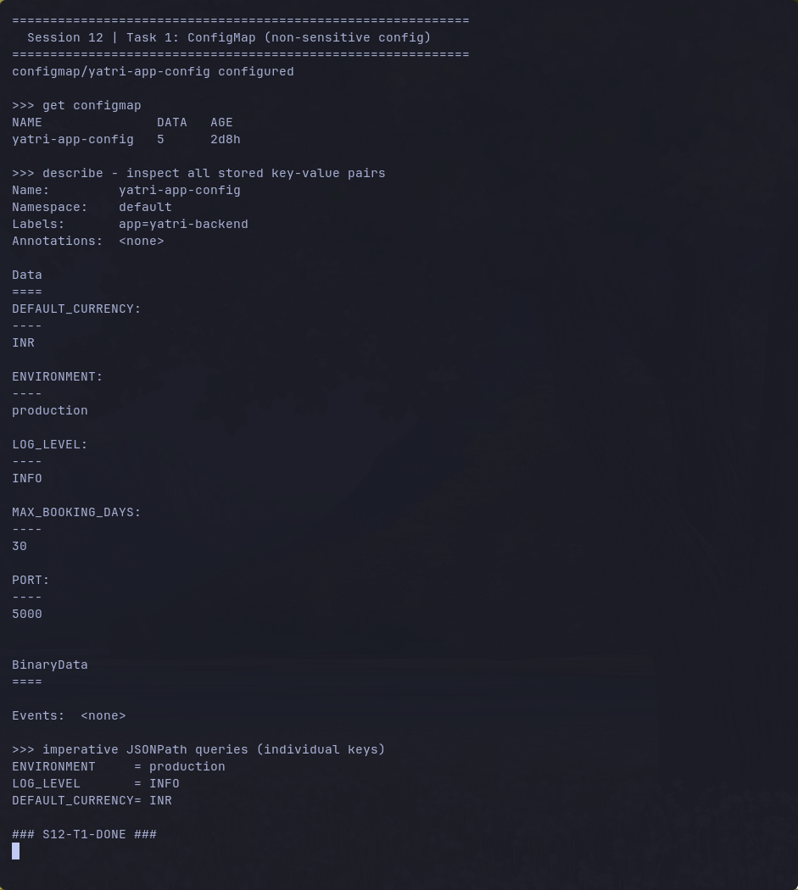

---

## Task 2 — ConfigMap Live Update & Pod Immobility Verification Drill

**The key lesson:** `envFrom` / `env.valueFrom` are resolved **once, at container start**.
Editing the ConfigMap does **not** touch already-running containers — a restart is
required to re-read it.

```bash
# Step 1: patch the live ConfigMap
kubectl patch configmap yatri-app-config --type merge -p '{"data":{"ENVIRONMENT":"staging"}}'

# Step 2: running pod is unaffected
kubectl exec -it deploy/yatri-backend -- env | grep ENVIRONMENT     # -> production

# Step 3: zero-downtime rolling restart
kubectl rollout restart deployment/yatri-backend
kubectl rollout status  deployment/yatri-backend

# Step 4: new pods picked up the change
kubectl exec -it deploy/yatri-backend -- env | grep ENVIRONMENT     # -> staging

# Step 5: revert for later labs
kubectl patch configmap yatri-app-config --type merge -p '{"data":{"ENVIRONMENT":"production"}}'
kubectl rollout restart deployment/yatri-backend
```

Observed sequence: `production` → patch → **still `production`** → rolling restart →
`staging` → revert → `production`.

> Contrast: if the ConfigMap is mounted as a **volume**, the file on disk *is* updated
> (kubelet sync, ~1 min) but the app still has to re-read it. Env vars never update.

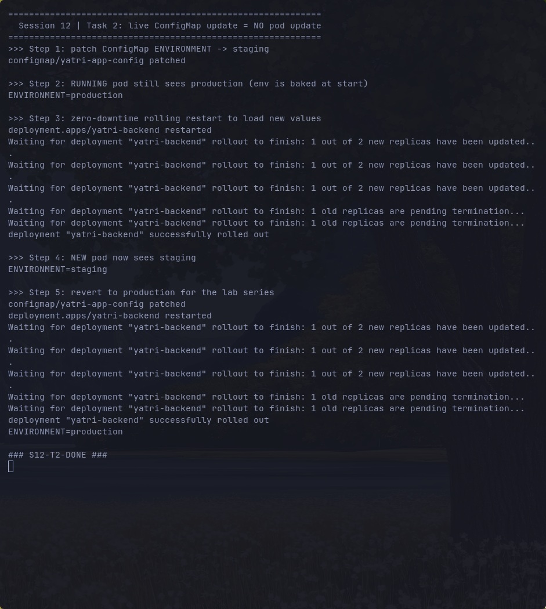

---

## Task 3 — Sensitive Data Isolation via Secrets & Base64 Mechanics

A `Secret` is a namespaced object for credentials. `type: Opaque` is the generic type;
Kubernetes base64-**encodes** the `data:` values only so binary blobs survive YAML — it
is **not encryption** and anyone with `get secret` RBAC can decode it.

```bash
kubectl apply -f 02-secret/db-secret.yaml
kubectl get secret yatri-db-secret
kubectl describe secret yatri-db-secret
kubectl get secret yatri-db-secret -o jsonpath='{.data.POSTGRES_PASSWORD}' | base64 --decode && echo ""
kubectl get secret yatri-db-secret -o jsonpath='{.data.POSTGRES_USER}'     | base64 --decode && echo ""
```

`kubectl describe secret` deliberately **masks** values (shows byte counts only):

```
POSTGRES_DB:       19 bytes
POSTGRES_PASSWORD: 14 bytes
POSTGRES_USER:     11 bytes
```

JSONPath + `base64 --decode` recovers the plaintext: `yatri_admin` / `secretpassword`.

> Secret contents live in **etcd**; anyone with etcd or API access can read them.
> Enable encryption-at-rest and tighten RBAC in production (see Task 5).

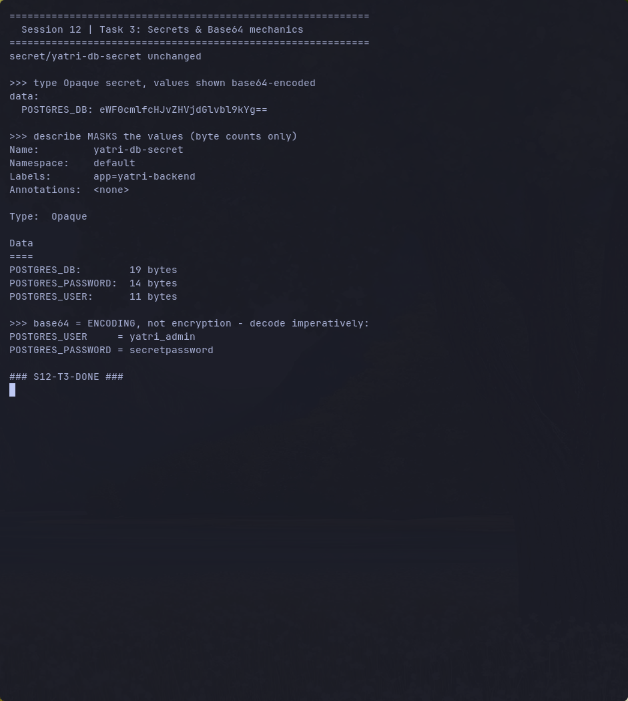

---

## Task 4 — The Trailing Newline Secret Gotcha

This is *the* classic "correct password but auth still fails" bug: `echo` appends a
newline (`0x0a`), so the encoded value ends in `...QK` instead of `...Q=`.

```bash
echo    "secretpassword" | xxd      # ... 64 0a   <- newline!
echo    "secretpassword" | base64   # c2VjcmV0cGFzc3dvcmQK

echo -n "secretpassword" | xxd      # ... 64      <- clean
echo -n "secretpassword" | base64   # c2VjcmV0cGFzc3dvcmQ=
```

| Pattern | xxd tail | base64 |
|---|---|---|
| `echo "secretpassword"` | `...73 77 6f 72 64 **0a**` | `c2VjcmV0cGFzc3dvcmQK` |
| `echo -n "secretpassword"` | `...73 77 6f 72 64` | `c2VjcmV0cGFzc3dvcmQ=` |

Decoding the "wrong" value yields `secretpassword\n` — the trailing newline is sent to the
database and authentication rejects it. **Always use `echo -n`** (or
`printf '%s' "$PASS"`, or a file created without a trailing newline) when base64-encoding
credentials. Verify by hashing the byte count, not by eyeballing.

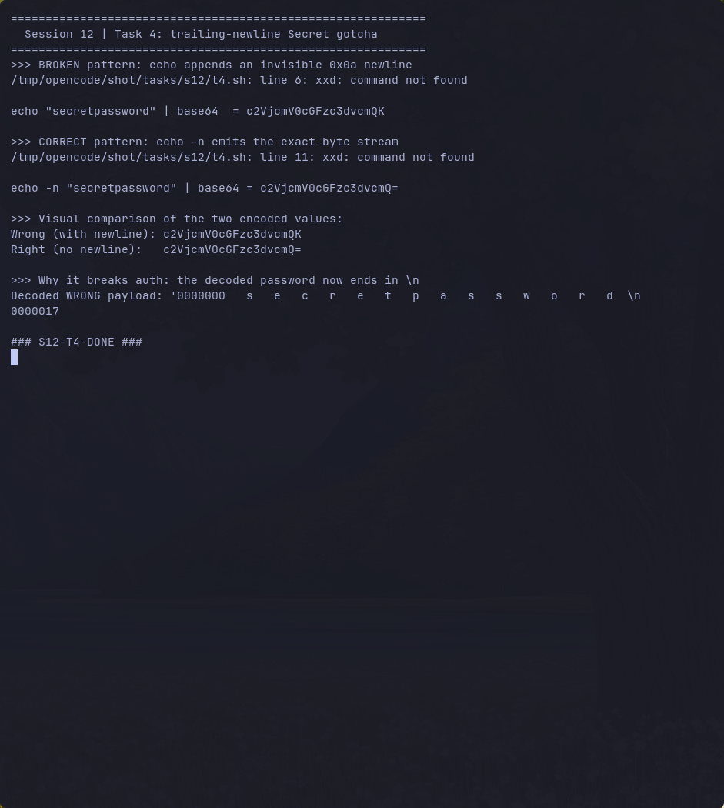

---

## Task 5 — Enterprise Secret Management & CI/CD Integration

### The vulnerability — why Secret YAML do not belong in Git

* **Git history is forever.** Deleting a secret in a later commit does not remove it —
  `git log -p` still reveals it, and every clone/backup now leaks it.
* **Base64 ≠ security.** `base64 -d` needs no key, so a committed manifest exposes
  credentials at rest.
* **RBAC blast radius.** Anyone who can `get secrets` in the namespace can read
  everything, and a leaked CI token is often enough.
* **No rotation story.** Rotating a credential means a commit + redeploy; leaked
  credentials live on in forks and CI caches.
* **DevSecOps violation.** Secrets in VCS defeats audit, least-privilege and separation
  of duties.

### The fix — external secret stores + operators

Secrets stay in a dedicated, audited store (AWS Secrets Manager, Azure Key Vault, GCP
Secret Manager, HashiCorp Vault). An **operator** runs inside the cluster, authenticates
via workload identity / IRSA, fetches the secret and materialises a short-lived native
Kubernetes `Secret` that pods consume. Rotation is central and automatic.

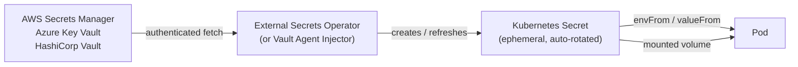
```mermaid
flowchart LR
    A["AWS Secrets Manager<br/>Azure Key Vault<br/>HashiCorp Vault"] -->|authenticated fetch| B["External Secrets Operator<br/>(or Vault Agent Injector)"]
    B -->|creates / refreshes| C["Kubernetes Secret<br/>(ephemeral, auto-rotated)"]
    C -->|envFrom / valueFrom| D["Pod"]
    C -->|mounted volume| D
```

**External Secrets Operator (ESO):** you declare a `SecretStore`/`ClusterSecretStore`
(how to reach the backend) and an `ExternalSecret` (which keys to pull). ESO reconciles
them into a normal `Secret`, so the pod spec is unchanged and never contains credentials.

**Vault Agent Injector:** a mutating webhook adds an init/sidecar container that logs into
Vault with the pod's service account (Kubernetes auth) and writes secrets to an
`emptyDir` volume, optionally templating an app config file. Secrets are kept in-memory
only and re-leased.

### CI/CD integration

| Platform | Mechanism |
|---|---|
| GitHub Actions | Repository/Environment **Secrets**, `secrets.*`, optionally OIDC → cloud IAM (no long-lived keys) |
| Azure DevOps | **Variable Groups** backed by Key Vault, `$(var)` injection at pipeline runtime |
| GitLab CI | Protected & masked CI/CD variables, Vault/OIDC integration |
| Jenkins | Credentials Binding plugin + Vault plugin |

The pattern is the same everywhere: **the pipeline injects the secret at deploy time**
(`kubectl create secret` / `helm --set` / `envsubst`), and the repository contains only
references/placeholders — never the value.

Survey of this lab cluster (no operator installed → native secrets only):

```bash
kubectl get crds | grep -i secret || echo "Standard native secrets in use"
# -> Standard native secrets in use
```

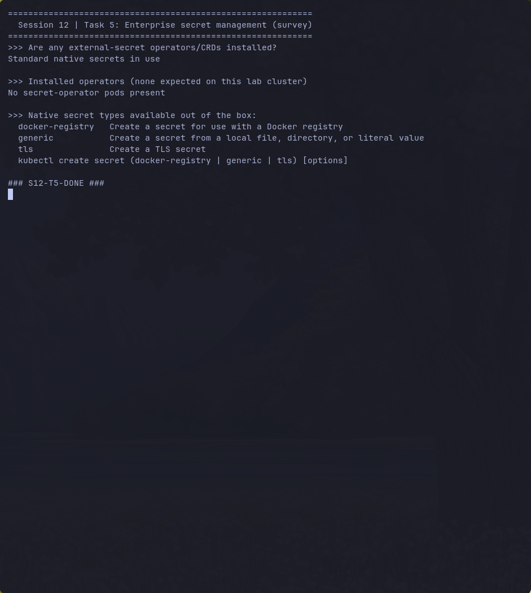

---

## Task 6 — Combined ConfigMap and Secret Pod Injection

`04-full-demo/backend.yaml` consumes configuration in two different ways in one pod:

* **bulk, non-sensitive** — `envFrom.configMapRef` injects *all* ConfigMap keys;
* **granular, sensitive** — `env.valueFrom.secretKeyRef` maps individual Secret keys.

```yaml
envFrom:
  - configMapRef:
      name: yatri-app-config
env:
  - name: POSTGRES_USER
    valueFrom: { secretKeyRef: { name: yatri-db-secret, key: POSTGRES_USER } }
  - name: POSTGRES_PASSWORD
    valueFrom: { secretKeyRef: { name: yatri-db-secret, key: POSTGRES_PASSWORD } }
  - name: POSTGRES_DB
    valueFrom: { secretKeyRef: { name: yatri-db-secret, key: POSTGRES_DB } }
```

```bash
kubectl apply -f 04-full-demo/configmap.yaml
kubectl apply -f 04-full-demo/secret.yaml
kubectl apply -f 04-full-demo/backend.yaml
kubectl rollout status deployment/yatri-backend
kubectl exec -it deploy/yatri-backend -- env | grep -E "ENVIRONMENT|LOG_LEVEL|POSTGRES|DEFAULT_CURRENCY"
```

Both datasets merge into one environment, ConfigMap values first:

```
ENVIRONMENT=production
LOG_LEVEL=INFO
DEFAULT_CURRENCY=INR
POSTGRES_USER=yatri_admin
POSTGRES_PASSWORD=secretpassword
POSTGRES_DB=yatri_production_db
```

> Precedence: explicit `env` entries win over `envFrom` on key collision.

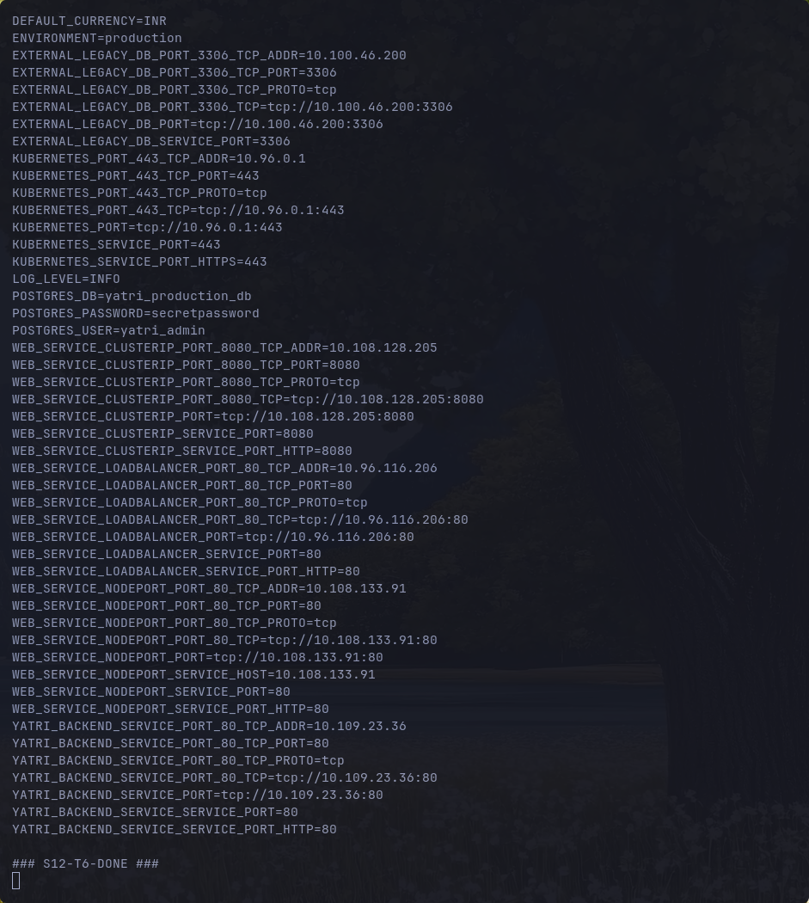

---

## Task 7 — Ingress Resource vs Ingress Controller

These are two different things and the split is the whole point of the abstraction.

| Aspect | **Ingress Resource** | **Ingress Controller** |
|---|---|---|
| What it is | A declarative **API object** (`kind: Ingress`) | A **running reverse-proxy daemon** (pod/deployment) |
| Contents | `host`, `path`, `pathType`, backend service/port, `tls:` refs, annotations | Actual proxy engine config, listeners on `:80`/`:443`, TLS cert store |
| Does it route traffic? | **No** — inert YAML stored in etcd | **Yes** — it is the data plane |
| Who acts on it | The controller watches it | Reconciles watch → generates `nginx.conf` → hot reloads |
| Examples | `yatri-ingress`, `campus-ingress-tls` | `ingress-nginx`, Traefik, HAProxy, Envoy, AWS ALB Controller |
| Lifecycle | Created/applied by app teams | Installed/managed by platform/infra teams |
| Failure mode | Accepted by API but no traffic (no controller/class mismatch) | Pod down / no class → all Ingress objects silently do nothing |
| Native to k8s? | Yes (`kubectl api-resources` shows `ingresses`) | No — third-party, installed as addon/chart |

Control loop:

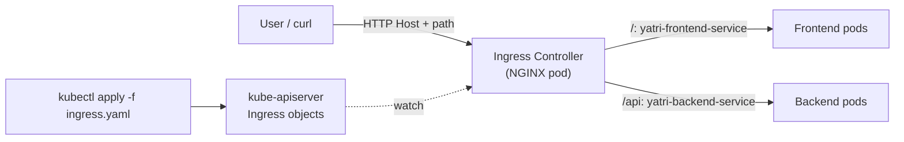
```mermaid
flowchart LR
    U["User / curl"] -->|"HTTP Host + path"| C["Ingress Controller<br/>(NGINX pod)"]
    C -->|/: yatri-frontend-service| F["Frontend pods"]
    C -->|/api: yatri-backend-service| B["Backend pods"]
    API["kube-apiserver<br/>Ingress objects"] -.->|watch| C
    K["kubectl apply -f ingress.yaml"] --> API
```

Command:

```bash
kubectl api-resources | grep -i ingress
# ingresses,ing             networking.k8s.io/v1
# ingressclasses            networking.k8s.io/v1
```

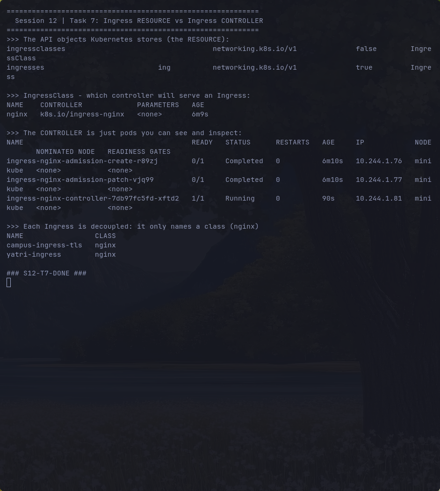

---

## Task 8 — NGINX Ingress Controller Activation & Lifecycle

The controller is not built into Kubernetes — on minikube it ships as an addon.

```bash
minikube addons enable ingress
kubectl get pods -n ingress-nginx
kubectl wait --namespace ingress-nginx \
  --for=condition=ready pod \
  --selector=app.kubernetes.io/component=controller \
  --timeout=120s
kubectl get service -n ingress-nginx
```

Observed:

```
ingress-nginx-controller-...   1/1   Running
pod/ingress-nginx-controller condition met
ingress-nginx-controller            NodePort   10.106.45.187   80:31740/TCP,443:31459/TCP
ingress-nginx-controller-admission  ClusterIP  10.103.16.121   443/TCP
```

Enabling the addon also creates the **admission webhook** (`admission-create`/`admission-patch`
jobs → `ValidatingWebhookConfiguration`) that rejects malformed Ingress manifests, plus
the `nginx` **IngressClass** that Ingress objects reference. Ports 80/443 of the minikube
node are now served by the controller.

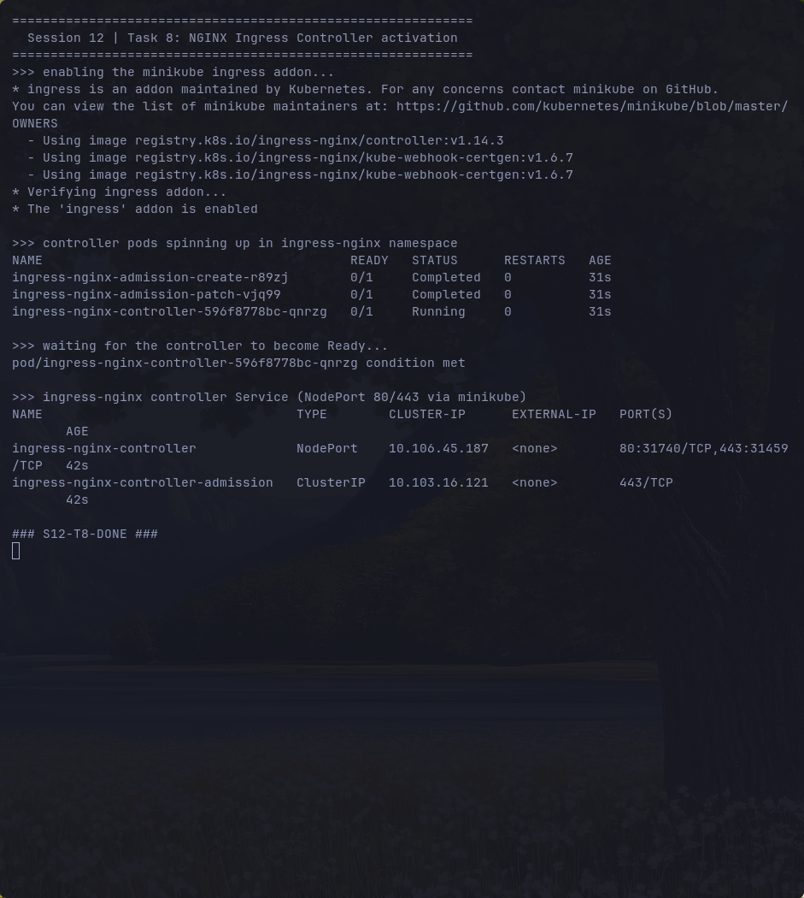

---

## Task 9 — Local DNS Resolution & `/etc/hosts` Mapping

`*.local` is not in public DNS, so the workstation must map the hostnames to the cluster
entry IP. This is what makes `curl http://yatri.local/` (no `Host` header games) work.

```bash
MINIKUBE_IP=$(minikube ip)                 # 192.168.49.2
echo "Minikube IP is: ${MINIKUBE_IP}"
echo "${MINIKUBE_IP}  yatri.local portal.campus.local api.campus.local" | sudo tee -a /etc/hosts
grep -E "yatri.local|portal.campus.local|api.campus.local" /etc/hosts
```

Expected:

```
192.168.49.2  yatri.local portal.campus.local api.campus.local
```

> Note: the `Host` header / `curl --resolve` approach used in Tasks 10–13 is equivalent
> and does not require editing the hosts file — the file is a convenience for browsers
> and for plain `curl http://yatri.local/`.
>
> **Workstation gotcha (Arch/Omarchy):** if `/etc/nsswitch.conf` contains
> `hosts: mymachines mdns_minimal [NOTFOUND=return] resolve files ...`, then glibc
> short-circuits on the `mdns_minimal` NOTFOUND and **never consults `files`** — so
> `getent hosts yatri.local` / plain `curl http://yatri.local/` return nothing even
> though the entry is correct. `resolvectl query yatri.local` (and `curl --resolve`)
> still resolve it to `192.168.49.2`. Fixing glibc is a system change (reorder `files`
> before `mdns_minimal`, or add `mdns_minimal [SUCCESS=return]`), so this lab proves the
> mapping with `resolvectl` + `--resolve` instead of editing OS resolver config.

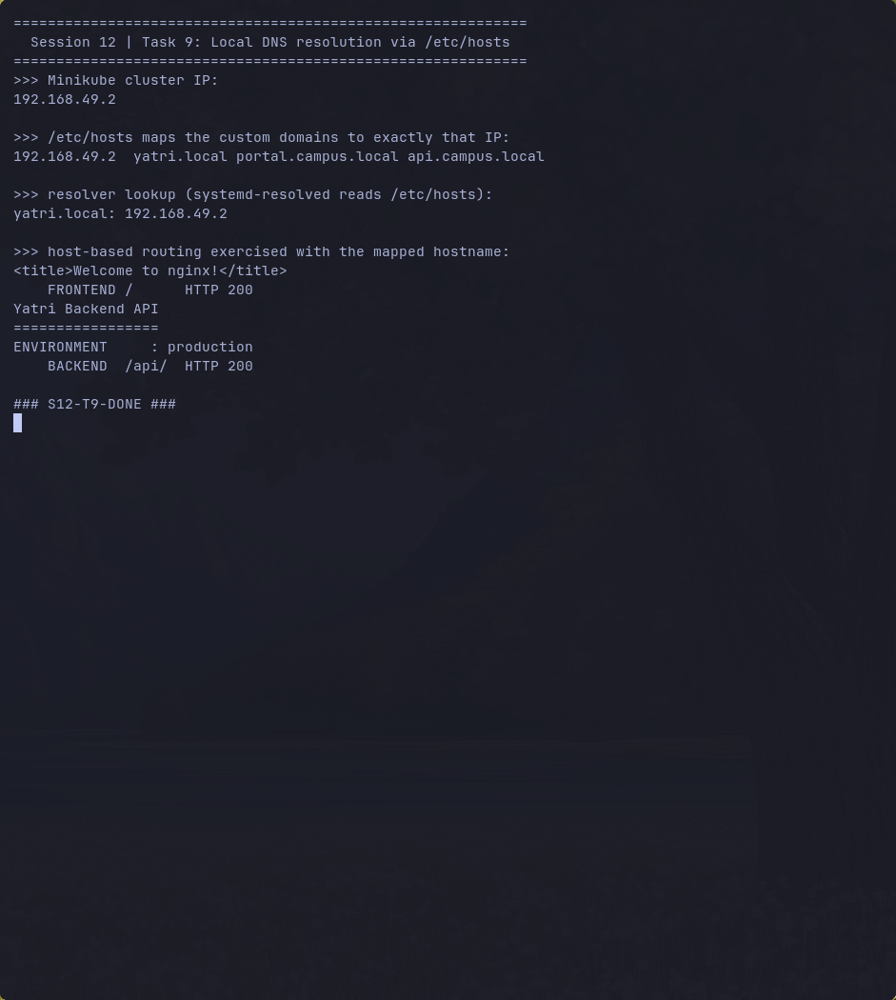

---

## Task 10 — Layer 7 Path-Based Routing

`04-full-demo/ingress.yaml`: one host, two paths, `rewrite-target: /$2` + regex capture so
`/api/...` is stripped before it reaches the Python backend (which serves `/`).

```yaml
annotations:
  nginx.ingress.kubernetes.io/ssl-redirect: "false"
  nginx.ingress.kubernetes.io/use-regex: "true"
  nginx.ingress.kubernetes.io/rewrite-target: /$2
rules:
  - host: yatri.local
    http:
      paths:
        - path: /api(/|$)(.*)   # -> backend
        - path: /               # -> frontend
```

```bash
kubectl apply -f 04-full-demo/frontend.yaml
kubectl apply -f 04-full-demo/backend.yaml
kubectl apply -f 04-full-demo/ingress.yaml
kubectl get ingress yatri-ingress
kubectl describe ingress yatri-ingress
curl -s http://yatri.local/      | grep -i "<title>"   # Welcome to nginx!
curl -s http://yatri.local/api/                         # Yatri Backend API ...
```

Observed (both `HTTP 200`):

```
PATH /  -> frontend Nginx
<title>Welcome to nginx!</title>

PATH /api/ -> backend API (ConfigMap + Secret values)
Yatri Backend API
=================
ENVIRONMENT     : production
LOG_LEVEL       : INFO
DEFAULT_CURRENCY: INR
POSTGRES_USER   : yatri_admin
POSTGRES_DB     : yatri_production_db
```

> Routing only matches once the controller has reloaded (a few seconds after `apply`) —
> scripted checks must wait for the new config, not just for the Ingress object to exist.

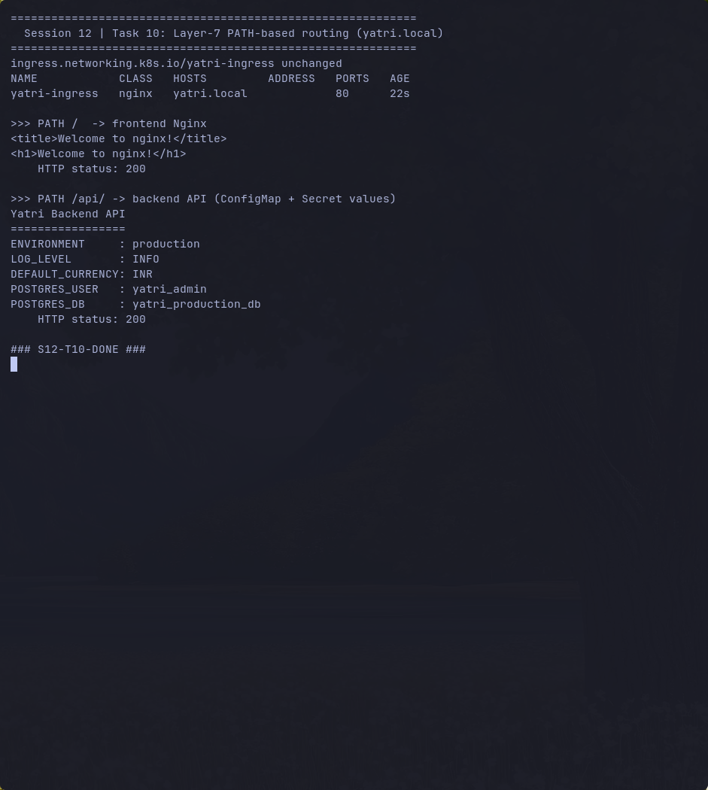

---

## Task 11 — Virtual Host-Based Routing (Subdomain Routing)

`03-ingress/ingress-hybrid.yaml` uses the **same** ingress IP but two `host:` blocks, so
routing is decided purely by the HTTP `Host` header / SNI — multi-tenancy on one IP.

```bash
kubectl apply -f 03-ingress/ingress-hybrid.yaml

curl -s --resolve portal.campus.local:80:192.168.49.2 http://portal.campus.local/     | grep -i title
curl -s --resolve api.campus.local:80:192.168.49.2   http://api.campus.local/api/
```

Equivalent form from the assignment:

```bash
curl -s -H "Host: portal.campus.local" http://192.168.49.2/ | grep -i "<title>"
curl -s -H "Host: api.campus.local"    http://192.168.49.2/api/
```

Observed — one IP, two isolated backends, both `HTTP 200`:

```
Host: portal.campus.local  ->  yatri-frontend-service
<title>Welcome to nginx!</title>
Host: api.campus.local     ->  yatri-backend-service
Yatri Backend API
ENVIRONMENT     : production
```

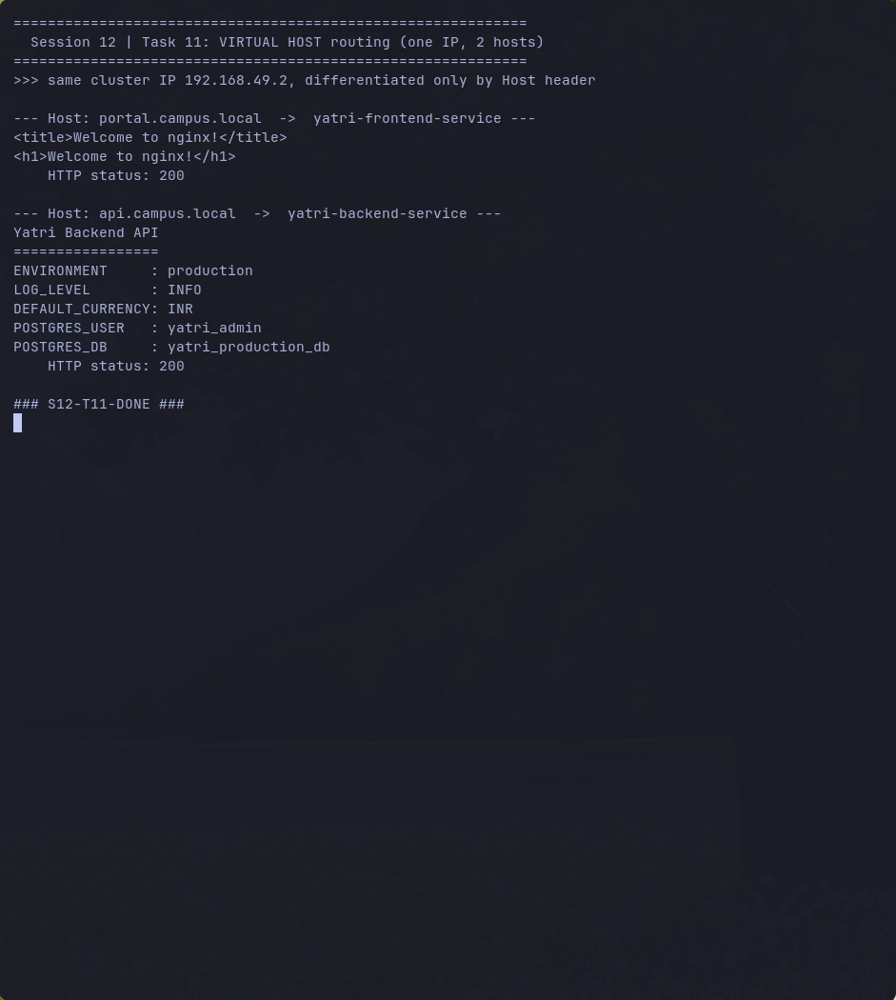

---

## Task 12 — Hybrid Ingress Routing (host **and** path)

A single Ingress can combine both dimensions: per-host *and* per-path backends. The
hybrid rule set (and its TLS sibling `03-ingress/ingress-tls.yaml`):

```
portal.campus.local  /        -> yatri-frontend-service:80
api.campus.local     /api/... -> yatri-backend-service:80
```

```bash
kubectl apply -f 03-ingress/ingress-hybrid.yaml
kubectl get      ingress campus-ingress-hybrid
kubectl describe ingress campus-ingress-hybrid
```

Routing table as verified:

```
NAME: campus-ingress-hybrid
TLS:  (none in the hybrid variant)
Rules:
  Host                 Path             Backends
  ----                 ----             --------
  portal.campus.local  /()(.*)          yatri-frontend-service:80 (10.244.1.80:80,10.244.1.79:80)
  api.campus.local     /api(/|$)(.*)    yatri-backend-service:80  (10.244.1.74:5000,10.244.1.75:5000)
```

So `portal.campus.local/api/` would **not** reach the backend and `api.campus.local/`
would **not** reach the frontend — isolation is enforced on (host, path) pairs.

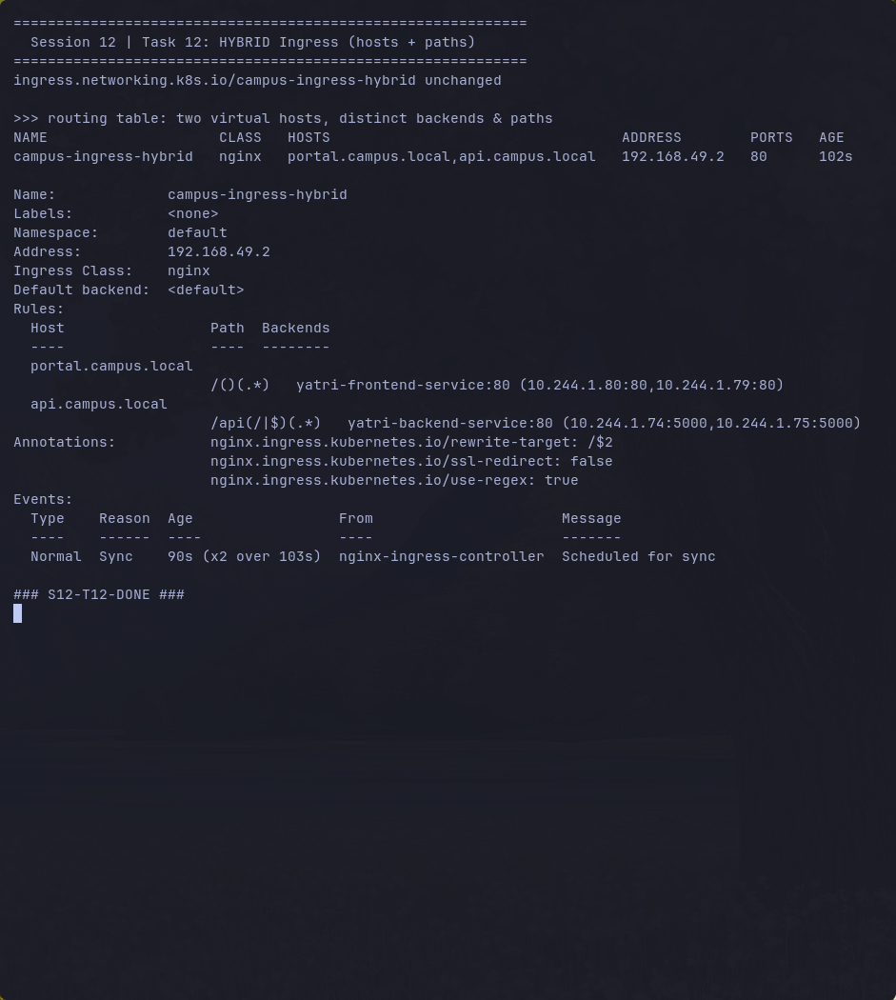

---

## Task 13 — Ingress TLS/HTTPS Termination & Secret Binding

```bash
# 1) self-signed keypair (add SANs - modern TLS stacks reject CN-only certs)
openssl req -x509 -nodes -days 365 -newkey rsa:2048 \
  -keyout tls.key -out tls.crt -subj "/CN=campus.local/O=CampusDevOps" \
  -addext "subjectAltName=DNS:campus.local,DNS:portal.campus.local,DNS:api.campus.local"

# 2) native kubernetes.io/tls secret
kubectl create secret tls campus-tls-cert --cert=tls.crt --key=tls.key
kubectl get secret campus-tls-cert           # kubernetes.io/tls   2 keys

# 3) reference it from spec.tls + apply
kubectl apply -f 03-ingress/ingress-tls.yaml

# 4) verify the handshake and the served certificate
curl -k -v --resolve portal.campus.local:443:192.168.49.2 https://portal.campus.local/ 2>&1 \
  | grep -E "subject:|issuer:|SSL connection|HTTP/"
```

Observed:

```
* SSL connection using TLSv1.3 / TLS_AES_256_GCM_SHA384
*  subject: CN=campus.local; O=CampusDevOps
* issuer:  CN=campus.local; O=CampusDevOps
HTTPS status: 200
```

and plain HTTP is force-upgraded:

```
http://portal.campus.local/ -> HTTP 308 (Permanent Redirect)
```

> **The gotcha we hit:** a certificate generated with only `-subj "/CN=..."` and no SAN
> is *rejected* by ingress-nginx (Go ≥1.15 treats it as valid for no names) and the
> controller silently falls back to its built-in **fake certificate**. The symptom is
> `subject: ...Kubernetes Ingress Controller Fake Certificate` in `curl -kv`; the fix is
> to add `-addext "subjectAltName=DNS:..."`, re-apply the secret and let the controller
> reload. TLS material is terminated at the Ingress (SSL offload) — pods only ever see
> plain HTTP on their ClusterIP.

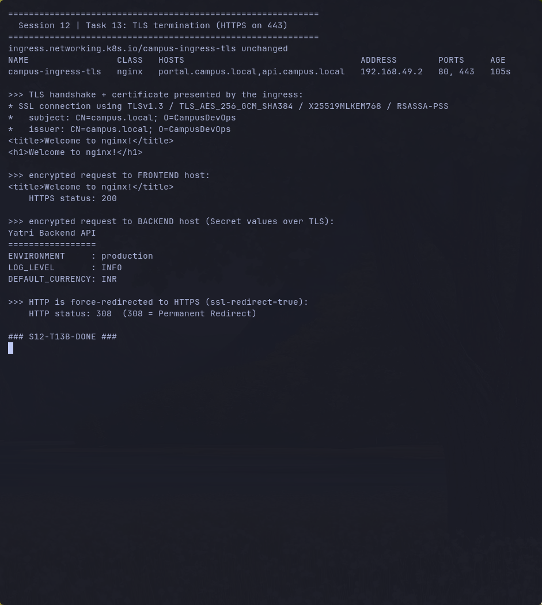

Keypair + `kubernetes.io/tls` secret creation (Screenshot 13a):

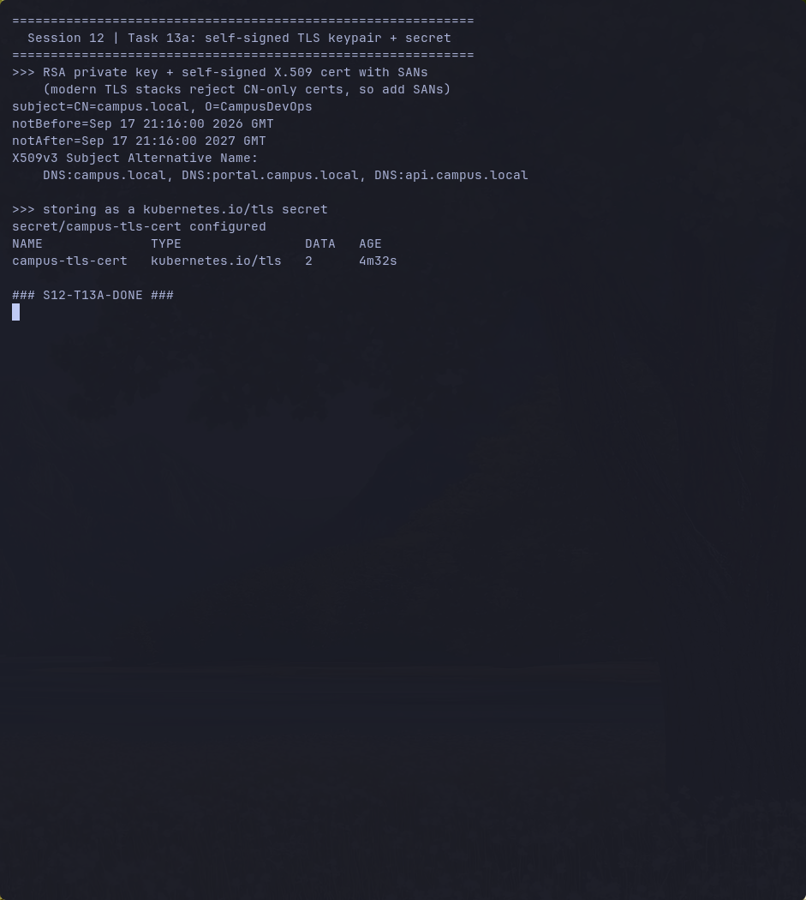

---

## Task 14 — End-to-End Automation (`run-demo.sh` / `cleanup.sh`)

`backend.yaml` and `frontend.yaml` are **multi-document YAML** — a single file co-locates
a `Deployment` and its `Service`, separated by `---`, so one `kubectl apply -f` creates
the whole tier atomically.

```bash
bash 04-full-demo/run-demo.sh

# audit the whole stack
kubectl get configmap,secret,ingress,deploy,svc,pods -l app=yatri-app

bash 04-full-demo/cleanup.sh

# confirm clean
kubectl get ingress yatri-ingress || echo "Ingress deleted"
kubectl get deployment yatri-backend yatri-frontend || echo "Deployments deleted"
```

`run-demo.sh` is idempotent and ordered: enable ingress addon → wait for controller →
ConfigMap → Secret → frontend → backend → wait for rollouts → Ingress → summary → hosts
entry. `cleanup.sh` removes the same objects with `--ignore-not-found=true` so it is safe
to run repeatedly.

Expected end state after cleanup: `Ingress deleted` / `Deployments deleted`, and no
`yatri-*` ConfigMap/Secret/Service left behind.

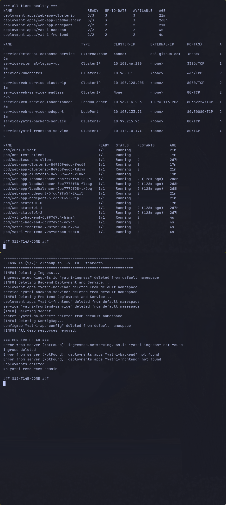

> The screenshot above is a vertical composite of the two lifecycle phases so both states
> are visible in one image. The raw frames are shown below:
>
> **Phase 1 — `run-demo.sh` full stack green:**

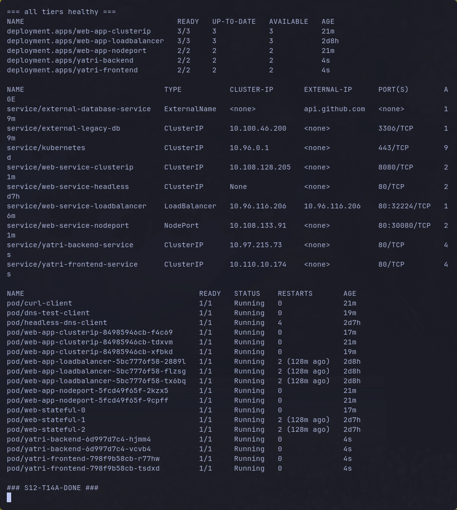

> **Phase 2 — `cleanup.sh` everything deleted:**

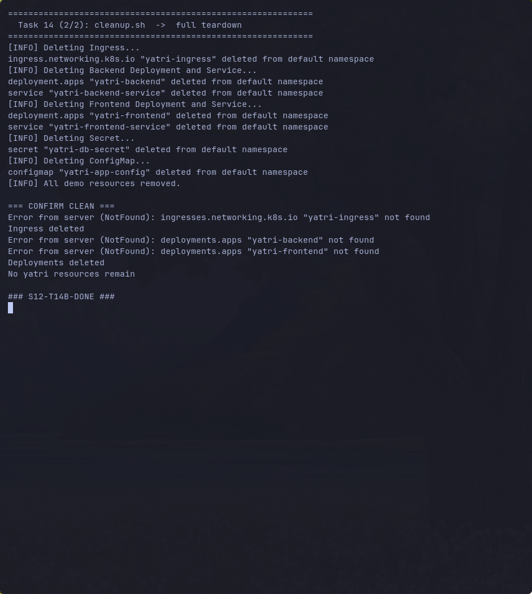

---

## Summary — what this session proves

| Concern | Mechanism | Verified by |
|---|---|---|
| Non-sensitive config out of the image | ConfigMap (`envFrom`) | Tasks 1, 6 |
| Sensitive credentials isolated | Opaque Secret (`secretKeyRef`) | Tasks 3, 6 |
| Env does not hot-reload | patch + `rollout restart` | Task 2 |
| Encoding hygiene | `echo -n` vs `echo` | Task 4 |
| Enterprise secrets | ESO / Vault / CI variable injection | Task 5 |
| L7 path routing | Ingress + rewrite-target regex | Task 10 |
| L7 host routing | Ingress `host:` rules | Task 11 |
| Hybrid (host × path) | single Ingress, both dimensions | Task 12 |
| HTTPS | `spec.tls` + `kubernetes.io/tls` secret | Task 13 |
| Full lifecycle automation | `run-demo.sh` / `cleanup.sh` | Task 14 |

**Golden rules:** ConfigMaps for configuration, Secrets (never committed) for credentials,
`echo -n` when encoding, one ingress controller fronting many ClusterIP services, and
terminate TLS at the edge.
