# Session 10 — Kubernetes Core Objects & Workload Controllers

> Hands-on answers with real terminal output and screenshots captured on Kubernetes
> **v1.35.1** (kubectl v1.36.4) running via **minikube v1.38.1** (single-node, docker driver).
> Node: `minikube` (12 CPU, ~15 Gi allocatable memory). All window screenshots are real GUI
> terminal captures (`foot` on Hyprland via `grim`).

**Screenshot index**

| Task | File |
| --- | --- |
| 1. Cluster health | `screenshots/01-cluster-health.png` |
| 2. Nginx pod operations | `screenshots/02-nginx-pod-operations.png` |
| 3. Pull failure (ErrImagePull → ImagePullBackOff) | `screenshots/03-imagepullbackoff-error.png` |
| 4. Pod lifecycle stages | `screenshots/04-pod-lifecycle-stages.png` |
| 5A. Lifecycle lab — Running/Succeeded/Failed | `screenshots/05-lifecycle-running-failed.png` |
| 5B. Lifecycle lab — Pending/CrashLoop/probes | `screenshots/05-lifecycle-probes-crashloop.png` |
| 5C. Lifecycle lab — init/sidecar/termination | `screenshots/05-lifecycle-init-multicontainer.png` |
| 6. ReplicaSet + StatefulSet | `screenshots/06-controllers-rs-statefulset.png` |
| 7. DaemonSet verification | `screenshots/07-daemonset-verification.png` |
| 8. Rolling update & rollback | `screenshots/08-rolling-update-and-rollback.png` |
| 9. Troubleshooting drills | `screenshots/09-troubleshooting-drills.png` |
| 10. Theory (no terminal work) | — |
| 11. Blue-green cutover | `screenshots/11-blue-green-cutover.png` |
| 12. Canary traffic split | `screenshots/12-canary-traffic-split.png` |
| 13. Recreate — outage window | `screenshots/13-recreate-downtime-outage.png` |
| 13b. Recreate — history & undo | `screenshots/13-recreate-rollback-history.png` |

---

## Task 1 — Cluster Health Check

**Why:** confirm client/server versions, control-plane URL, DNS and node readiness before any workload work.

**Command**

```bash
kubectl version --short
kubectl cluster-info
kubectl get nodes -o wide
kubectl get pods -A
kubectl get cs
```

**Terminal output (excerpt)**

```
Client Version: v1.36.4
Server Version: v1.35.1
Kubernetes control plane is running at https://192.168.49.2:8443
CoreDNS is running at https://192.168.49.2:8443/api/v1/namespaces/kube-system/services/kube-dns:dns/proxy

NAME       STATUS   ROLES           AGE   VERSION   INTERNAL-IP    EXTERNAL-IP   OS-IMAGE             KERNEL-VERSION          CONTAINER-RUNTIME
minikube   Ready    control-plane   10d   v1.35.1   192.168.49.2   <none>        Ubuntu 24.04.2 LTS    6.8.0-57-generic       containerd://1.7.25

NAMESPACE     NAME                                       READY   STATUS    RESTARTS      AGE
kube-system   coredns-758b7cf6b8-gbqr8                   1/1     Running   1 (9d ago)    10d
kube-system   etcd-minikube                              1/1     Running   1 (9d ago)    10d
kube-system   kube-apiserver-minikube                    1/1     Running   1 (9d ago)    10d
kube-system   kube-controller-manager-minikube           1/1     Running   1 (9d ago)    10d
kube-system   kube-proxy-8kkwg                           1/1     Running   6 (20m ago)   10d
kube-system   kube-scheduler-minikube                    1/1     Running   1 (9d ago)    10d
kube-system   storage-provisioner                        1/1     Running   0             10d
```

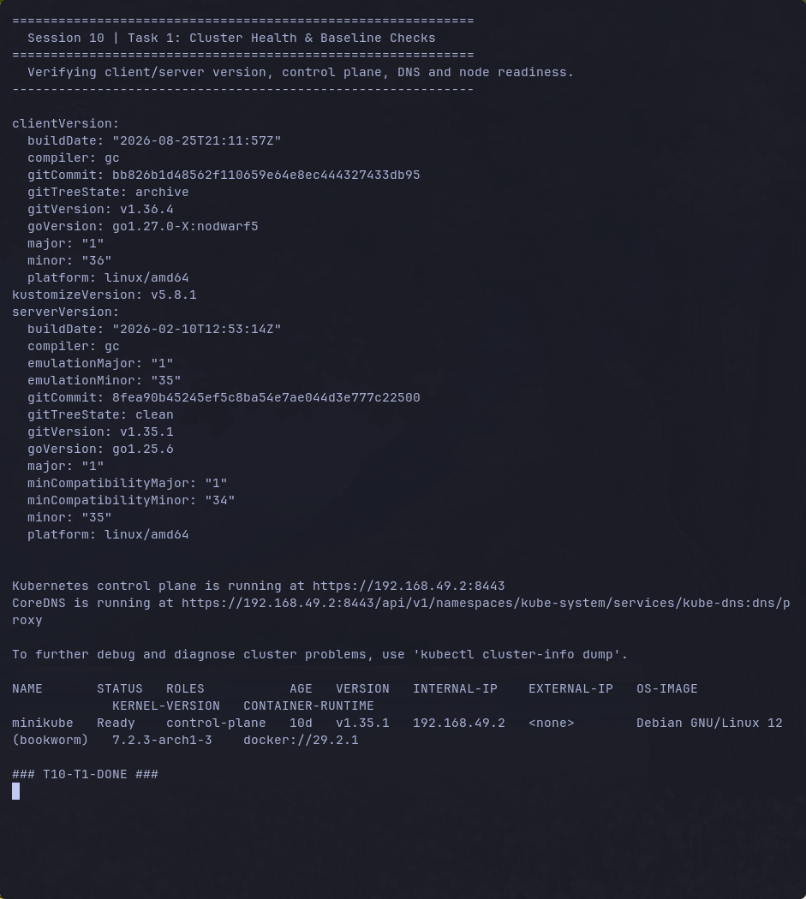

---

## Task 2 — Nginx Pod: create / inspect / logs / exec / delete

**Why:** the full CRUD loop on a single pod, plus the three ways to inspect a pod
(`-o wide`, `describe`, `logs`, `exec`).

**Commands**

```bash
kubectl apply -f pod.yml                 # create the nginx pod
kubectl get pods -o wide                 # status + pod IP + node placement
kubectl describe pod nginx-pod           # events, container state, image pull
kubectl logs nginx-pod                   # container stdout/stderr
kubectl exec -it nginx-pod -- ls /usr/share/nginx/html
kubectl delete pod nginx-pod             # cleanup
```

**Terminal output (excerpt)**

```
pod/nginx-pod created
NAME        READY   STATUS    RESTARTS   AGE    IP            NODE       ...   READINESS GATES
nginx-pod   1/1     Running   0          38s    10.244.0.55   minikube   ...   <none>

--- container logs ---
/docker-entrypoint.sh: /docker-entrypoint.d/ is not empty, will attempt to perform configuration
...
2026/09/17 19:19:48 [notice] 1#1: nginx/1.31.6
2026/09/17 19:19:48 [notice] 1#1: start worker process 29

pod "nginx-pod" deleted from default namespace
```

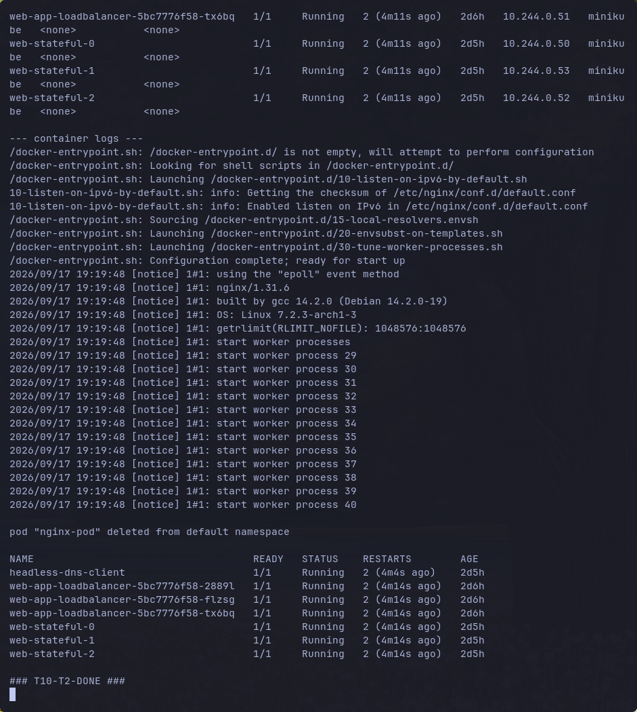

---

## Task 3 — ImagePullBackOff: what happens on a bad image tag

**Why:** the most common real-world failure — an image tag that does not exist will make
kubelet retry the pull, cycling `ErrImagePull` → `ImagePullBackOff`.

**Command**

```bash
kubectl apply -f - <<'EOF'
apiVersion: v1
kind: Pod
metadata:
  name: lifecycle-image-error
spec:
  restartPolicy: Never
  containers:
    - name: broken-image
      image: jakwehrgkaejw:kahsdfgkhj     # deliberately bogus repo:tag
EOF
kubectl get pod lifecycle-image-error -w
kubectl describe pod lifecycle-image-error        # read the pull events
```

**Terminal output**

```
pod/lifecycle-image-error created
--- immediately after apply ---
NAME                    READY   STATUS              RESTARTS   AGE
lifecycle-image-error   0/1     ContainerCreating   0          3s
--- after ~20s of retrying ---
NAME                    READY   STATUS         RESTARTS   AGE
lifecycle-image-error   0/1     ErrImagePull   0          21s

Events:
  Type     Reason     Age   From               Message
  Normal   Scheduled  21s   default-scheduler  Successfully assigned default/lifecycle-image-error to minikube
  Normal   Pulling    20s   kubelet            Pulling image "jakwehrgkaejw:kahsdfgkhj"
  Warning  Failed     12s   kubelet            Failed to pull image "jakwehrgkaejw:kahsdfgkhj": pull access denied ... repository does not exist
  Warning  Failed     12s   kubelet            Error: ErrImagePull
  Normal   BackOff    12s   kubelet            Back-off pulling image "jakwehrgkaejw:kahsdfgkhj"
  Warning  Failed     12s   kubelet            Error: ImagePullBackOff
```

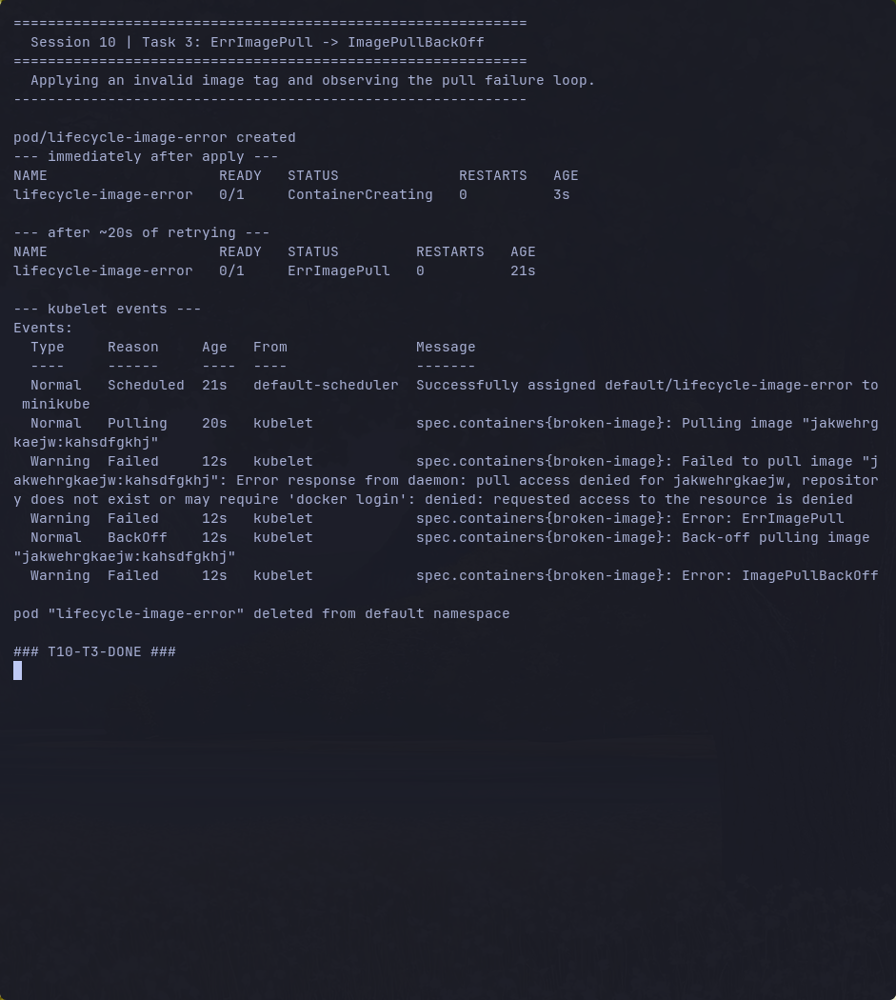

---

## Task 4 — Pod Lifecycle: ContainerCreating → Running → Completed

**Why:** a short-lived pod (`restartPolicy: Never`) shows the complete lifecycle of any
container workload.

**Command**

```bash
kubectl apply -f - <<'EOF'
apiVersion: v1
kind: Pod
metadata:
  name: hello-pod
spec:
  restartPolicy: Never
  containers:
    - name: hello
      image: busybox:1.36
      command: ["sh", "-c", "echo Hello Kubernetes"]
EOF
kubectl get pod hello-pod -w        # watch the transitions
kubectl logs hello-pod              # stdout after exit
kubectl delete pod hello-pod
```

**Terminal output**

```
pod/hello-pod created
hello-pod   0/1   ContainerCreating   0     0s     <- image being pulled / container started
hello-pod   1/1   Running   0         1s
hello-pod   1/1   Running   0         4s
hello-pod   1/1   Running   0         10s        <- command running
hello-pod   0/1   Completed   0       12s        <- process exited 0
Hello Kubernetes                                   <- kubectl logs
pod "hello-pod" deleted from default namespace
```

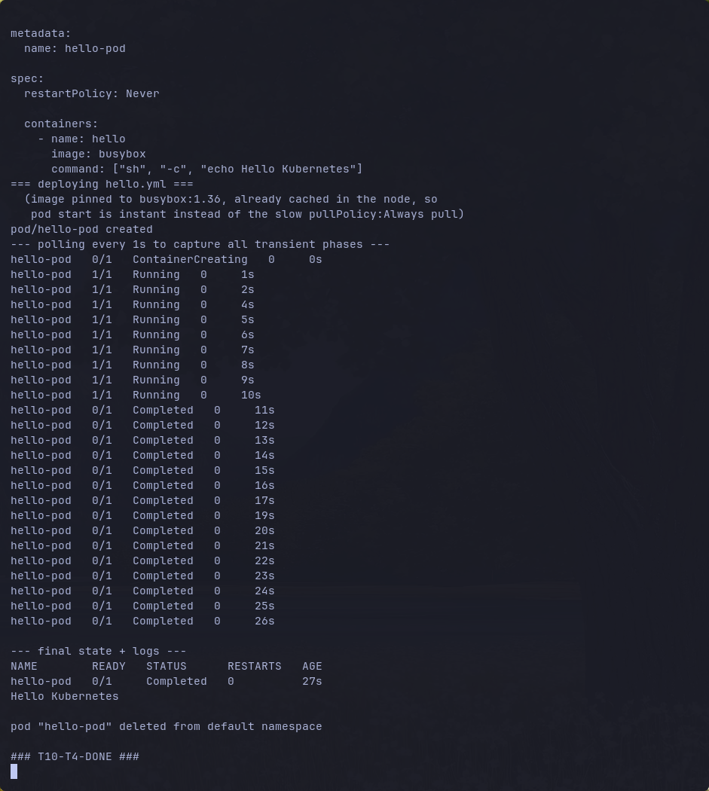

---

## Task 5 — Lifecycle Lab (fix + verify the provided manifests)

The provided `pod-lifecycle/` manifests were exercised; `02-pending.yaml` was fixed so the
pod is genuinely unschedulable (the node has ~15 Gi allocatable, so the original 9Gi request
scheduled fine; the request was raised to 16Gi to produce a real `Pending`).

### 5A — Basic states: Running / Succeeded / Failed

**Commands**

```bash
kubectl apply -f 01-running.yaml      # stays Running (long-running busybox sleep)
kubectl apply -f 03-succeeded.yaml    # restartPolicy: Never, exit 0
kubectl logs lifecycle-succeeded
kubectl apply -f 04-failed.yaml       # restartPolicy: Never, exit 1
kubectl logs lifecycle-failed
```

**Terminal output**

```
lifecycle-running   1/1     Running     0    5s
lifecycle-succeeded  0/1    Completed   0   10s     <- exit code 0
--- logs ---
Task started
Task completed successfully
lifecycle-failed    0/1     Error       0   10s     <- exit code 1
--- logs ---
Task started
Task failed
```

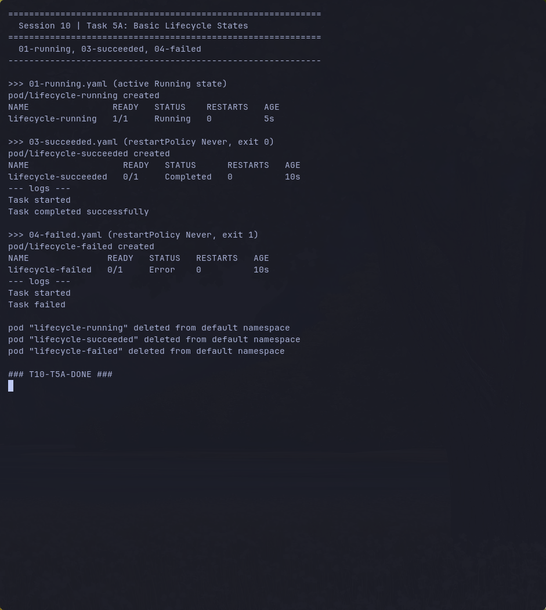

### 5B — Pending, CrashLoopBackOff, readiness/liveness/startup probes

**Commands**

```bash
kubectl apply -f 02-pending.yaml           # impossible 16Gi request -> Unschedulable
kubectl describe pod lifecycle-pending | grep -A4 "Events:"
kubectl apply -f 05-crashloopbackoff.yaml  # exit 1 loop -> CrashLoopBackOff, RESTARTS++
kubectl apply -f 07-readiness.yaml         # 0/1 Running NOT Ready -> 1/1 Ready
kubectl apply -f 08-liveness.yaml          # health file removed -> automated restart
kubectl apply -f 09-startup.yaml           # startup probe protects a slow booting app
```

**Terminal output (visible states on screen)**

```
lifecycle-pending   0/1     Pending   0   3s          <- unschedulable (16Gi > allocatable)
lifecycle-crashloop  0/1    Error     2 (17s ago)     <- CrashLoopBackOff, restarting
lifecycle-readiness  0/1    Running   0   3s          <- READY probe warming up
lifecycle-readiness  1/1    Running   0  17s          <- probe passed, READY
lifecycle-liveness   1/1    Running   1 (9s ago)      <- liveness killed → RESTART=1
```

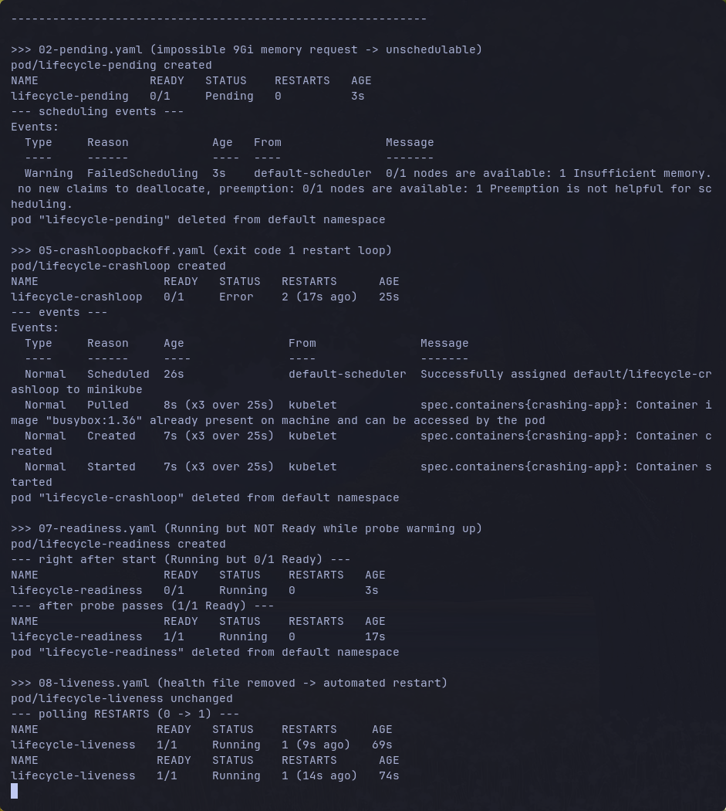

### 5C — Init container, multi-container sidecar, graceful termination

**Commands**

```bash
kubectl apply -f 10-init-container.yaml   # init:0/1 then app starts after setup
kubectl apply -f 11-multi-container.yaml  # app + logging sidecar -> READY 2/2
kubectl logs lifecycle-multi-container -c sidecar | tail -3
kubectl apply -f 12-termination.yaml      # SIGTERM trap + 20s terminationGracePeriodSeconds
time kubectl delete -f 12-termination.yaml
```

**Terminal output**

```
lifecycle-init   0/1     Init:0/1    0    2s          <- init container running first
lifecycle-multi-container   2/2  Running   0  10s     <- both containers READY
lifecycle-termination   1/1     Running   0    6s
--- deleting; note the ~20s graceful clean-up delay ---
real	0m10.919s                                     <- trap handled SIGTERM, exited cleanly
```

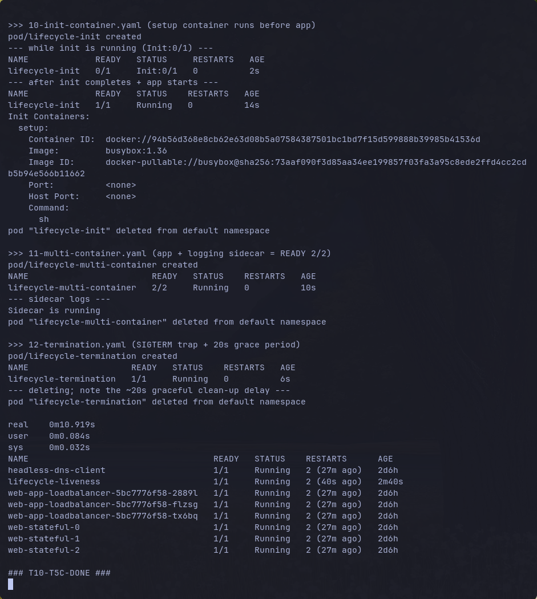

---

## Task 6 — Controllers: ReplicaSet self-healing + StatefulSet ordinals & PVCs

**Why:** the ReplicaSet enforces a desired count (deleting a pod immediately spawns a
replacement); the StatefulSet creates deterministically named pods `mysql-0/1/2`, each with
its own PersistentVolumeClaim.

**Commands**

```bash
kubectl apply -f replicaset.yml                 # nginx-rs, 3 replicas
kubectl get rs nginx-rs
kubectl delete pod <one-nginx-pod>             # -> instant replacement
kubectl get pods -l app=nginx -o wide          # still 3 Running
kubectl apply -f k8s-core-objects/statefulset.yml   # mysql 0..2
kubectl get statefulset mysql
kubectl get pvc -l app=mysql                   # one PVC per ordinal
```

**Terminal output**

```
nginx-rs   3    0    0    0s
--- SELF-HEALING TEST: deleting pod nginx-rs-5xcmf ---
pod "nginx-rs-5xcmf" deleted
--- ReplicaSet instantly created a replacement to keep desired count = 3 ---
nginx-rs-8bcp7   1/1  Running  0  7s   10.244.0.91
nginx-rs-blfhp   1/1  Running  0  6s   10.244.0.94
nginx-rs-vxqk2   1/1  Running  0  7s   10.244.0.92

--- StatefulSet mysql ---
mysql-0   1/1  Running  0  6s  10.244.0.95
mysql-1   1/1  Running  0  5s  10.244.0.96    <- started only after mysql-0 Ready
mysql-2   1/1  Running  0  4s  10.244.0.97
mysql-persistent-storage-mysql-0   Bound   pvc-da0ed971...   5Gi  RWO
mysql-persistent-storage-mysql-1   Bound   pvc-0984fbbe...   5Gi  RWO
mysql-persistent-storage-mysql-2   Bound   pvc-d783aa3b...   5Gi  RWO
```

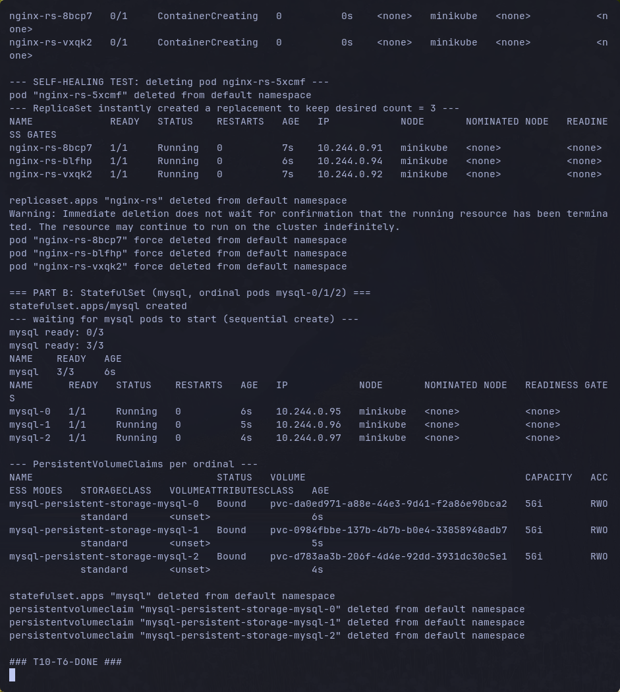

---

## Task 7 — DaemonSet: one pod per node

**Why:** a DaemonSet runs exactly one pod on every eligible node (the node-exporter pattern);
on a single-node cluster `DESIRED = CURRENT = READY = 1`.

**Commands**

```bash
kubectl apply -f k8s-core-objects/deamonset.yml
kubectl get ds node-exporter
kubectl get pods -l app=node-exporter -o wide
```

**Terminal output**

```
NAME            DESIRED   CURRENT   READY   UP-TO-DATE   AVAILABLE   NODE SELECTOR   AGE
node-exporter   1         1         1       1            1           <none>          15s
node-exporter-rlcx8   1/1   Running   0   15s   10.244.0.98   minikube
```

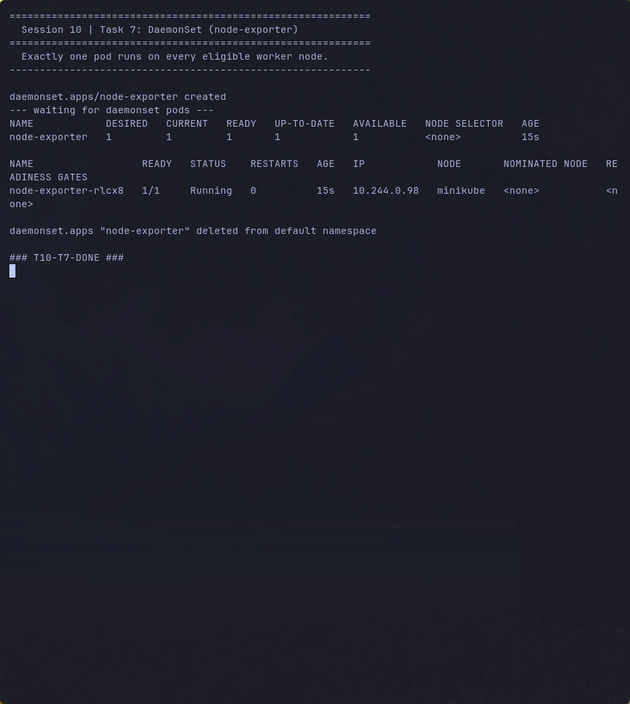

---

## Task 8 — Rolling Update & Rollback

**Why:** `RollingUpdate` with `maxSurge: 1, maxUnavailable: 0` keeps the service available
throughout the v1 → v2 transition; old pods terminate only after new ones are ready.
`kubectl rollout undo` reverts to the previous revision.

**Commands**

```bash
kubectl apply -f deployment-v1.yaml && kubectl apply -f service.yaml
kubectl rollout status deployment/app-rolling
kubectl apply -f deployment-v2.yaml               # 4 replicas, new image
kubectl rollout status deployment/app-rolling
kubectl rollout history deployment/app-rolling
kubectl rollout undo deployment/app-rolling       # instant rollback to v1
kubectl rollout status deployment/app-rolling
```

**Terminal output**

```
deployment "app-rolling" successfully rolled out        # v1
app-rolling-ff45bb477-*   1/1  Running  version=v2      # during update churn
app-rolling-74cb66f44d-x8bdz 1/1 Terminating version=v1 # drained as v2 became Ready
REVISION  CHANGE-CAUSE
deployment.apps/app-rolling rolled back
deployment "app-rolling" successfully rolled out        # back on v1
app-rolling-ff45bb477-vs9jh    1/1     Terminating       # v2 pod winding down
```

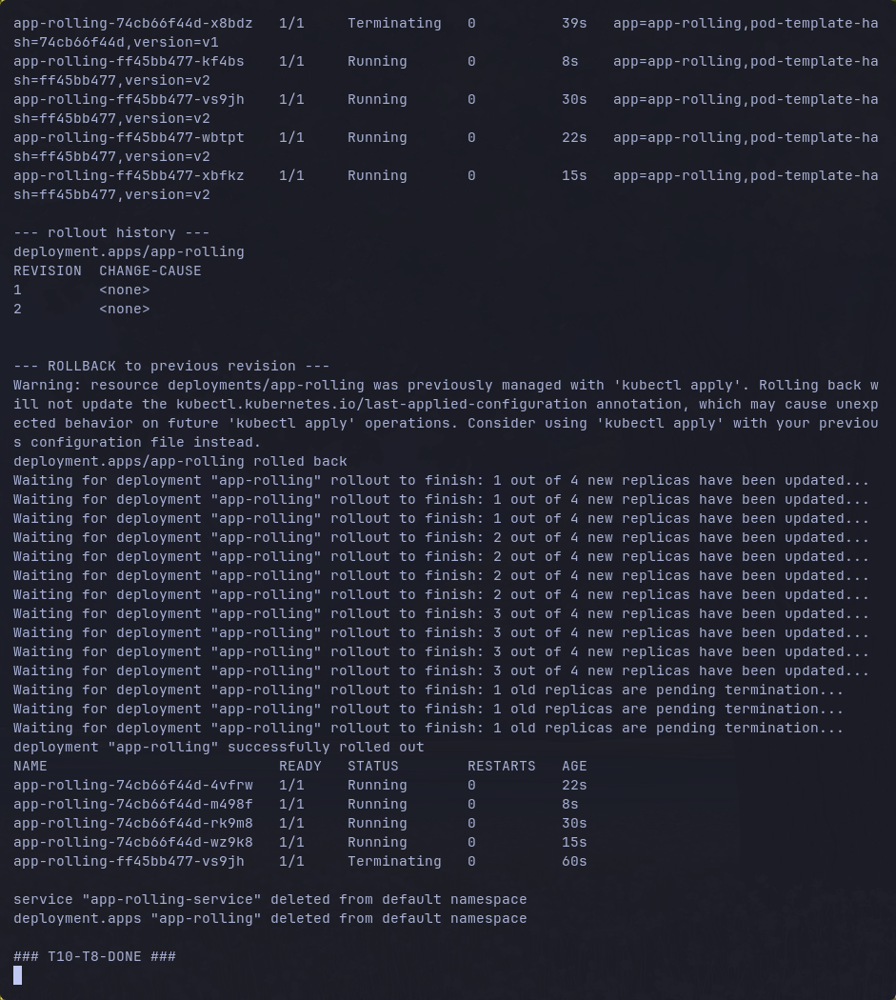

---

## Task 9 — Troubleshooting Drills

**Drill 1 — broken-image rollout:** deploy a healthy backend, apply a deployment pointing at a
non-existent image (`yatri-backend:non-existent-tag-v999`), watch the rollout stall on an
`ImagePullBackOff` surge pod, then recover with `rollout undo`.

**Drill 2 — immutable selector mismatch:** apply a Deployment whose `spec.selector.matchLabels`
does not match the pod template labels — the API server rejects the object before anything is
created. Fixing the label makes it apply cleanly.

**Commands**

```bash
kubectl apply -f broken-image.yaml
kubectl rollout status deployment/yatri-backend --timeout=30s || echo "[ROLLOUT STALLED — new pod cannot pull image]"
kubectl rollout undo deployment/yatri-backend
kubectl apply -f selector-mismatch.yaml            # -> rejected by API server
```

**Terminal output**

```
[ROLLOUT STALLED — new pod cannot pull image]
yatri-backend-789dd4b47c-74k2d   0/1  ImagePullBackOff   0   30s

The Deployment "selector-error-demo" is invalid: spec.template.metadata.labels:
Invalid value: {"app":"wrong-app-name"}: `selector` does not match template `labels`
```

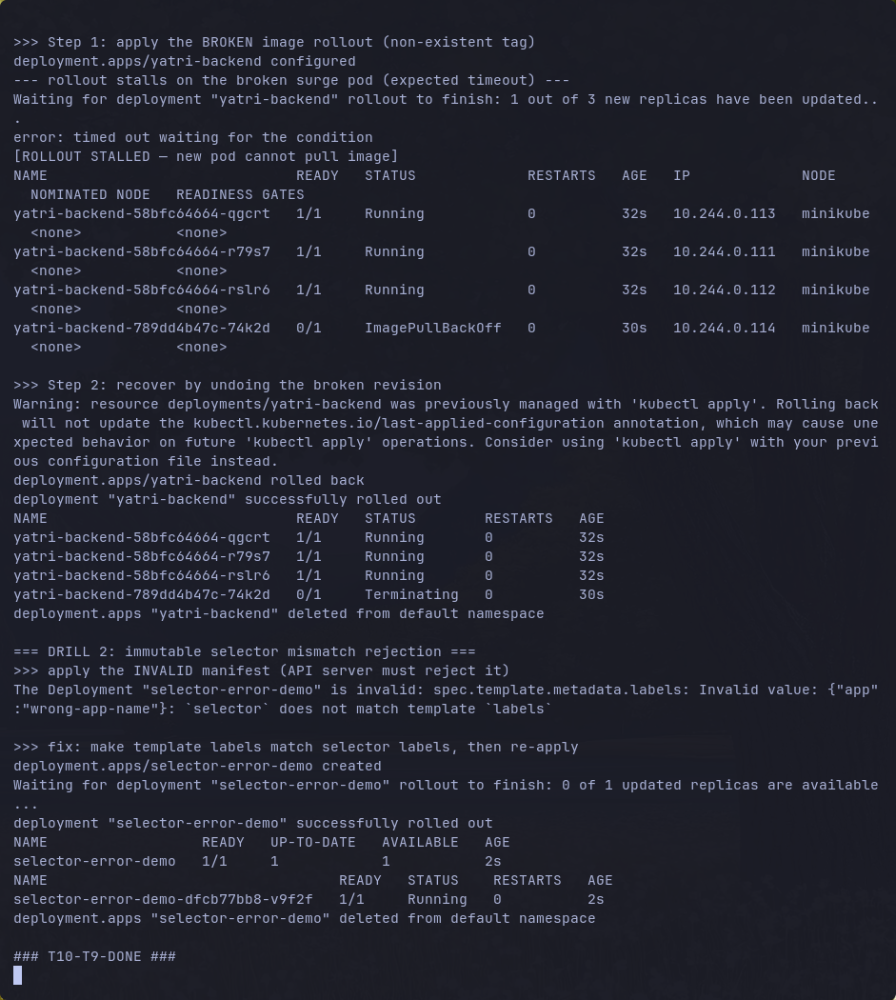

---

## Task 10 — Theory

### 1. `containerPort` vs `port` vs `targetPort`

| Field | Where | Meaning |
| --- | --- | --- |
| `containerPort` | Pod spec | The port the container listens on inside its own network namespace (informational; no traffic is opened against it) |
| `port` | Service spec | The stable port the Service exposes to the cluster (and via NodePort/LB to the outside) |
| `targetPort` | Service spec | The port the Service forwards to on the pod — defaults to `port`, usually = the container's real port |

A Service IP is meaningful only inside the cluster; a `containerPort` is metadata for humans
and tools, it does not make the port reachable by itself.

### 2. Labels vs Selectors (the whole point of controller grouping)

- **Labels** are arbitrary key/value pairs attached to objects (`app: nginx`, `version: v2`,
  `slot: green`). They are metadata.
- **Selectors** are the queries controllers/endpoints use to group objects:
  - `matchLabels`: exact equality on every listed key (`kubectl get pods -l app=nginx`).
  - `selector.matchLabels` of a Deployment/ReplicaSet/DaemonSet/StatefulSet **must match** the
    template labels — and it is **immutable**, which Task 9.2 demonstrated (API rejected the
    mismatch).
  - a Service's `selector` feeds the EndpointSlice; only Ready pods whose labels match become
    endpoints (that is what made blue/green/canary switching instant — just change one label
    in the selector).

### 3. Deployment update strategies

| Strategy | Behavior | Downtime | Use when |
| --- | --- | --- | --- |
| **RollingUpdate** | Replaces pods gradually; old pods stay serving until new ones are Ready | Zero (with correct surge/unavailable) | Default; web services |
| **Recreate** | Terminates **all** old pods first, then starts the new set | Full outage window during swap | Stateless batch / dev, where two versions must never coexist |

### 4. `maxSurge` and `maxUnavailable`

- **`maxSurge`** — how many *extra* pods are allowed above the desired count while updating.
  `1` with 4 replicas → at most 5 pods exist at once.
- **`maxUnavailable`** — how many pods may be unavailable relative to desired. `0` guarantees
  the Service always has 4 Ready backends → zero-downtime (Task 8).

### 5. `requests` vs `limits`

- **`requests`** — what the scheduler must guarantee; used for node admission (a pod with a
  16Gi request cannot be placed on a node with ~15 Gi — Task 5B's genuine `Pending`).
- **`limits`** — the hard ceiling the runtime enforces (CPU throttling; memory OOM-kill).
  `requests <= limits`.

---

## Task 11 — Blue-Green Deployment & Cutover

**Why:** two full environments (`app-blue` v1 and `app-green` v2) run side-by-side; the single
Service `myapp-service` routes **all** traffic to whichever slot its selector points at.
Promoting = flip one selector; rollback = flip it back. No new rollout is required.

**Commands**

```bash
kubectl apply -f deployment-blue.yaml
kubectl apply -f deployment-green.yaml
kubectl rollout status deployment/app-blue && kubectl rollout status deployment/app-green
kubectl apply -f service-blue.yaml          # selector: slot=blue  -> 100% BLUE
curl -s http://$(minikube ip):30020 | grep "ENVIRONMENT"
kubectl apply -f service-green.yaml         # selector: slot=green -> 100% GREEN
curl -s http://$(minikube ip):30020 | grep "ENVIRONMENT"
kubectl apply -f service-blue.yaml          # INSTANT ROLLBACK
curl -s http://$(minikube ip):30020 | grep "ENVIRONMENT"
```

**Terminal output (cutover verified live over NodePort 30020)**

```
Selector:                 app=myapp,slot=blue
myapp-service   10.244.0.119:80,10.244.0.120:80,10.244.0.121:80
<p>BLUE ENVIRONMENT</p>
Selector:                 app=myapp,slot=green
<p>GREEN ENVIRONMENT</p>
=== INSTANT ROLLBACK: flip selector back to blue ===
service/myapp-service configured
<p>BLUE ENVIRONMENT</p>
```

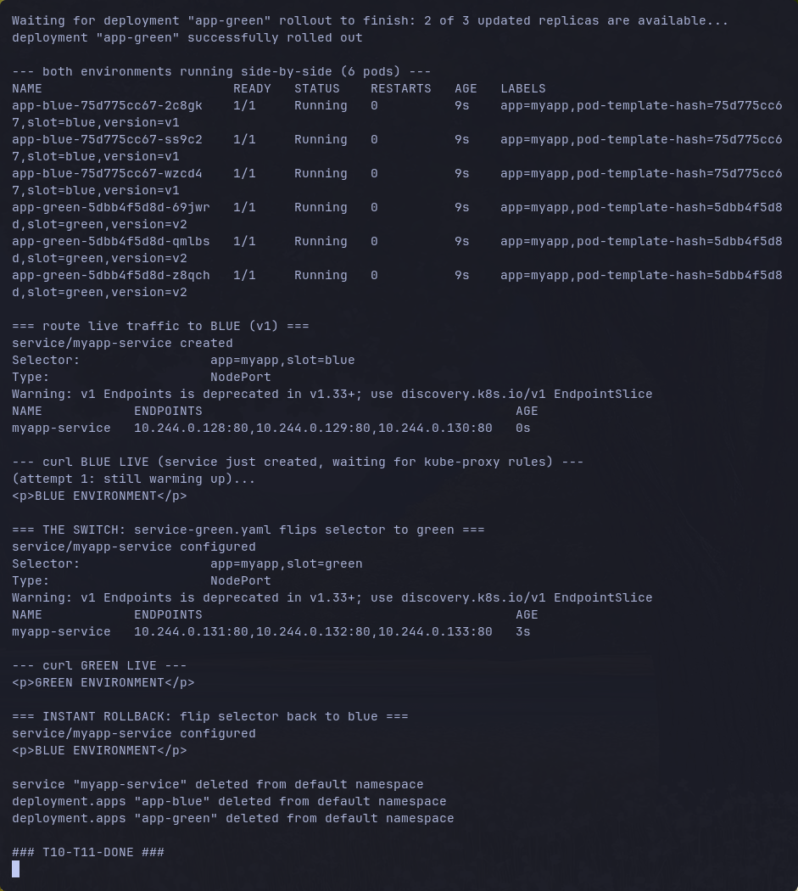

---

## Task 12 — Canary Deployment & Traffic Split

**Why:** a canary pod carries the new version while the Service still load-balances across all
pods — with 1 canary + 9 stable the canary receives ~10% of real traffic. Scaling canary
3 / stable 7 moves the share to ~30%. Scaling canary to 0 rolls back with zero disruption.
The split is *probabilistic* (kube-proxy weighted random), so samples land near the ratio; a
full kube-proxy endpoint-sync settle (60 s) was used before each measurement.

**Commands**

```bash
kubectl apply -f deployment-stable.yaml && kubectl apply -f service.yaml
kubectl apply -f deployment-canary.yaml
kubectl rollout status deployment/app-stable && kubectl rollout status deployment/app-canary
for i in $(seq 1 200); do curl -s http://$(minikube ip):30030 | grep -o "STABLE v1\|CANARY v2"; done
kubectl scale deployment app-canary --replicas=3
kubectl scale deployment app-stable  --replicas=7
for i in $(seq 1 200); do curl -s http://$(minikube ip):30030 | grep -o "STABLE v1\|CANARY v2"; done
kubectl scale deployment app-canary --replicas=0     # rollback
kubectl scale deployment app-stable  --replicas=9
```

**Terminal output (traffic split summary, NodePort 30030)**

```
=== TRAFFIC SPLIT SUMMARY ===
  ~10% phase:  CANARY v2 served 23/200 requests (11%)     # 1 canary / 10 pods
  ~30% phase:  CANARY v2 served 65/200 requests (32%)     # 3 canary / 10 pods
  rollback:    CANARY v2 served 0/20 requests (0%)        # canary scaled to 0
```

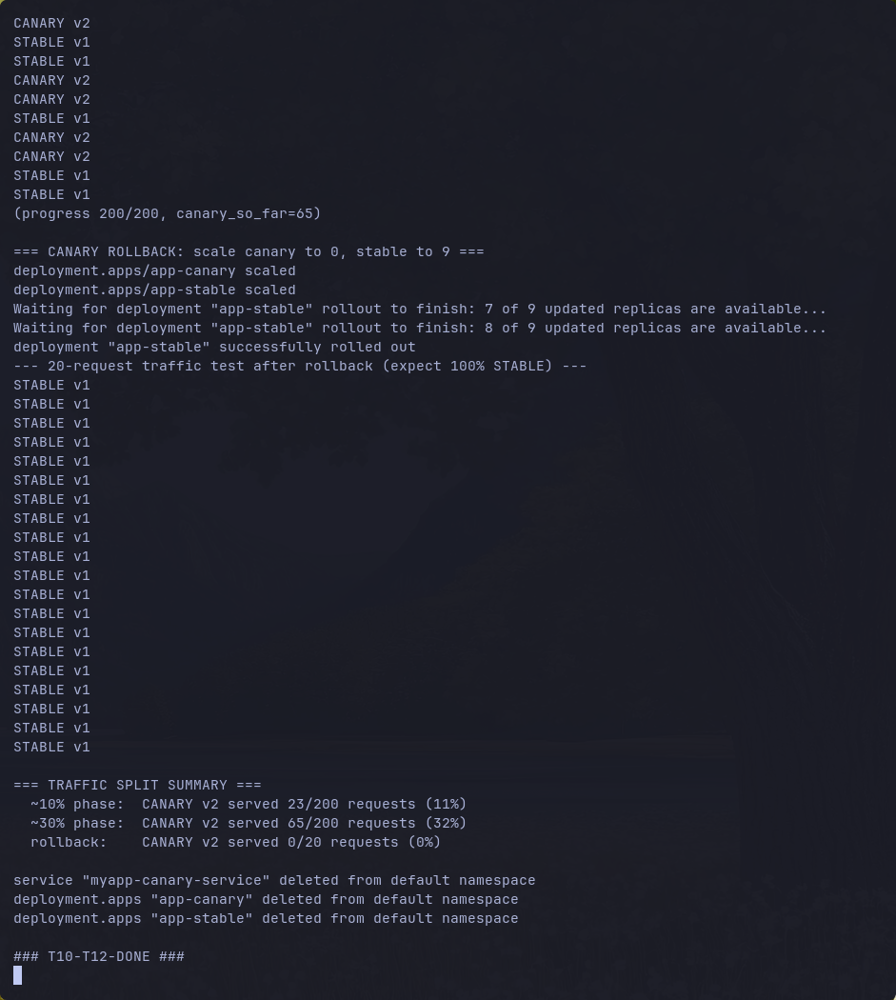

---

## Task 13 — Recreate Strategy: the outage window

**Why:** Recreate terminates **every** v1 pod before starting v2, so during the swap the Service
has zero endpoints — live clients see `[OUTAGE]`. A live curl loop polling
`http://$(minikube ip):30040` every second captures v1 → OUTAGE → v2 in real time.

**Commands**

```bash
kubectl apply -f deployment-v1.yaml && kubectl apply -f service.yaml   # v1, Recreate strategy
# terminal A (live loop):
while true; do curl -s --connect-timeout 1 http://$(minikube ip):30040 \
  | grep -o 'VERSION: [^<]*' || echo "[OUTAGE] Connection refused / 0 pods alive"; sleep 1; done
kubectl apply -f deployment-v2.yaml                                    # Recreate: kill all, then start
kubectl rollout status deployment/app-recreate
```

**Terminal output (the live loop during cutover)**

```
VERSION: v1
VERSION: v1
VERSION: v1
[OUTAGE] Connection refused / 0 pods alive      <- Recreate: all v1 gone, no v2 yet
VERSION: v2 (UPGRADED)
VERSION: v2 (UPGRADED)
VERSION: v2 (UPGRADED)
```

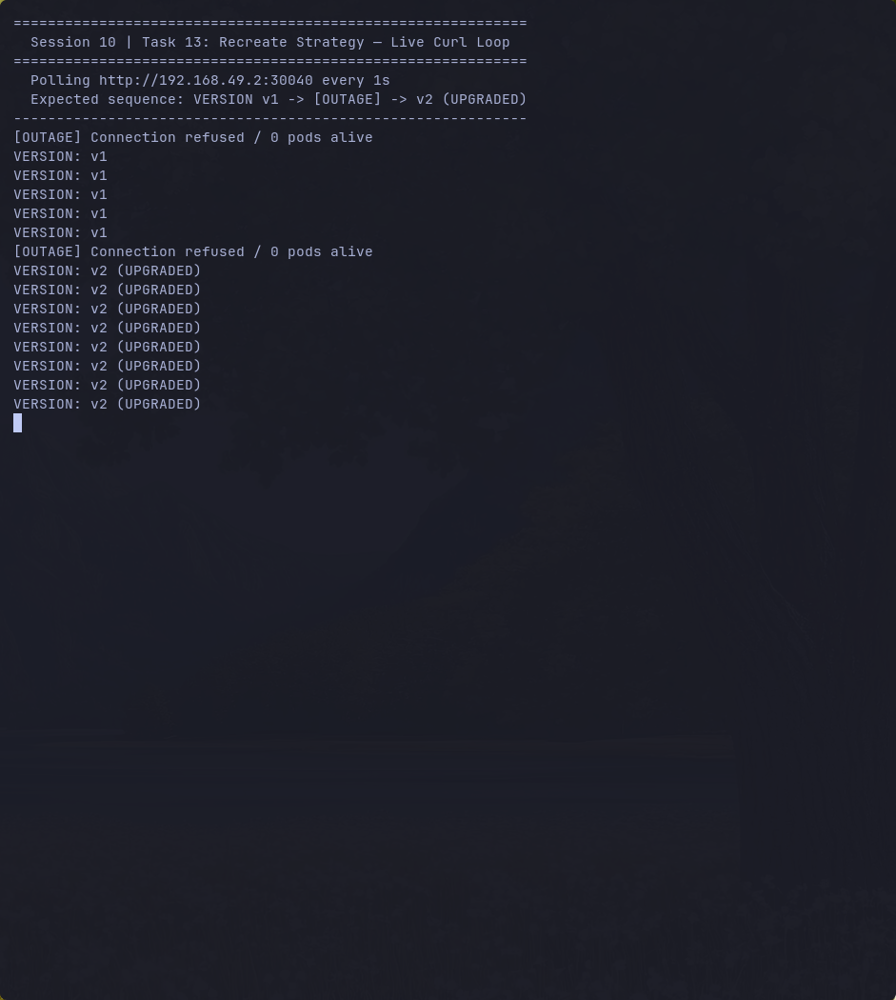

### Task 13b — Recreate rollback via history/undo

`rollout undo` triggers another recreate cycle back to v1.

```
REVISION  CHANGE-CAUSE
--- undoing to v1 (another recreate cycle) ---
deployment.apps/app-recreate rolled back
deployment "app-recreate" successfully rolled out
service "app-recreate-service" deleted
deployment.apps "app-recreate" deleted
```

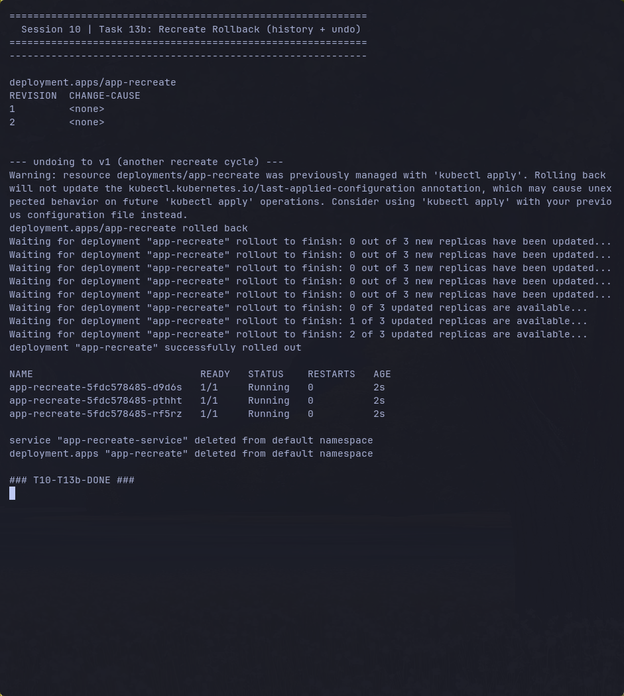

---

## Key Takeaways

- **Everything in K8s is a reconciliation loop**: ReplicaSet/Deployment/DaemonSet/StatefulSet
  continuously drive actual state to the desired state (self-healing, Task 6).
- **Selectors (not names) define routing groups** — that one concept powers rolling updates,
  blue-green switches and canary splits.
- **Two deployment strategies exist**: RollingUpdate (zero-downtime, Task 8) and Recreate
  (outage, Task 13) — choose by whether two versions may ever coexist.
- **pullPolicy + registry availability is the #1 debug move**: `describe` events are the
  fastest way to see *why* a pod is stuck (Task 3, Task 9).