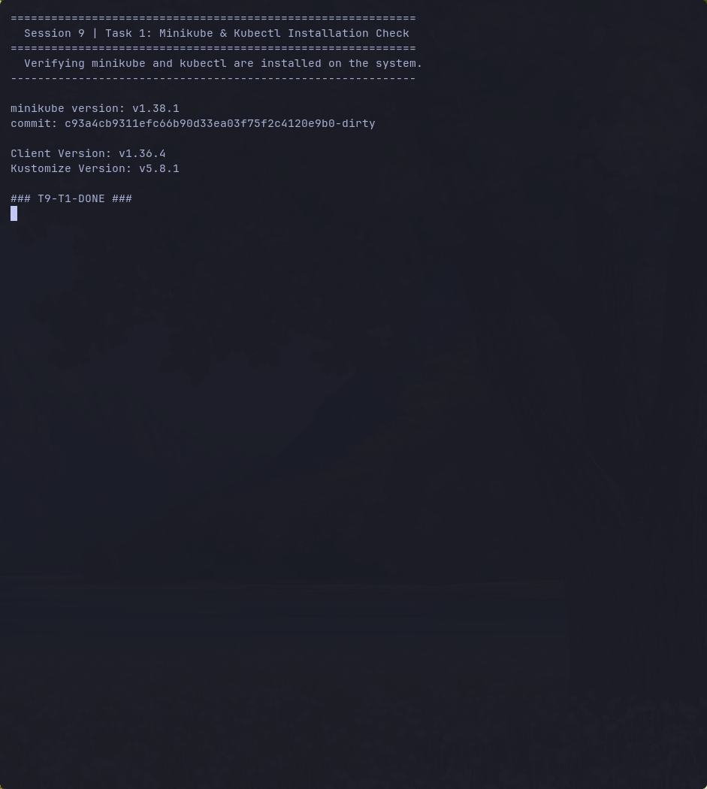
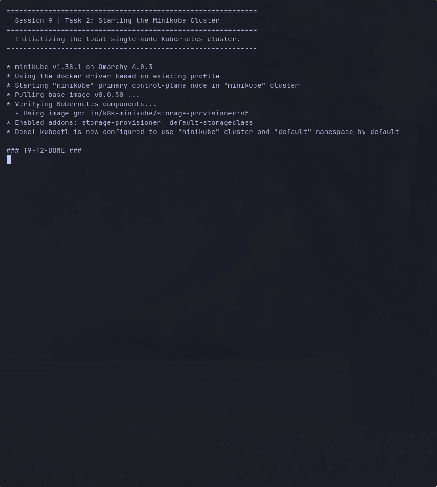
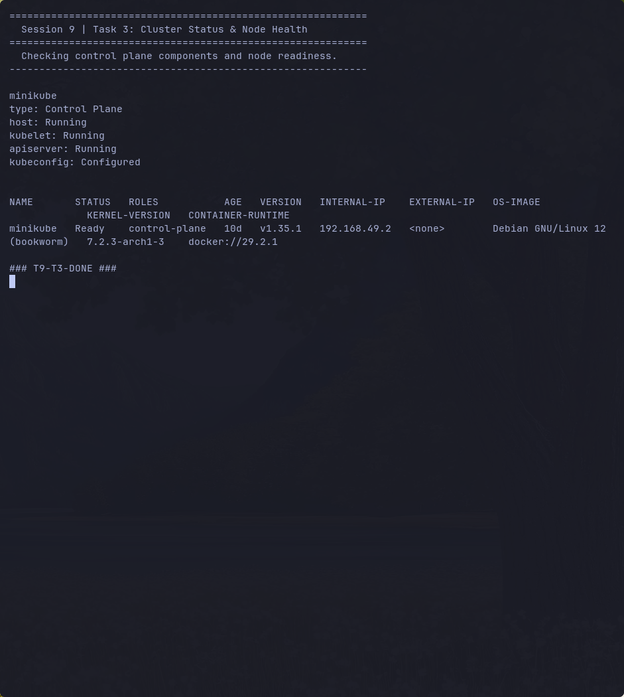
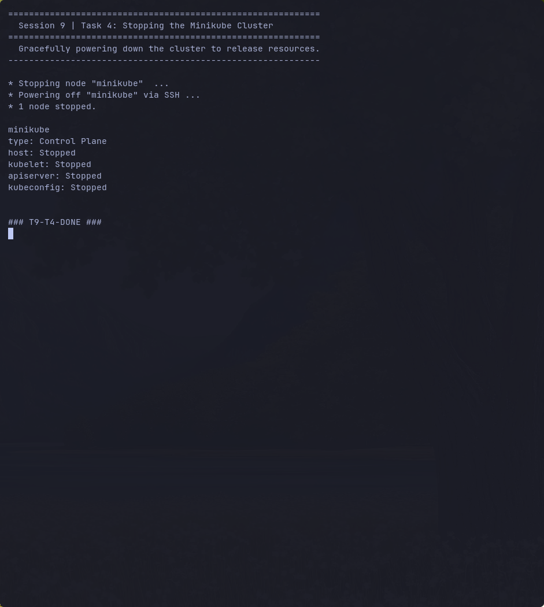

# Session 9: Kubernetes Fundamentals & Cluster Architecture

**Author:** [Your Name]
**Course:** SST DevOps & Cloud [SWE]
**Session:** 09 - Kubernetes Fundamentals
**Repository:** devops-heros / session9-k8s

---

## Task 1: Minikube & CLI Installation Verification

Verify that Minikube and the Kubernetes CLI (`kubectl`) are successfully installed on the local system.

**Command:**

```bash
minikube version
kubectl version --client
```

**Output:**

```
minikube version: v1.38.1
commit: c93a4cb9311efc66b90d33ea03f75f2c4120e9b0-dirty

Client Version: v1.36.4
Kustomize Version: v5.8.1
```

**Screenshot:**



---

## Task 2: Starting the Minikube Kubernetes Cluster

Initialize the local single-node Kubernetes cluster using the containerized Docker runtime environment.

**Command:**

```bash
minikube start
```

**Output:**

```
* minikube v1.38.1 on Omarchy 4.0.3
* Using the docker driver based on existing profile
* Starting "minikube" primary control-plane node in "minikube" cluster
* Pulling base image v0.0.50 ...
* Verifying Kubernetes components...
  - Using image gcr.io/k8s-minikube/storage-provisioner:v5
* Enabled addons: storage-provisioner, default-storageclass
* Done! kubectl is now configured to use "minikube" cluster and "default" namespace by default
```

**Screenshot:**



---

## Task 3: Verifying Cluster Status & Node Health

Inspect the status of the local cluster control plane, kubelet, API server, and verify the node is in `Ready` state.

**Commands:**

```bash
minikube status
kubectl get nodes -o wide
```

**Output:**

```
minikube
type: Control Plane
host: Running
kubelet: Running
apiserver: Running
kubeconfig: Configured

NAME       STATUS   ROLES           AGE   VERSION   INTERNAL-IP    EXTERNAL-IP   OS-IMAGE                         KERNEL-VERSION   CONTAINER-RUNTIME
minikube   Ready    control-plane   10d   v1.35.1   192.168.49.2   <none>        Debian GNU/Linux 12 (bookworm)   7.2.3-arch1-3    docker://29.2.1
```

**Screenshot:**



---

## Task 4: Stopping the Minikube Cluster

Gracefully power down the Minikube cluster VM/container to release system resources.

**Command:**

```bash
minikube stop
minikube status
```

**Output:**

```
* Stopping node "minikube"  ...
* Powering off "minikube" via SSH ...
* 1 node stopped.

minikube
type: Control Plane
host: Stopped
kubelet: Stopped
apiserver: Stopped
kubeconfig: Stopped
```

**Screenshot:**



---

## Task 5: Kubernetes Cluster Architecture & Component Analysis

A concise breakdown of the core components powering a Kubernetes cluster based on the
[official Kubernetes architecture documentation](https://kubernetes.io/docs/concepts/architecture/) and classroom discussion.

```
+-------------------------------------------------------------------------------------+
|                             CONTROL PLANE (MASTER NODE)                              |
|                                                                                     |
|   +----------------+      +----------------+      +----------------+                |
|   |     etcd       |<---->| kube-apiserver |<---->| kube-scheduler |                |
|   | (State Storage)|      |  (Front Door)  |      | (Placement)    |                |
|   +----------------+      +--------+-------+      +----------------+                |
|                                   |                                                |
|                                   v                                                |
|                       +---------------------------+                                |
|                       | kube-controller-manager    |                               |
|                       | (Reconciliation Loops)     |                               |
|                       +---------------------------+                                |
+-----------------------------------------+------------------------------------------+
                                          |
                                          | (kubectl, kubelet, controllers talk to apiserver)
                                          v
+-----------------------------------------+------------------------------------------+
|                                WORKER NODES (DATA PLANE)                             |
|                                                                                     |
|   Worker Node                                Worker Node                            |
|   +--------------------------+               +--------------------------+          |
|   | kubelet   (Node Captain) |               | kubelet   (Node Captain) |          |
|   | kube-proxy(Networking)   |               | kube-proxy(Networking)   |          |
|   | Container Runtime (CRI)  |               | Container Runtime (CRI)  |          |
|   |   Pod 1 | Pod 2          |               |   Pod 3 | Pod 4         |          |
|   +--------------------------+               +--------------------------+          |
+-------------------------------------------------------------------------------------+
```

### Control Plane (Master) Components

- **`kube-apiserver` (The Front Door)** — Single entry point for all administrative tasks and internal
  communication. Exposes the HTTP/JSON REST API. Every `kubectl` command, the scheduler, controllers,
  and the kubelet authenticate and communicate only through it. No component directly touches `etcd`
  except the API server.
- **`etcd` (The Brain / State Storage)** — Distributed, highly available key-value store that persists
  the entire cluster state, specs, secrets, and metadata. Everything in Kubernetes is an API object whose
  declarative desired state lives in `etcd`.
- **`kube-scheduler` (The Placement Engine)** — Watches for newly created Pods with no assigned node and
  picks the optimal worker node based on CPU/memory requests, affinity/anti-affinity, taints and tolerations.
- **`kube-controller-manager` (The Enforcer)** — Runs control loops that keep `Current State == Desired State`.
  Contains sub-controllers such as the Node Controller (node-down detection/eviction), ReplicaSet Controller
  (pod replica count), and EndpointSlice/Service Controllers (linking Services to live Pod IPs).

### Worker Node (Data Plane) Components

- **`kubelet` (The Node Captain)** — Primary agent on every worker node. Receives `PodSpec` objects from the
  API server, instructs the container runtime to pull images and start containers, monitors container health,
  and reports heartbeats back to the API server.
- **`kube-proxy` (The Network Router)** — Maintains network rules (`iptables`/`IPVS`) enabling Kubernetes
  Services to route and load-balance TCP/UDP traffic across pods.
- **`Container Runtime Interface (CRI)`** — The software that actually runs containers. Modern Kubernetes
  uses lightweight standard runtimes such as **containerd** or **CRI-O** (Minikube uses containerd inside the
  node; here it runs on a Docker driver).
- **`Pod` (The Smallest Deployable Unit)** — Encapsulates one or more tightly coupled containers sharing the
  same network namespace and storage volumes. Most enterprise pods run one primary container with optional
  sidecar/init helpers.

---

## Submission Steps

1. Screenshots saved inside `session9-k8s/screenshots/`.
2. Push to GitHub and submit the raw link of `session9-k8s/README.md` on the Google Form.

```bash
git add session9-k8s/
git commit -m "Submit Session 9 Kubernetes fundamentals and Minikube setup"
git push origin main
```

---

## Resources

- https://kubernetes.io/docs/tutorials/kubernetes-basics/
- https://minikube.sigs.k8s.io/docs/start/
- https://kubernetes.io/docs/concepts/architecture/
- https://github.com/Nency-Ravaliya/Kubernetes