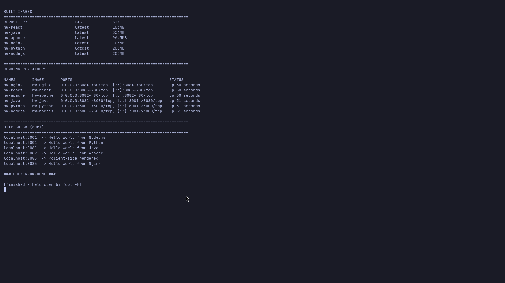

# Docker Fundamental — Hello World Applications

Six simple **Hello World** web applications, each in its own folder with application code and a
`Dockerfile`, built and run with Docker, and verified in a real browser.

## Folder structure

```
docker-hello-world/
├── nodejs-app/     # Node.js + Express          -> localhost:3001
├── python-app/     # Python + Flask             -> localhost:5001
├── java-app/       # Java (JDK HttpServer)      -> localhost:8081
├── Apache-app/     # Apache httpd 2 (Alpine)    -> localhost:8082
├── React-app/      # React + esbuild (multi-stage)-> localhost:8083
├── nginx-app/      # Nginx                      -> localhost:8084
└── show-hello-world.sh
```

Each folder contains the app code and a `Dockerfile` exactly as required.

## Running containers (evidence)



```bash
# build
docker build -t hw-nodejs ./nodejs-app
docker build -t hw-python ./python-app
docker build -t hw-java   ./java-app
docker build -t hw-apache ./Apache-app
docker build -t hw-react  ./React-app
docker build -t hw-nginx  ./nginx-app

# run
docker run -d --name hw-nodejs -p 3001:3000 hw-nodejs
docker run -d --name hw-python -p 5001:5000 hw-python
docker run -d --name hw-java   -p 8081:8080 hw-java
docker run -d --name hw-apache -p 8082:80   hw-apache
docker run -d --name hw-react  -p 8083:80   hw-react
docker run -d --name hw-nginx  -p 8084:80   hw-nginx
```

---

## 1. Node.js app — `nodejs-app/`

```javascript
// server.js
const express = require("express");
const app = express();
const PORT = process.env.PORT || 3000;
app.get("/", (req, res) => {
  res.send("<!doctype html><html><body><h1>Hello World from Node.js!</h1></body></html>");
});
app.listen(PORT, () => console.log(`Node.js app listening on port ${PORT}`));
```

```dockerfile
FROM node:20-alpine
WORKDIR /app
COPY package*.json ./
RUN npm install --omit=dev
COPY server.js .
EXPOSE 3000
CMD ["node", "server.js"]
```


## 2. Python app — `python-app/`

```python
# app.py
from flask import Flask
app = Flask(__name__)

@app.route("/")
def hello():
    return "<!doctype html><html><body><h1>Hello World from Python!</h1></body></html>"

if __name__ == "__main__":
    app.run(host="0.0.0.0", port=5000)
```

```dockerfile
FROM python:3.12-slim
WORKDIR /app
COPY requirements.txt .
RUN pip install --no-cache-dir -r requirements.txt
COPY app.py .
EXPOSE 5000
CMD ["python", "app.py"]
```


## 3. Java app — `java-app/`

Uses the JDK's built-in `com.sun.net.httpserver.HttpServer` so there are **no external
dependencies** — a plain HTTP server that returns HTML.

```java
// HelloServer.java
HttpServer server = HttpServer.create(new InetSocketAddress(8080), 0);
server.createContext("/", exchange -> { /* write "Hello World from Java!" */ });
server.start();
```

```dockerfile
FROM eclipse-temurin:21-jdk-alpine
WORKDIR /app
COPY HelloServer.java .
RUN javac HelloServer.java
EXPOSE 8080
CMD ["java", "HelloServer"]
```


## 4. Apache app — `Apache-app/`

```dockerfile
FROM httpd:2-alpine
COPY index.html /usr/local/apache2/htdocs/index.html
EXPOSE 80
```

`index.html` contains `<h1>Hello World from Apache!</h1>`.


## 5. React app — `React-app/`

A **multi-stage build**: stage 1 bundles the React app with esbuild, stage 2 serves the static
bundle with Nginx.

```jsx
// src/index.jsx
import React from "react";
import { createRoot } from "react-dom/client";
function App() { return <h1>Hello World from React!</h1>; }
createRoot(document.getElementById("root")).render(<App />);
```

```dockerfile
FROM node:20-alpine AS build
WORKDIR /app
COPY package*.json ./
RUN npm install
COPY . .
RUN npm run build

FROM nginx:alpine
COPY --from=build /app/dist/bundle.js /usr/share/nginx/html/bundle.js
COPY public/index.html /usr/share/nginx/html/index.html
EXPOSE 80
```


## 6. Nginx app — `nginx-app/`

```dockerfile
FROM nginx:alpine
COPY index.html /usr/share/nginx/html/index.html
EXPOSE 80
```


---

## Verification

Every page was fetched with `curl` (see the terminal screenshot) and rendered in a real browser
with headless Chromium (`--screenshot`), which is how the six images above were produced:

```bash
chromium --headless=new --no-sandbox --hide-scrollbars \
  --window-size=1280,720 --virtual-time-budget=6000 \
  --screenshot=screenshots/web-nodejs.png http://127.0.0.1:3001/
```

The React page is rendered by JavaScript, so `curl` shows an empty `<div id="root">` — the browser
screenshot proves the React app itself displays **Hello World from React!**.
