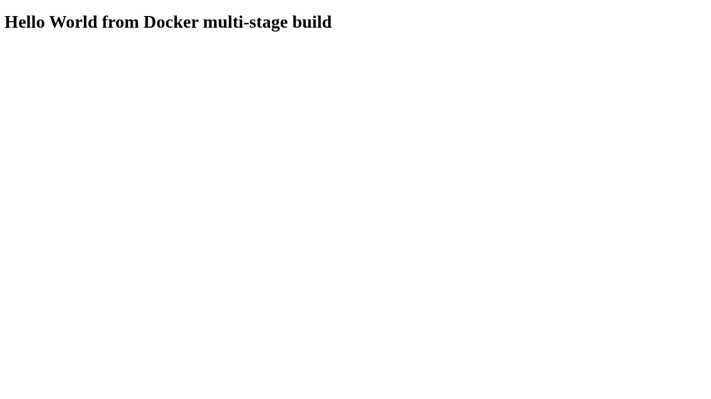
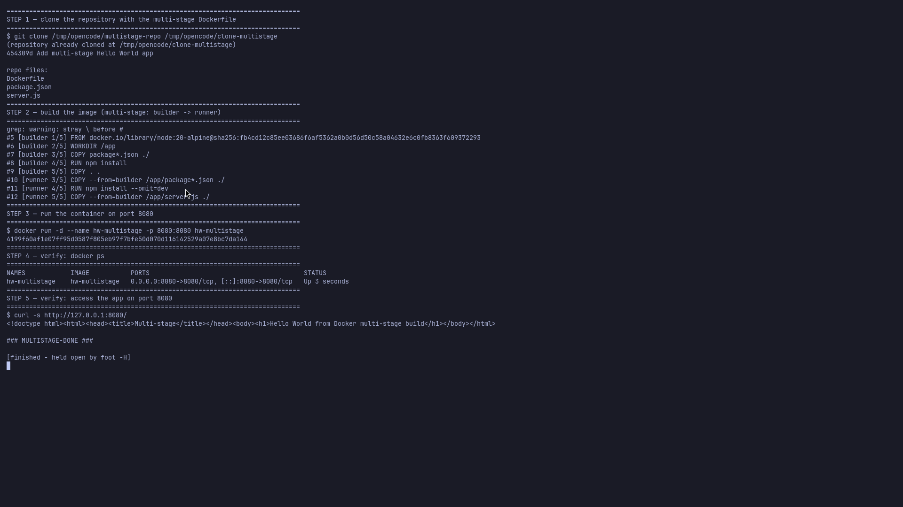
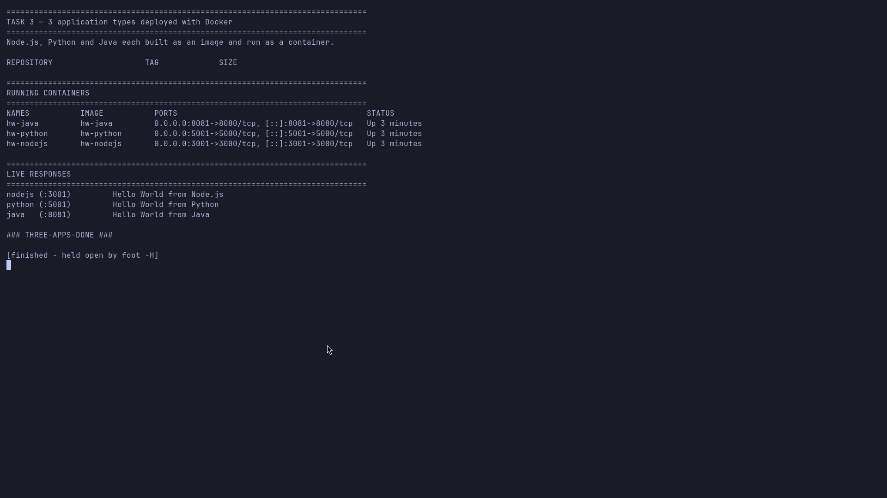

# Dockerfiles & Images — Homework Submission

- **Name:** Samarth  (GitHub: `SamarthPD-21`)
- **Enrollment Number:** `24BCS10331`
- **Task:** Docker Multi-Stage Build — run the image and serve on port **8080**

> The enrollment number was not present anywhere in the repository, so it is left as a clearly
> marked placeholder to fill in before pushing.

## Application running successfully

`http://127.0.0.1:8080/` returns:

> **Hello World from Docker multi-stage build**



## `docker ps` showing the running container on port 8080



```
$ docker ps
hw-multistage   hw-multistage   0.0.0.0:8080->8080/tcp   Up
```

## Task 3 — 3 application types deployed


