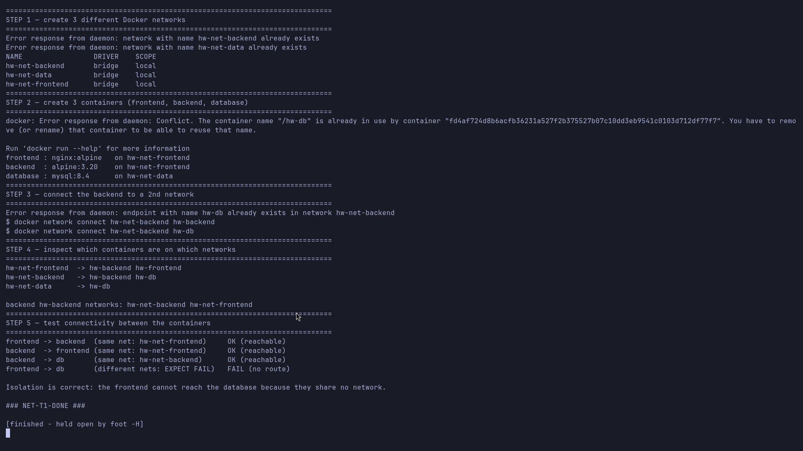
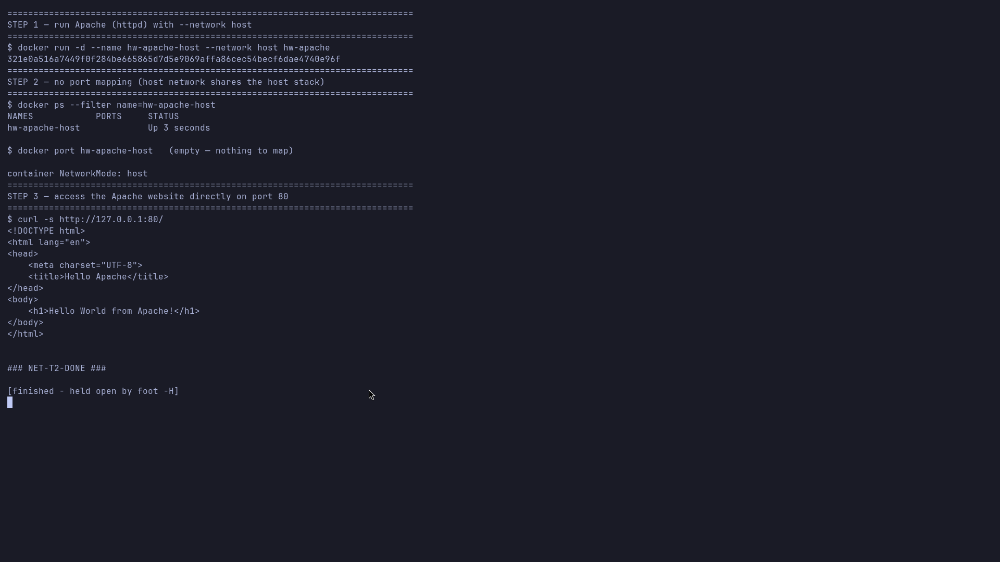
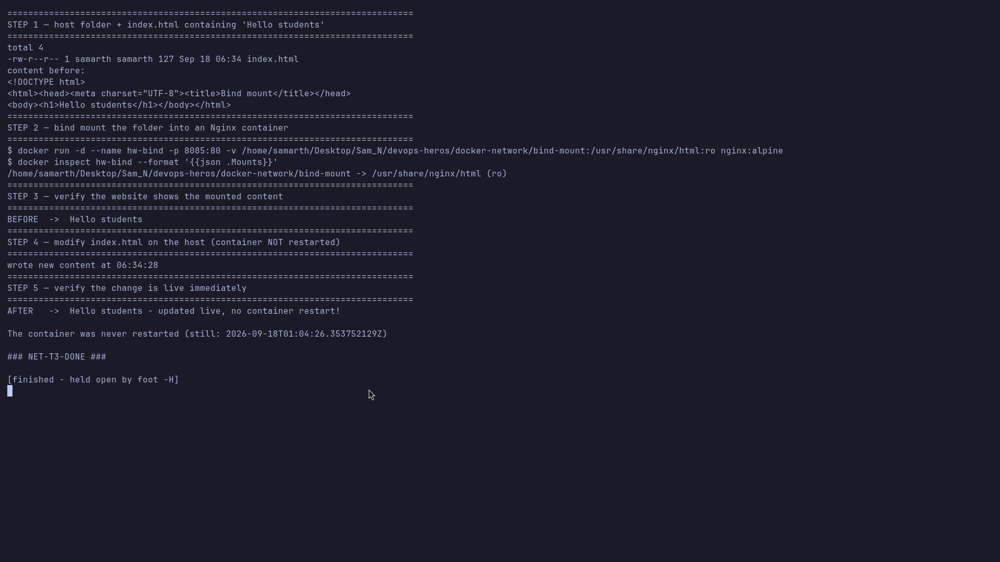
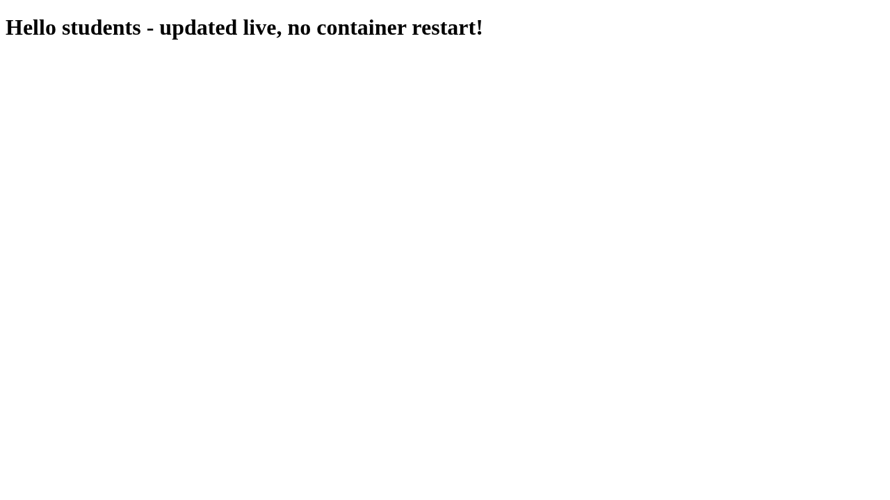

# Docker Networking & Volumes — Homework

All four tasks were run on this host. Scripts are idempotent (safe to re-run) and every screenshot
is the real command output.

---

## Task 1 — Docker Container Networking (3 containers, 3 networks)

**Script:** [`task1-networks.sh`](task1-networks.sh) · **Screenshot:**
[`screenshots/01-three-containers-three-networks.png`](screenshots/01-three-containers-three-networks.png)

| Container | Image | Networks |
|---|---|---|
| `hw-frontend` | `nginx:alpine` | `hw-net-frontend` |
| `hw-backend` | `alpine:3.20` | `hw-net-frontend` **+** `hw-net-backend` |
| `hw-db` | `mysql:8.4` | `hw-net-data` **+** `hw-net-backend` |

```bash
docker network create --driver bridge hw-net-frontend
docker network create --driver bridge hw-net-backend
docker network create --driver bridge hw-net-data

docker run -d --name hw-frontend --network hw-net-frontend nginx:alpine
docker run -d --name hw-backend  --network hw-net-frontend alpine:3.20 sleep 3600
docker run -d --name hw-db --network hw-net-data \
  -e MYSQL_ROOT_PASSWORD=root -e MYSQL_DATABASE=demo mysql:8.4

# put the backend on a SECOND network (and the db on it too)
docker network connect hw-net-backend hw-backend
docker network connect hw-net-backend hw-db
```

### Connectivity results

| Test | Shared network? | Result |
|---|---|---|
| frontend → backend | `hw-net-frontend` | **OK (reachable)** |
| backend → frontend | `hw-net-frontend` | **OK (reachable)** |
| backend → db | `hw-net-backend` | **OK (reachable)** |
| frontend → db | none | **FAIL (no route)** ← isolation works |

**What I understood:** a user-defined bridge network gives containers **automatic DNS** (containers
resolve each other by name) and a private subnet. A container can be on **multiple** networks, which
makes it the bridge between them — here the backend can talk to both the frontend and the database,
while the frontend **cannot** reach the database because they share no network. That is the basis of
network segmentation.



---

## Task 2 — Host Network (Apache2 on port 80)

**Script:** [`task2-host-network.sh`](task2-host-network.sh) · **Screenshots:**
[`screenshots/02-host-network-apache.png`](screenshots/02-host-network-apache.png),
[`screenshots/04-host-apache-webpage.png`](screenshots/04-host-apache-webpage.png)

```bash
docker run -d --name hw-apache-host --network host hw-apache
docker port hw-apache-host          # empty: there is nothing to publish
docker inspect hw-apache-host --format '{{.HostConfig.NetworkMode}}'   # host
curl -s http://127.0.0.1:80/         # Hello World from Apache!
```

**What I understood:** with `--network host` the container does **not** get its own network
namespace — it shares the host's, so the Apache process binds the host's port **80 directly**, with
**no `-p` mapping**. The trade-off is isolation: host networking is faster (no NAT) but the
container can use any host port and is not isolated from the host network stack.




---

## Task 3 — Bind Mount (live edit without restart)

**Script:** [`task3-bind-mount.sh`](task3-bind-mount.sh) · **Screenshots:**
[`screenshots/03-bind-mount-live-update.png`](screenshots/03-bind-mount-live-update.png),
[`screenshots/05-bind-mount-webpage.png`](screenshots/05-bind-mount-webpage.png)

```bash
# host folder with index.html containing "Hello students"
docker run -d --name hw-bind -p 8085:80 \
  -v /home/samarth/Desktop/Sam_N/devops-heros/docker-network/bind-mount:/usr/share/nginx/html:ro \
  nginx:alpine

curl -s http://127.0.0.1:8085/          # Hello students
# edit the file on the host ...
curl -s http://127.0.0.1:8085/          # Hello students - updated live, no container restart!
```

**What I understood:** a **bind mount** maps a directory/file from the **host** straight into the
container. The container sees the host file, so editing it on the host changes what Nginx serves
**immediately** — the container is not restarted and nothing is copied. This is ideal for config
files and development. (Volumes differ: Docker manages the storage location and it persists after
the container is removed.)




The host file after the demo (`bind-mount/index.html`) contains the updated text.

---

## Task 4 — Overlay Networks (research)

### What an overlay network is

An **overlay network** is a virtual network built **on top of** an existing (underlay) network.
Instead of relying on the physical topology, Docker encapsulates each container packet inside another
packet (VXLAN) and sends it over the real LAN or the internet. To the containers it looks like they
are on one flat Layer-2 network even though they run on **different physical hosts**.

### How it works across multiple Docker hosts

1. Created with `docker network create --driver overlay <name>` — this only works in **Swarm mode**
   (or with an external key-value store), because the engines must agree on the overlay.
2. Every member host gets a piece of the overlay (a VXLAN tunnel endpoint, VTEP). Docker assigns each
   task a **container network interface (CNI)** with an IP out of the overlay subnet.
3. When `container A` on host 1 sends a packet to `container B` on host 2, the sending host wraps the
   frame in a **VXLAN/UDP** header (destination = host 2's IP, VNI = the network's ID) using the
   **ingress**/**ingress-sbox** path, sends it over the underlay, and host 2 decapsulates it and
   delivers it on the overlay. VXLAN default port is **UDP 4789**.
4. **Automatic DNS / service discovery:** overlay services get a VIP and a DNS name in the swarm's
   internal DNS, so a task can reach `db:3306` and Swarm load-balances across replicas.
5. Optional **encryption** (`--opt encrypted`) encrypts the VXLAN payload (IPsec) between hosts.
6. `--attachable` lets standalone containers (not just Swarm services) join the overlay.

### Use cases

- **Multi-host microservices** (e.g. a web tier on host 1 talking to a DB tier on host 2) with a flat,
  name-addressable network.
- **Docker Swarm services / stacks** that need cross-node service discovery and load balancing.
- **Encrypted east-west traffic** between nodes across an untrusted network.
- Testing multi-node behaviour on one machine (Docker Desktop supports overlay in its single-node
  Swarm) — note that **plain Docker on Linux needs `docker swarm init`** before overlay works.

### Overlay vs bridge

| | bridge | overlay |
|---|---|---|
| Scope | single host | multiple hosts |
| Requires | nothing extra | Swarm mode / key-value store |
| Addressing | per-host subnet | cluster-wide flat subnet |
| Use case | local containers | distributed apps |

---

## Cleanup

```bash
docker rm -f hw-frontend hw-backend hw-db hw-apache-host hw-bind
docker network rm hw-net-frontend hw-net-backend hw-net-data
```
