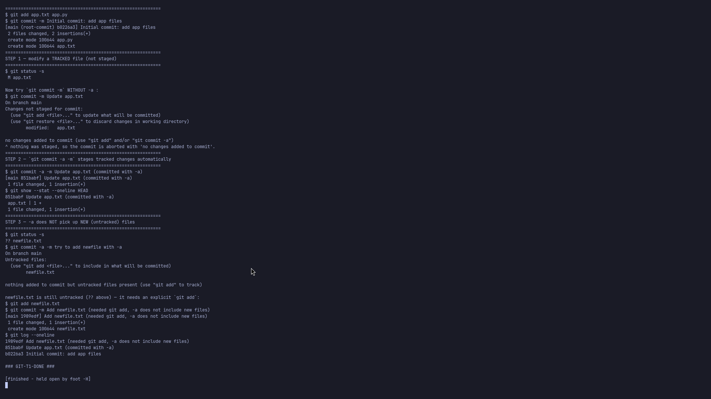
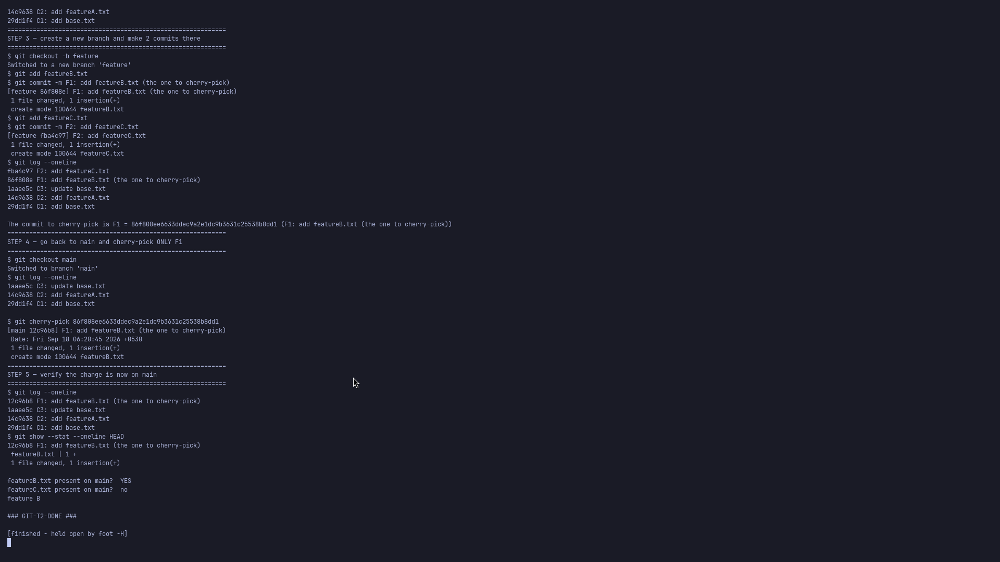

# Git / GitHub — Homework

Both tasks were practised in throwaway repositories created by the scripts (nothing is pushed;
the demo repos live under `/tmp`).

---

## Task 1 — `git commit -a -m` vs `git commit -m`

**Script:** [`task1-commit-a.sh`](task1-commit-a.sh) · **Screenshot:**
[`screenshots/01-commit-a-vs-commit-m.png`](screenshots/01-commit-a-vs-commit-m.png)

### The difference

| | `git commit -m "msg"` | `git commit -a -m "msg"` |
|---|---|---|
| What gets committed | **Only what is already staged** in the index | **All modified/deleted tracked files** are staged automatically, then committed |
| Untracked (new) files | No | **No** — `-a` ignores untracked files |
| When to use | After an explicit `git add` (precise commits) | Quick commit of changes to files Git already tracks |

`-a` is shorthand for "`git add -u` the tracked files, then commit".

### What the test showed

1. Setup: repo with tracked `app.txt`, `app.py`.
2. Modified `app.txt` (tracked, unstaged) → `git status -s` shows ` M app.txt`.
3. `git commit -m "Update app.txt"` → **aborted**: `no changes added to commit (use "git add" and/or "git commit -a")`.
4. `git commit -a -m "Update app.txt (committed with -a)"` → **succeeds**, the tracked modification is included (`git show --stat` proves `app.txt | 1 +`).
5. Created a **new** file `newfile.txt` → `git commit -a -m "try to add newfile with -a"` → **aborted**: `nothing added to commit but untracked files present`. The `?? newfile.txt` status remains.
6. `git add newfile.txt` + `git commit -m ...` → succeeds.

**Conclusion:** `-a` only auto-stages changes to files Git is **already tracking**. New files still
need `git add`.



---

## Task 2 — `git cherry-pick`

**Script:** [`task2-cherry-pick.sh`](task2-cherry-pick.sh) · **Screenshot:**
[`screenshots/02-cherry-pick.png`](screenshots/02-cherry-pick.png)

### Steps performed

1. On `main`, made **3 commits**: `C1: add base.txt`, `C2: add featureA.txt`, `C3: update base.txt`.
2. `git log --oneline` to view them.
3. Created branch `feature` and made **2 commits** there: `F1: add featureB.txt`, `F2: add featureC.txt`.
4. `git log --oneline` to identify the target commit → **F1** (its hash captured with `git rev-parse HEAD~1`).
5. `git checkout main` and `git cherry-pick <F1>`.
6. Verified: `git log --oneline` shows F1 is now the tip of `main`, and `git show --stat HEAD` shows
   `featureB.txt` was added.

### Result

```
$ git cherry-pick 86f808e
[main 86f808e] F1: add featureB.txt (the one to cherry-pick)
 1 file changed, 1 insertion(+)
 create mode 100644 featureB.txt

featureB.txt present on main?  YES
featureC.txt present on main?  no
```

Only the single chosen commit (`F1`) was copied onto `main`; `F2` (featureC.txt) was **not**.
Cherry-pick replays the *changes* of one commit onto the current branch, creating a **new** commit
with a different hash — it is not a merge and does not move branch history.



---

## Submission

The task allows either screenshots **or** an `.md` file — this README plus the two screenshots is the
`.md` submission, and the scripts reproduce every command.
