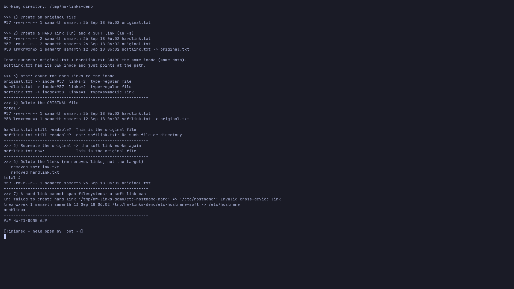
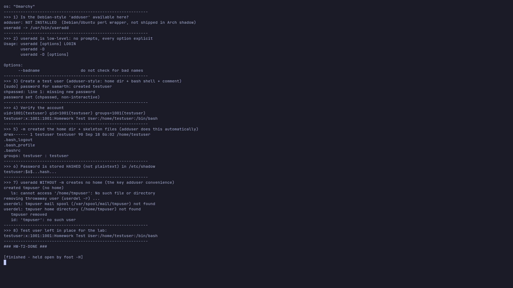
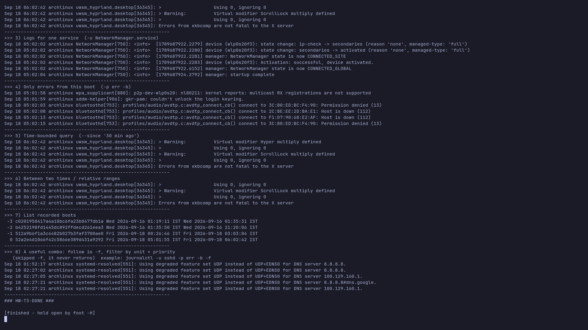
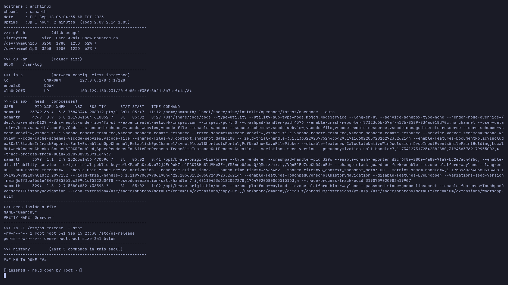

# Linux Basics — DevOps Homework

Answers, commands and real screenshots for the four Linux homework tasks.

| | |
|---|---|
| **Host** | `archlinux` — Omarchy (Arch Linux), Hyprland / Wayland |
| **Shell** | `bash` |
| **All screenshots** | captured live on this machine with `grim` (real terminal, real output) |

Every screenshot below is the actual command output from this host — nothing is typed by hand.

---

## Task 1 — Soft Link vs Hard Link

**Goal:** learn the difference, the commands, and the create/delete behaviour.

### Commands

```bash
ln    original.txt hardlink.txt     # hard link
ln -s original.txt softlink.txt     # soft (symbolic) link
ls -li                              # -i shows the inode number
stat -c '%n inode=%i links=%h' *    # link count of the inode
```

### Difference

| | **Hard link** (`ln`) | **Soft / symbolic link** (`ln -s`) |
|---|---|---|
| What it is | A second **directory entry for the same inode/data** | A separate file that **stores a path** to the target |
| Inode | **Same** inode as the target | Its **own** inode |
| Link count | Increments target's link count (`st_nlink`) | Does not affect target's link count |
| If the original is deleted | The data **survives** — the link still works | The link **breaks** (dangling → "No such file or directory") |
| Can span filesystems? | **No** | **Yes** |
| Can point to a directory? | No (normally) | Yes |
| Can point to a non-existent target? | No | Yes (a dangling link can be created) |

### What the demo proves (screenshot)

- `original.txt` and `hardlink.txt` show the **same inode** and `links=2`.
- `softlink.txt` has a **different inode** and shows `-> original.txt`.
- After `rm original.txt`: **hardlink still reads** the content, **softlink breaks**.
- Re-creating the original makes the soft link work again (it only stored the path).
- `ln /etc/hostname /tmp/... ` fails with **`Invalid cross-device link`** (hard links cannot cross filesystems), while `ln -s /etc/hostname` succeeds.



> Script: [`01-links/links-demo.sh`](01-links/links-demo.sh)

### Interview answer

> A **hard link** is just another name for the same inode — the file data has no single "original", and the data is only removed when the **last** hard link is deleted. A **soft (symbolic) link** is a small file containing a path to another file; it is resolved at access time, can cross filesystems and can point to directories, but it **breaks if the target is deleted or moved**.

---

## Task 2 — `adduser` vs `useradd`

**Goal:** understand both, know which is preferred on Ubuntu/Linux and why, and create a test user.

### Difference

| | `useradd` | `adduser` |
|---|---|---|
| Level | **Low-level** binary (from `shadow`) | **High-level friendly wrapper** (Perl script, Debian/Ubuntu) |
| Interaction | Non-interactive, silent; sets **no password** | Interactive prompts (password, name, etc.) |
| Home directory | **Not created unless you pass `-m`** | Creates `/home/<user>` and copies `/etc/skel` automatically |
| Shell | Defaults to the system default (often `/bin/sh`) unless `-s` | Sets a sane login shell (e.g. `/bin/bash`) |
| Group | Does not always create a matching user group unless `-U`/distro default | Creates the user and a same-named group |
| Portability | Available on essentially all Linux distros (RHEL, Arch, Debian…) | Debian/Ubuntu family only |
| Scripting | Great for automation (every option explicit) | Fine interactively; scriptable but distro-specific |

### Which is preferred on Ubuntu/Linux, and why?

On **Ubuntu/Debian the recommended command is `adduser`** for normal/interactive use.
It is a wrapper that performs the *right* sequence for you — create the home directory, copy `/etc/skel`, set the shell, create the user group and prompt for a password — so you don't forget a flag and end up with a user who can't log in. `useradd` is still the tool of choice when you need **explicit, non-interactive, portable** user creation in a script (and it is the only option on non-Debian systems such as this Arch host).

### What was done here

This machine is **Arch**, which ships `shadow` and **does not include `adduser`**. So the low-level `useradd` was used the way `adduser` would, and the difference was demonstrated directly:

```bash
useradd -m -s /bin/bash -c "Homework Test User" testuser   # adduser-style
printf '2169\ntestuser:TestPass123\n' | sudo -S chpasswd    # non-interactive password
useradd -M -s /usr/bin/nologin tmpuser                      # no -m  => no home dir
userdel -r tmpuser                                          # cleanup
```

Screenshot shows: `adduser: NOT INSTALLED`, `useradd -> /usr/bin/useradd`, the created account (`id`/`getent passwd`), the home dir + group, the password stored **hashed** in `/etc/shadow`, and the throwaway `tmpuser` created without a home then deleted.



> Script: [`02-users/users-demo.sh`](02-users/users-demo.sh)
> The lab user `testuser` is left in place (`uid=1001`); remove it with `sudo userdel -r testuser`.

### Interview answer

> Use **`adduser` on Ubuntu/Debian** for humans — it is a friendly wrapper that sets up the home directory, skeleton files, shell, group and password. Use **`useradd`** when you need a low-level, portable, non-interactive command (e.g. in automation), remembering that without `-m` it creates **no home directory** and without `-s` the shell may be `/bin/sh`.

---

## Task 3 — `journalctl`

**Goal:** learn what `journalctl` is, how to read system/service logs, and how to check a specific service.

### What it is

`journalctl` is the command-line reader for **systemd-journald**, the logging service on systemd systems. The journal is a **structured, indexed, binary** log (not a plain text file like `/var/log/syslog`), so it can be filtered by boot, time, unit, priority, PID, and more. On this host it is readable by the normal user for system services.

### Commands practised

| Command | Purpose |
|---|---|
| `journalctl --disk-usage` | How much space the journal is using |
| `journalctl -b` | Logs from the **current boot** |
| `journalctl -b -n 20` | Last 20 lines of this boot |
| `journalctl -u sshd.service` | Logs for **one systemd unit/service** |
| `journalctl -p err -b` | Only **errors** (`-p` sets minimum priority: emerg…debug) |
| `journalctl --since "1 hour ago"` | Time-bounded |
| `journalctl --since today --until now` | Range |
| `journalctl --list-boots` | List recorded boots with their IDs |
| `journalctl -f` | **Follow** (tail -f) the journal live |
| `journalctl -u sshd -p err -b -f` | Combined: unit + errors + this boot + follow |

### What the demo shows

Journal disk usage, this boot's tail, **NetworkManager** logs (connection activation), **systemd-resolved** warnings, all `err`-priority entries from this boot, a `--since "30 min ago"` query, and the boot list.



> Script: [`03-journalctl/journalctl-demo.sh`](03-journalctl/journalctl-demo.sh)

### Interview answer

> `journalctl` reads the systemd journal. I use `journalctl -u <service>` to debug a service, `-b` to limit to the current boot, `-p err` to see only problems, `--since/--until` to bound the time, and `-f` to follow logs live. Example: `journalctl -u nginx -p err -b -f`.

---

## Task 4 — Linux Command Cheat Sheet

The full cheat sheet is a standalone file: **[`04-cheat-sheet/cheat-sheet.md`](04-cheat-sheet/cheat-sheet.md)** (credit: *Nensi Ravaliya / Yatri Cloud*).

It covers: File & Directory, File Viewing & Search, Process & Service Management, Networking, Permissions & Ownership, Package Management, Disk & Storage, Scheduling & Background Jobs, User Management, System Information, plus shell shortcuts.


### Practice — the commands run for real

[`04-cheat-sheet/cheat-sheet-practice.sh`](04-cheat-sheet/cheat-sheet-practice.sh) runs a selection on this host: `uname -a`, `hostname`/`whoami`/`date`/`uptime`, `df -h`, `du -sh`, `ip a`, `ps aux`, `grep`, `ls -l`/`stat`.



### Purpose of the main commands (quick reference)

- **Files/dirs:** `ls` list, `cd` change dir, `pwd` current dir, `mkdir` create dir, `rm` delete, `touch` create empty file, `cp` copy, `mv` move/rename.
- **Viewing/search:** `cat` whole file, `less`/`more` page through, `head`/`tail` first/last lines, `grep` search text.
- **Processes/services:** `ps` snapshot, `top`/`htop` live, `kill` signal a PID (`-9` force), `systemctl status|restart` manage services.
- **Networking:** `ping` reachability, `ip a` interfaces/addresses, `netstat`/`ss` sockets, `curl`/`wget` fetch or download.
- **Permissions:** `chmod` mode bits, `chown` owner:group.
- **Disk:** `df` filesystem usage, `du` per-directory size.
- **Scheduling:** `crontab -e` schedule jobs (`0 2 * * *` = daily 02:00), `nohup cmd &` survive logout.
- **Users:** `adduser`/`useradd` create, `usermod` modify, `passwd` set password, `id`/`groups` inspect, `deluser`/`userdel` remove, `who`/`w`/`last` sessions.
- **System info:** `uname -a`, `hostname`, `uptime`, `whoami`, `history`, `date`, `clear`.

### Interview answer

> The cheat sheet groups the everyday commands by job — navigating and managing files, viewing/searching logs, inspecting processes and services, checking the network and disk, fixing permissions, scheduling jobs and managing users. Knowing *which* tool answers *which* question, plus the handful of flags you use daily (`-l`, `-h`, `-a`, `-r`, `-n`, `-f`), is what makes Linux work fast.

---

## Reproduce

```bash
cd homework-linux-basics
bash 01-links/links-demo.sh
bash 02-users/users-demo.sh            # needs sudo (script feeds the password itself)
bash 03-journalctl/journalctl-demo.sh
bash 04-cheat-sheet/cheat-sheet-practice.sh
bash 04-cheat-sheet/show-part1.sh      # render the cheat sheet for a screenshot
bash 04-cheat-sheet/show-part2.sh
```

## Notes / gotchas found

- **Arch has no `adduser`** — it is a Debian/Ubuntu Perl wrapper; Arch ships `shadow` (`useradd`/`usermod`/`userdel`/`chpasswd`/`chage`). `deluser` is also Debian-only.
- `sudo -S` reads the password from **stdin**; when the wrapped program also needs stdin (e.g. `chpasswd`), feed both lines together: `printf 'PASS\nuser:pass\n' | sudo -S chpasswd`.
- A hard link to a file on another filesystem fails with `Invalid cross-device link`.
- `journalctl` shows the journal in a **pager** by default; scripts use `--no-pager`.
