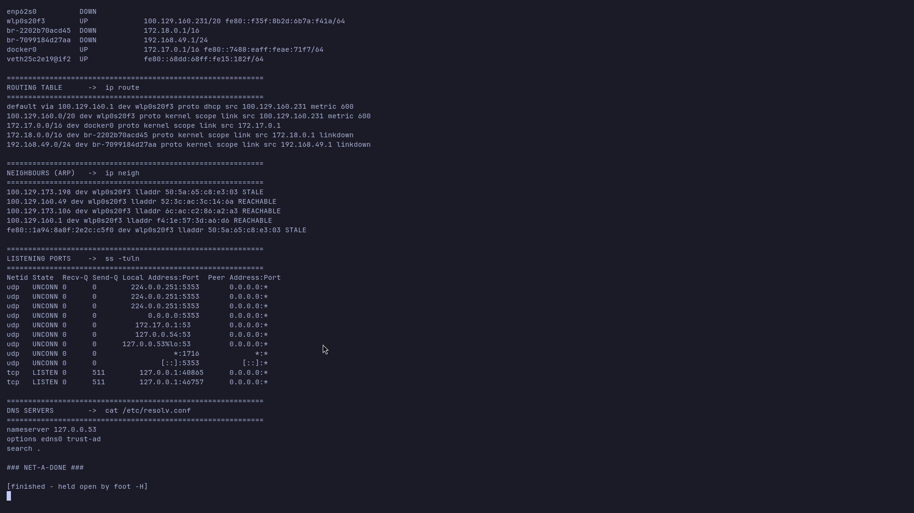
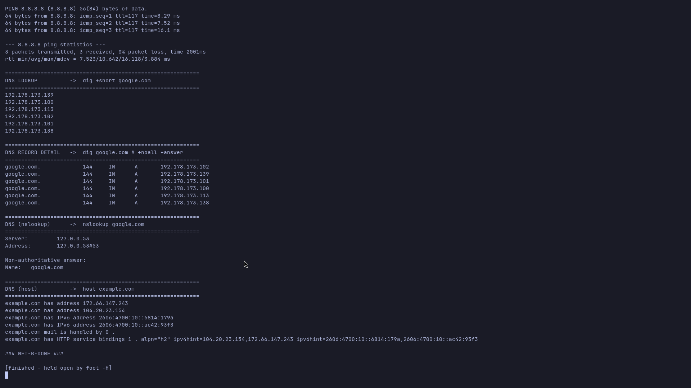
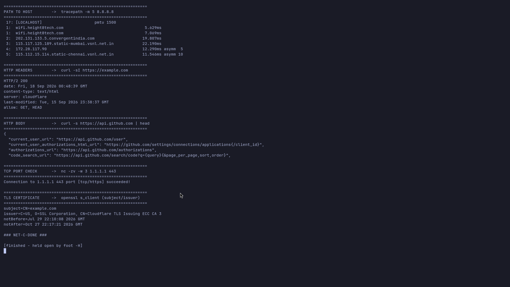

# Networking Commands — Practice & Notes

**Task 2:** executed the networking commands on this host (`archlinux`), recorded the real output
below, and added a short explanation of what each command is for.

> Every block below is genuine output captured on this machine (see the three screenshots at the
> bottom). Reproduce with [`net-interface.sh`](net-interface.sh), [`net-dns.sh`](net-dns.sh),
> [`net-http.sh`](net-http.sh).

---

## 1. Addresses / interfaces — `ip -brief addr`

```
$ ip -brief addr
lo               UNKNOWN        127.0.0.1/8 ::1/128
enp62s0          DOWN
wlp0s20f3        UP             100.129.160.231/20 fe80::f35f:8b2d:6b7a:f41a/64
br-2202b70acd45  DOWN           172.18.0.1/16
br-7099184d27aa  DOWN           192.168.49.1/24
docker0          UP             172.17.0.1/16 fe80::7488:eaff:feae:71f7/64
veth25c2e19@if2  UP             fe80::68dd:68ff:fe15:182f/64
```

**What I understood:** `ip` is the modern replacement for `ifconfig`. `-brief` prints one line per
interface. `lo` is the loopback, `wlp0s20f3` is the Wi-Fi NIC (UP, has a /20 private address),
`docker0`/`br-*` are Docker/Minikube bridges, and `veth*@ifN` is one end of a container veth pair.
`DOWN` means the interface exists but the link is not up.

## 2. Routing table — `ip route`

```
$ ip route
default via 100.129.160.1 dev wlp0s20f3 proto dhcp src 100.129.160.231 metric 600
100.129.160.0/20 dev wlp0s20f3 proto kernel scope link src 100.129.160.231 metric 600
172.17.0.0/16 dev docker0 proto kernel scope link src 172.17.0.1
172.18.0.0/16 dev br-2202b70acd45 proto kernel scope link src 172.18.0.1 linkdown
192.168.49.0/24 dev br-7099184d27aa proto kernel scope link src 192.168.49.1 linkdown
```

**What I understood:** the kernel decides where to send a packet by matching the destination against
these routes. `default via 100.129.160.1` is the gateway used for everything not matching a more
specific route. Each `/20`, `/16`, `/24` line is a directly-connected network reachable on that
interface (`scope link`). `linkdown` = the bridge is currently down.

## 3. Neighbour / ARP table — `ip neigh`

```
$ ip neigh
100.129.173.198 dev wlp0s20f3 lladdr 50:5a:65:c8:e3:03 STALE
100.129.160.49  dev wlp0s20f3 lladdr 52:3c:ac:3c:14:6a STALE
100.129.173.106 dev wlp0s20f3 lladdr 6c:ac:c2:86:a2:a3 REACHABLE
100.129.160.1   dev wlp0s20f3 lladdr f4:1e:57:3d:a6:d6 REACHABLE
```

**What I understood:** this is the ARP cache — the IPv4→MAC mapping for hosts on the local segment.
`REACHABLE` is a fresh confirmed entry, `STALE` is still usable but not recently verified. It replaces
`arp -a`.

## 4. Listening sockets — `ss -tuln`

```
$ ss -tuln | head
Netid State  Recv-Q Send-Q Local Address:Port  Peer Address:Port
udp   UNCONN 0      0            0.0.0.0:5353       0.0.0.0:*      # mDNS
udp   UNCONN 0      0         127.0.0.53%lo:53     0.0.0.0:*      # systemd-resolved
udp   UNCONN 0      0         172.17.0.1:53         0.0.0.0:*      # docker DNS
tcp   LISTEN 0      511      127.0.0.1:40865       0.0.0.0:*
tcp   LISTEN 0      511      127.0.0.1:46757       0.0.0.0:*
```

**What I understood:** `ss` is the modern replacement for `netstat`. `-t` TCP, `-u` UDP, `-l` listening,
`-n` numeric ports. It answers "what is this machine listening on?". Adding `-p` shows the owning
process (needs root for other users' sockets).

## 5. DNS servers — `cat /etc/resolv.conf`

```
$ cat /etc/resolv.conf
nameserver 127.0.0.53
options edns0 trust-ad
search .
```

**What I understood:** `/etc/resolv.conf` tells the resolver which nameservers to query.
`127.0.0.53` is the local stub resolver of `systemd-resolved`; it forwards to the real upstream
servers (see `resolvectl status`).

## 6. Reachability — `ping -c 3 8.8.8.8`

```
$ ping -c 3 8.8.8.8
64 bytes from 8.8.8.8: icmp_seq=1 ttl=117 time=16.2 ms
64 bytes from 8.8.8.8: icmp_seq=2 ttl=117 time=11.9 ms
64 bytes from 8.8.8.8: icmp_seq=3 ttl=117 time=8.01 ms
--- 8.8.8.8 ping statistics ---
3 packets transmitted, 3 received, 0% packet loss, time 2001ms
rtt min/avg/max/mdev = 8.011/12.057/16.228/3.355 ms
```

**What I understood:** `ping` sends ICMP echo requests and measures round-trip time. Pinging an IP
tests the network path; pinging a **name** (e.g. `google.com`) also tests DNS. `0% packet loss`
and low RTT mean the host is reachable. `ttl=117` is the remaining hop count.

## 7. DNS lookup — `dig +short google.com` and `dig google.com A +noall +answer`

```
$ dig +short google.com
192.178.173.139
192.178.173.101
...
$ dig google.com A +noall +answer
google.com.  162  IN  A  192.178.173.139
...
```

**What I understood:** `dig` queries DNS and is the tool of choice for troubleshooting. `+short`
prints just the answer; `+noall +answer` prints the answer section with type and TTL (162 seconds).
Multiple A records = DNS round-robin across several servers.

## 8. `nslookup google.com`

```
$ nslookup google.com
Server:   127.0.0.53
Address:  127.0.0.53#53
Non-authoritative answer:
Name:  google.com
```

**What I understood:** `nslookup` is the older, simpler DNS tool. It shows *which* server answered
(here the local stub) and the resolved name. "Non-authoritative" means the answer came from cache
rather than the domain's authoritative server.

## 9. `host example.com`

```
$ host example.com
example.com has address 104.20.23.154
example.com has address 172.66.147.243
example.com has IPv6 address 2606:4700:10::6814:179a
example.com mail is handled by 0 .
example.com has HTTP service bindings 1 . alpn="h2" ipv4hint=...
```

**What I understood:** `host` is a quick DNS swiss-army knife: `A` (IPv4), `AAAA` (IPv6), `MX`
(mail), and `HTTPS` service bindings — all in one lookup.

## 10. Path to a host — `tracepath -m 5 8.8.8.8`

```
$ tracepath -m 5 8.8.8.8
 1?: [LOCALHOST]                      pmtu 1500
 1:  wifi.height8tech.com                                  5.841ms
 2:  202.131.133.5.convergentindia.com                     7.093ms
 3:  115.117.125.189.static-mumbai.vsnl.net.in             6.107ms
 4:  no reply
 5:  115.112.15.114.static-chennai.vsnl.net.in            23.022ms asymm 10
```

**What I understood:** `tracepath` shows every router (hop) a packet passes through and the latency
to it — it is an unprivileged alternative to `traceroute` that also discovers the path MTU. `no reply`
is a router that does not answer probes (common).

## 11. HTTP headers — `curl -sI https://example.com`

```
$ curl -sI https://example.com
HTTP/2 200
date: Fri, 18 Sep 2026 00:48:12 GMT
content-type: text/html
server: cloudflare
last-modified: Tue, 15 Sep 2026 23:38:37 GMT
allow: GET, HEAD
```

**What I understood:** `curl -I` does a HEAD request so you get only the status line and headers.
`HTTP/2 200` = success, `server: cloudflare` = the edge serving the site, `content-type` tells the
client how to interpret the body.

## 12. HTTP body — `curl -s https://api.github.com`

```
$ curl -s https://api.github.com | head
{
  "current_user_url": "https://api.github.com/user",
  ...
```

**What I understood:** without `-I`, `curl` fetches the body — the fastest way to test a REST API from
the shell. `-s` silences the progress meter.

## 13. TCP port check — `nc -zv -w 3 1.1.1.1 443`

```
$ nc -zv -w 3 1.1.1.1 443
Connection to 1.1.1.1 443 port [tcp/https] succeeded!
```

**What I understood:** `nc` (netcat) `-z` scans without sending data, `-v` is verbose, `-w` sets a
timeout. It proves a specific TCP port is open and accepting connections — handy for firewall tests.

## 14. TLS certificate — `openssl s_client`

```
$ echo | openssl s_client -connect example.com:443 -servername example.com 2>/dev/null \
    | openssl x509 -noout -subject -issuer -dates
subject=CN=example.com
issuer=C=US, O=SSL Corporation, CN=Cloudflare TLS Issuing ECC CA 3
notBefore=Jul 29 22:10:08 2026 GMT
notAfter=Oct 27 22:17:21 2026 GMT
```

**What I understood:** `s_client` opens a raw TLS connection; piping the certificate into
`openssl x509` prints who the cert is for, who issued it, and its validity dates. This is how you
debug HTTPS/TLS problems (expiry, wrong domain, chain).

---

## Modern replacements for older commands

| Older command | Modern replacement | Why |
|---|---|---|
| `ifconfig` | `ip -brief addr` | `ifconfig` is deprecated (net-tools) |
| `netstat -tulnp` | `ss -tulnp` | `ss` is faster and uses netlink |
| `arp -a` | `ip neigh` | part of iproute2 |
| `route -n` | `ip route` | part of iproute2 |
| `traceroute` | `tracepath` | no root needed, discovers PMTU |

## Task 1 — practice repos

Task 1 pointed at the DevOps-Hero / instructor GitHub resources for networking. The list is saved in
[`resources.md`](resources.md) (Nency Ravaliya's repos:
`Networking`, `Network-Troubleshooting`, `OSI-Network-devices`, `Subnetting`, `IP-quest`,
`How-DHCP-Works`, `IPFIX-NETFLOW-NTP`). The commands above are the practical drill of that material.

## Screenshots




