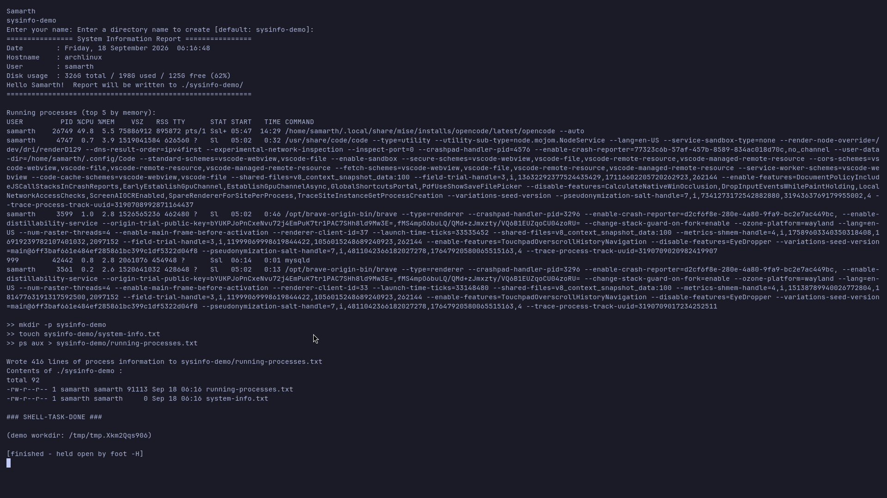

# Shell Scripting Homework — System Information Script

## Task

Create a shell script that:

- prints the current **date**
- prints the **hostname**
- prints the **username**
- prints the **disk usage**
- prints the **running processes**
- uses **variables** to store and use data
- takes **user input** using `read -p`
- creates a directory using `mkdir`
- creates a file using `touch`
- stores the running-processes information in the file using **`>`** output redirection

## Script

[`system-info.sh`](system-info.sh)

```bash
#!/usr/bin/env bash
set -u

# ------------------------------------------------------------------
# 1) Variables — store data once, reuse it everywhere
# ------------------------------------------------------------------
TODAY="$(date '+%A, %d %B %Y  %T')"
HOST="$(hostname)"
CURRENT_USER="$(whoami)"
DISK_USAGE="$(df -h / | awk 'NR==2 {printf "%s total / %s used / %s free (%s)", $2, $3, $4, $5}')"

# ------------------------------------------------------------------
# 2) User input with read -p
# ------------------------------------------------------------------
read -p "Enter your name: " NAME
read -p "Enter a directory name to create [default: sysinfo-demo]: " DIR_NAME
DIR_NAME="${DIR_NAME:-sysinfo-demo}"

# ------------------------------------------------------------------
# 3) Print the system information
# ------------------------------------------------------------------
echo
echo "================ System Information Report ================"
echo "Date        : $TODAY"
echo "Hostname    : $HOST"
echo "User        : $CURRENT_USER"
echo "Disk usage  : $DISK_USAGE"
echo "Hello $NAME!  Report will be written to ./$DIR_NAME/"
echo "==========================================================="
echo
echo "Running processes (top 5 by memory):"
ps aux --sort=-%mem | head -n 6

# ------------------------------------------------------------------
# 4) Create a directory (mkdir) and a file (touch)
# ------------------------------------------------------------------
echo ">> mkdir -p $DIR_NAME"
mkdir -p "$DIR_NAME"
echo ">> touch $DIR_NAME/system-info.txt"
touch "$DIR_NAME/system-info.txt"

# ------------------------------------------------------------------
# 5) Store the running-processes output in a file using > redirection
# ------------------------------------------------------------------
echo ">> ps aux > $DIR_NAME/running-processes.txt"
ps aux > "$DIR_NAME/running-processes.txt"

echo
echo "Wrote $(wc -l < "$DIR_NAME/running-processes.txt") lines of process information to $DIR_NAME/running-processes.txt"
ls -l "$DIR_NAME"
```

## How to run

```bash
# interactive
bash system-info.sh

# non-interactive (answers piped in) — this is what produced the screenshot
bash run-demo.sh
```

> `read -p` only displays its prompt when input is a terminal, so `run-demo.sh` runs it under
> a pseudo-terminal (`script -qec ...`) and feeds the answers in.

## Output (screenshot)



The screenshot shows the two prompts, the report (date, hostname, user, disk usage), a `ps aux`
preview, then `mkdir -p sysinfo-demo`, `touch`, and `ps aux > sysinfo-demo/running-processes.txt`
(417 lines written) and the final `ls -l`.

## Command-by-command

| Requirement | Where it is used |
|---|---|
| current date | `TODAY="$(date '+%A, %d %B %Y  %T')"` |
| hostname | `HOST="$(hostname)"` |
| username | `CURRENT_USER="$(whoami)"` |
| disk usage | `df -h /` (formatted with `awk`) |
| running processes | `ps aux` |
| variables | `TODAY`, `HOST`, `CURRENT_USER`, `DISK_USAGE`, `NAME`, `DIR_NAME` |
| `read -p` | `read -p "Enter your name: " NAME` and the directory prompt |
| `mkdir` | `mkdir -p "$DIR_NAME"` |
| `touch` | `touch "$DIR_NAME/system-info.txt"` |
| `>` redirection | `ps aux > "$DIR_NAME/running-processes.txt"` |
